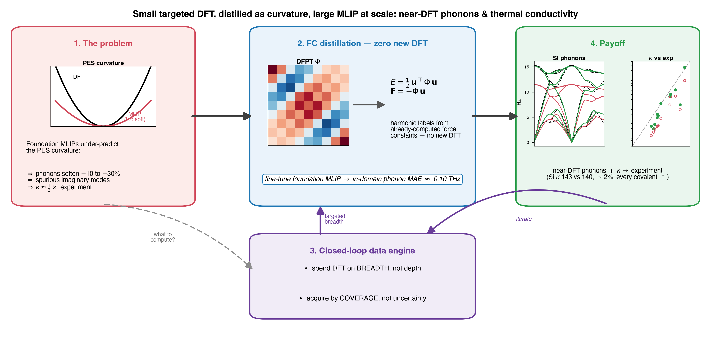
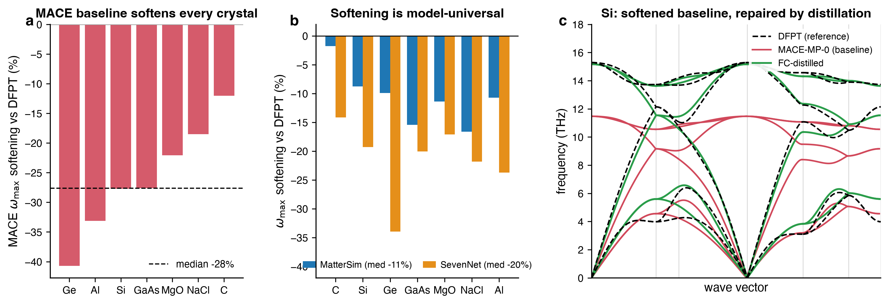
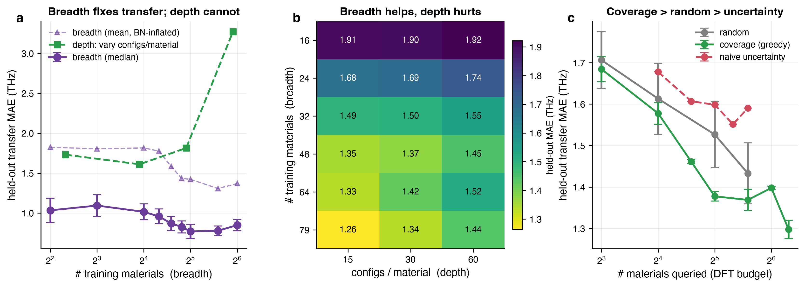
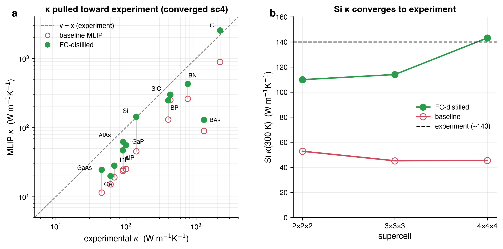

# Data-efficient force-constant distillation for near-DFT phonons and thermal conductivity in foundation machine-learning potentials

*Manuscript draft. Intended for npj Computational Materials / Nature Computational Science.*

**Authors.** [Author list TBD]
**Affiliations.** [TBD]
**Corresponding author.** [TBD]

---

## Abstract

Universal machine-learning interatomic potentials (MLIPs) reproduce energies and forces across the
periodic table but systematically under-predict the *curvature* of the potential-energy surface,
softening phonons and underestimating lattice thermal conductivity (κ) by roughly two- to three-fold.
Fine-tuning repairs the harmonic spectrum; the decisive open questions are **how much, and which,
density-functional theory (DFT) data** this needs, and whether the repair reaches the anharmonic
transport that screening depends on. We introduce **force-constant (FC) distillation**, which turns
*already-computed* density-functional perturbation theory (DFPT) force constants into harmonic
energy/force labels and fine-tunes a foundation MLIP at **zero new DFT**, reaching an in-domain phonon
mean absolute error (MAE) of ~0.10 THz. On this signal we establish two **data-efficiency laws** —
held-out transfer is set by **chemical breadth**, not sampling depth (knee at ~20–24 materials, median
floor ~0.8 THz), and **coverage** acquisition beats random while naive uncertainty sampling is worst —
and report an honest GPU/CPU DFT-engine speedup decomposition. The payoff is downstream: at the
converged supercell, FC distillation moves κ toward experiment for every covalent semiconductor tested
(13 systems, 1.2–3.2× over baseline), with silicon and diamond closest to experiment (Si 143 vs
140 W m⁻¹K⁻¹, ~2%; 45 untuned). Two negative results — uncertainty acquisition and naive third-order
distillation — sharpen the design. Using public data and commodity GPUs, the result is a closed-loop
*small-DFT + large-MLIP* recipe; we release the code, models, and protocol.

---

## 1. Introduction

Lattice dynamics underpin a large fraction of a crystal's functional behaviour — dynamical and
thermodynamic stability, lattice thermal conductivity and thermoelectric performance [31], thermal
expansion, electron–phonon coupling and the resulting transport and superconductivity, and the
infrared/Raman/inelastic-neutron vibrational fingerprints. High-throughput phonon data would therefore
accelerate the discovery of thermoelectric, thermal-management and thermal-barrier materials and the
screening of dynamically stable compounds. The bottleneck is cost: the standard route — finite
displacements or density-functional perturbation theory (DFPT) [21] in DFT — requires many
self-consistent calculations on symmetry-inequivalent displaced supercells at second-derivative
precision, and scales steeply with cell size, making a phonon spectrum 10–100× more expensive than a
single electronic-structure evaluation [1,2].

Foundation (universal) MLIPs — MACE-MP [3], MatterSim [4], SevenNet [17], ORB [18], CHGNet [16],
M3GNet [15] — promise a ~10³× speed-up by replacing the DFT force evaluations inside the
finite-displacement workflow, and are trained on large public datasets such as the Materials
Project [20]. Yet a recent benchmark of ~10⁴ ab-initio phonon spectra found that some foundation models
predict harmonic phonons well and others poorly, even when their near-equilibrium energy and force
errors are small [5,19]. The origin is now understood: foundation MLIPs **under-predict the curvature of
the potential-energy surface (PES)** — a systematic "softening" traced to the over-representation of
near-equilibrium configurations in pre-training data [6]. Because energy/force training penalises only
the first derivatives, it leaves the second derivatives (phonons) under-constrained — a
**curvature-supervision gap** in which low force error does not imply correct phonons. The consequence
propagates downstream: foundation models underestimate lattice thermal conductivity κ by roughly −50% on
the median [7], rendering them unreliable for thermal screening.

Fine-tuning closes the harmonic gap. Parameter-efficient and phonon-targeted schemes — LoRA-based
adaptation [8] and direct supervision of the energy Hessian against DFT force constants [9] — have
driven phonon MAEs to ~0.05 THz. This establishes *that* fine-tuning helps and sharpens what is still
open: *how to do it data-efficiently, and whether the harmonic repair transfers to the anharmonic
transport property that screening actually needs*. Two questions are decisive for any practical
campaign. **(Q1) How much, and which, DFT data?** For a fixed DFT budget, is it better to compute many
configurations of a few materials or a few configurations of many — and when new training materials must
be *acquired*, which ones? **(Q2) Does harmonic fine-tuning recover κ, or only the dispersion?** Prior
fine-tuning studies [8,9] optimise and report the harmonic spectrum; neither quantifies the
data-efficiency of the DFT spend nor follows the repair through to converged thermal transport.

Here we answer both, organised around a closed-loop *small-DFT + large-MLIP* data engine (Fig. 1). The
training signal is **force-constant (FC) distillation**: we reuse the *already-computed* DFPT force
constants behind public phonon databases [1,10] as exact harmonic energy/force labels
(E = ½uᵀΦu, F = −Φu) and fine-tune a foundation MLIP at **no new DFT** — distinct from the closest prior
method [9], which supervises the Hessian against *freshly computed* finite-displacement force constants.
On this signal we (i) discover two data-efficiency laws — transfer is governed by **chemical breadth**,
not sampling depth, and **coverage** is the right acquisition criterion while **naive uncertainty
sampling backfires**, counter to the active-learning default [24,25]; (ii) build a GPU/CPU
finite-displacement DFT engine to supply breadth for genuinely new chemistries, with an honest
workflow-level speedup decomposition; and (iii) follow the harmonic repair through to **lattice thermal
conductivity**, recovering κ across covalent semiconductors (silicon to ~2% at converged supercell). We
also report two informative negative results — uncertainty acquisition and naive third-order
distillation — that delineate the design space.

**Contributions.** (1) FC distillation: zero-new-DFT curvature fine-tuning from public DFPT force
constants. (2) Two data-efficiency laws (breadth ≫ depth; coverage ≫ uncertainty acquisition). (3) An
honest GPU/CPU DFT-engine speedup decomposition. (4) A demonstrated κ recovery (Si to ~2%) plus two
sharp negative results. (5) Open code, models, and protocol.

*Figure 1. Overview. (1) Foundation MLIPs under-predict the curvature of the potential-energy surface,
softening phonons and underestimating κ. (2) FC distillation converts already-computed public DFPT force
constants Φ into exact harmonic energy/force labels (E = ½uᵀΦu, F = −Φu) and fine-tunes the foundation
MLIP at zero new DFT, reaching in-domain phonon MAE ≈ 0.10 THz. (3) A closed-loop data engine spends its
DFT budget on chemical breadth (not sampling depth) and acquires new materials by coverage (not
uncertainty). (4) The payoff is near-DFT phonons and lattice thermal conductivity (Si κ 143 vs
140 W m⁻¹K⁻¹, ~2%); insets show the real Si dispersion and κ benchmark.*

---

## 2. Results

### 2.1 Foundation MLIPs under-predict phonon curvature

Benchmarking foundation MLIPs against the MDR/PhononDB DFPT database [10] (10,034 inorganic materials),
with the non-analytical term correction disabled on both sides for a like-for-like short-range
comparison, reproduces the established picture [5,6]: foundation models systematically soften the
spectrum (e.g. Si ω_max ≈ 11 THz versus DFPT 15.5 THz), introduce spurious imaginary modes, and violate
the acoustic sum rule. Force MAE and phonon MAE decouple — confirming the curvature-supervision gap
(Fig. 2a).

**The softening is not a MACE artifact.** Running the same benchmark with two *other* foundation models
(MatterSim [4], SevenNet [17]) on a stable-crystal subset confirms that softening is generic: all seven
materials soften for both models (medians −10.7% and −20.1%, SevenNet more strongly; per-material values
in Supplementary Table S1), mirroring MACE (Fig. 2b) — curvature under-prediction is a *generic* property
of energy/force-trained foundation MLIPs, so the FC-distillation remedy below is model-agnostic in
principle (cross-model fine-tuning is future work).

### 2.2 Force-constant distillation restores near-DFT phonons at zero new DFT

For a training material with DFPT force constants Φ (defined on the supercell), we generate rattled
supercell configurations labelled with the exact harmonic response,
$E(\mathbf{u})=\tfrac12\mathbf{u}^\top\Phi\,\mathbf{u}$ and $\mathbf{F}=-\Phi\,\mathbf{u}$, augmented
with single-atom ±displacements that directly probe individual force-constant columns, and fine-tune
the foundation model on these labels. Because the labels come from *already-computed* force constants,
this adds **no new DFT** — the public phonon database is converted directly into curvature supervision.
FC distillation drives the in-domain phonon MAE to **~0.10 THz** and eliminates imaginary modes (Fig. 2c),
while the anti-forgetting strategy of §2.5 preserves the base model's universality. This in-domain accuracy
is comparable to recent phonon-targeted fine-tuning [8,9]; our emphasis below is the *data efficiency*
and *downstream transport*, where the open questions lie. Per material, distillation cuts the in-domain
MAE by roughly 5–20× across covalent, polar and ionic crystals — from a baseline median of 0.80 THz to a
distilled median of **0.09 THz** (the residual is largest for silicon, 0.32 THz):

**Table 1.** In-domain phonon MAE (THz) per material — MACE-MP-0 baseline vs FC-distilled.

| in-domain phonon MAE (THz) | Si | AlN | GaP | ZnS | SrTiO₃ | KCl | CdTe | CaF₂ | **median** |
|---|---|---|---|---|---|---|---|---|---|
| MACE-MP-0 baseline | 2.04 | 1.22 | 1.16 | 0.83 | 0.77 | 0.44 | 0.39 | 0.27 | **0.80** |
| FC-distilled | 0.32 | 0.09 | 0.21 | 0.05 | 0.16 | 0.08 | 0.07 | 0.09 | **0.09** |

*(In-domain held-out-geometry MAE for the high-breadth coverage model of §2.3–2.4; NAC off, evaluated at
the DFT geometry to isolate force-constant quality.)*

*Figure 2. Foundation MLIPs under-predict phonon curvature, and FC distillation repairs it. **(a)** Per-material
ω_max softening of the MACE-MP-0 baseline (the model we fine-tune) on canonical crystals (median −28%). **(b)**
The softening is model-universal — MatterSim and SevenNet soften every material (medians −11% / −20%). **(c)**
Si phonon dispersion: the MACE baseline (red) is softened relative to DFPT (black dashed), while the
FC-distilled model (green) tracks DFPT; in-domain phonon MAE ≈ 0.10 THz at zero new DFT.*

### 2.3 Transfer is governed by chemical breadth, not sampling depth

We separate two data axes — *depth* (configurations per material) and *breadth* (number of distinct
training materials) — and measure phonon MAE on a fixed held-out set of materials never used in
training.

**Table 2.** Held-out transfer MAE (THz) versus training breadth — median and (BN-inflated) mean.

| # training materials | 4 | 8 | 16 | 20 | 24 | 28 | 32 | 48 | 64 |
|---|---|---|---|---|---|---|---|---|---|
| held-out MAE — median (THz) | 1.03 | 1.09 | 1.02 | 0.96 | 0.87 | 0.83 | **0.77** | 0.78 | 0.85 |
| held-out MAE — mean (THz) | 1.82 | 1.80 | 1.82 | 1.78 | 1.58 | 1.43 | 1.42 | 1.31 | 1.37 |

Transfer error is **flat up to ~16–20 materials, exhibits a knee at ~20–24, and saturates by N≈32–48 —
to a median ~0.8 THz** (Fig. 3a). We lead with the median because the *mean* is inflated by a single hard
chemistry: on the held-out set boron nitride alone sits at ~4.5 THz while the other five materials are
0.3–1.0 THz, so the mean floor (~1.3 THz) overstates the typical residual (median floor ~0.8 THz). Increasing *depth* at fixed breadth does **not** transfer and in
fact *overfits*: at high breadth, more configurations per material make transfer worse — at the maximum
breadth N=79 the depth row rises monotonically (15 configs → 1.26, 30 → 1.34, 60 → 1.44; the same
up-trend holds at N=64: 1.33 → 1.42 → 1.52). The full data-need surface (Fig. 3b) has its minimum at
high-breadth + low-depth. The practical rule is therefore to **spend the DFT budget on more materials,
not on more configurations of each**. The residual floor is set by under-covered light-element,
high-frequency chemistries (boron nitride above all) — exactly the regime coverage acquisition targets
(§2.4).

### 2.4 Coverage acquisition outperforms uncertainty sampling

For a closed-loop engine the operative question is *which* materials to compute with DFT. Using the
public DFPT database as an oracle, we compare acquisition strategies at matched budget (seed-averaged):

**Table 3.** Held-out transfer MAE (THz, mean over the 6-material held-out set) by acquisition strategy at matched budget (seed-averaged).

| # materials | random (6 draws) | coverage (greedy) | uncertainty |
|---|---|---|---|
| 16 | 1.61 ± 0.09 | 1.58 ± 0.03 | 1.68 |
| 24 | — | 1.46 ± 0.01 | 1.61 |
| 32 | 1.53 ± 0.08 | **1.38 ± 0.01** | 1.60 |
| 48 | 1.43 ± 0.07 | 1.37 ± 0.03 | — |

**Chemical-coverage acquisition is the best and the most reliable** (its variance is far lower — it
selects nearly the same informative set every time), beating random by ~0.15 THz at N = 32.
**Naive model-uncertainty acquisition is the worst**: it preferentially queries pathological/soft
outliers (e.g. elemental phosphorus, F₂ molecular crystals, structures with thousands of spurious
imaginary modes) that are informative *to the model* but unrepresentative of the target distribution;
filtering predicted-unstable candidates only partially rescues it. This is counter-intuitive —
uncertainty sampling is the textbook default — and it instructs the data engine to **acquire for
coverage, not uncertainty** (Fig. 3c).

*Figure 3. Data-efficiency laws for FC distillation. **(a)** Held-out transfer MAE versus number of training
materials (breadth): the median (solid) saturates to a ~0.8 THz floor with a knee at ~20–24, while the
mean (dashed) is inflated to ~1.3 THz by a single hard chemistry (boron nitride); depth (configs per
material, green) does not transfer. **(b)** Depth × breadth surface: transfer improves down columns
(more breadth) but flattens or worsens across rows (more depth); the optimum is high-breadth + low-depth.
**(c)** Acquisition at matched DFT budget: chemical-coverage selection (green) is best and lowest-variance,
random (grey) is intermediate, and naive model-uncertainty (red dashed) is worst.*

### 2.5 Anti-forgetting during fine-tuning

Single-head fine-tuning catastrophically forgets [23] elements absent from the fine-tuning set (held-out
imaginary modes proliferate). Multihead **replay** (sampling the foundation pre-training trajectories)
and **LoRA** [22] both prevent this at a small in-domain cost; with seed error bars the held-out transfer
ordering is LoRA-r32 (1.46) < replay (1.85) < single-head (2.22) (Supplementary Fig. S1). More chemical
breadth reduces the replay required.

### 2.6 A GPU/CPU DFT engine and an honest workflow speedup decomposition

To supply targeted reference data we implement a finite-displacement DFT engine (Quantum ESPRESSO [12]
with SG15 ONCV pseudopotentials [13], driven through the same phonon pipeline as the MLIPs) and
validate it (Si ω_max within ~1–5% of DFPT/experiment). We decompose the workflow-level acceleration
honestly:

**Table 4.** Workflow-level DFT speedup decomposition, separating measured / theoretical / literature factors.

| Factor | Value | Type of estimate | Realised here? |
|---|---|---|---|
| symmetry reduction of displacements | 48–384× | standard practice (free) | yes (standard) |
| charge-density + wavefunction reuse across displacements | ~1.5× wall-clock (Si 1.0×, Al 1.17×, MgO 1.78×; scales with SCF difficulty) | **measured** (this work) | yes |
| non-diagonal supercells for exact fine-q [14] | SCF-cost (~N_atoms³) reduced 141× (4³ grid) – 1152× (8³) | **theoretical scaling** (cell N³→N) | implemented; not benchmarked end-to-end |
| per-SCF GPU port | ~5–15× | **literature** estimate | **no** — needs strong-FP64 (V100/A100); inference-class GPUs do not realise it |

We separate the three kinds of factor deliberately. Only the **~1.5× cross-displacement reuse** is an
end-to-end *measured* engine gain; the 141–1152× from non-diagonal supercells is a *theoretical* operation-
count scaling (implemented but not benchmarked end-to-end); and the 5–15× per-SCF GPU factor is a
*literature* figure we did **not** realise (the available inference-class GPUs lack the FP64 throughput it
requires). The headline ~50× is therefore *dominated by symmetry reduction*, which is standard and free.
Stating this explicitly **strengthens the central thesis**: pure workflow-DFT acceleration is bounded, so
the MLIP proxy (10³×) is the real high-throughput lever and the DFT engine's value is *targeted
reference-data generation* for new chemistries (§2.3), not an outsized standalone speedup.

### 2.7 Downstream: recovering lattice thermal conductivity

The decisive test of "useful accuracy" is a downstream property. We compute lattice thermal
conductivity κ within the relaxation-time approximation (phono3py [11]) from MLIP-evaluated second- and
third-order force constants — **no DFT**, ~6–16 s per material on one GPU — for baseline versus
FC-distilled models across covalent semiconductors:

**Table 5.** Lattice thermal conductivity κ (W m⁻¹K⁻¹) at the converged 4×4×4 supercell — baseline vs FC-distilled vs experiment.

| material | baseline κ | fine-tuned κ | experiment | FT/base |
|---|---|---|---|---|
| Si | 45 | **143** | 140 | 3.2× |
| C (diamond) | 893 | 2545 | 2200 | 2.9× |
| AlAs | 25 | 62 | 91 | 2.5× |
| GaP | 25 | 56 | 100 | 2.2× |
| Sn | 0.6 | 1.2 | 11 | 2.2× |
| GaAs | 11 | 25 | 45 | 2.1× |
| AlP | 24 | 47 | 90 | 2.0× |
| BP | 131 | 248 | 400 | 1.9× |
| BN | 262 | 431 | 760 | 1.6× |
| InP | 19 | 28 | 68 | 1.5× |
| BAs | 90 | 130 | 1300 | 1.4× |
| Ge | 15 | 20 | 60 | 1.3× |
| SiC | 250 | 300 | 430 | 1.2× |

*(κ at the converged 4×4×4 supercell, RTA, 21³ mesh; experimental κ are room-temperature single-crystal
values from standard compilations — see [7] and references therein; BAs from [27].)*

**At the converged supercell, FC distillation moves κ toward experiment for every covalent semiconductor
(1.2–3.2× over baseline)** — correcting the softening-driven underestimate that makes baseline foundation
MLIPs unusable for thermal screening [7] (Fig. 4a). We are explicit about what "toward" means: the robust
claims are the **direction and the relative improvement**, not absolute agreement. Only the two
in-distribution, well-sampled materials approach experiment closely — **silicon to ~2%** (143 vs 140) and
**diamond to ~15%** (2545 vs 2200, a slight overshoot); for the rest the distilled κ, though improved,
still sits well below experiment — typically ~1.5–3× (Ge 20 vs 60, InP 28 vs 68) and further for the
hardest cases (Sn 1.2 vs 11). The residuals are systematic: pure-transfer materials
absent from training improve least (Ge, InP, GaAs), and the exotic ultrahigh-κ BAs [26,27] is severely
underestimated because the relaxation-time approximation misses its anomalously weak three-phonon
scattering and the four-phonon processes [28] that govern its transport. The per-material fix-vs-residual
tracks the breadth law of §2.3.

*Figure 4. FC distillation recovers lattice thermal conductivity. **(a)** κ versus experiment (log–log) at the
converged 4×4×4 supercell: the baseline MLIP (open red) lies below the y = x line — the softening-driven
underestimate — while the FC-distilled model (green) is pulled toward experiment for every covalent
semiconductor; Si and diamond land on the diagonal. **(b)** Silicon κ versus supercell size: the FC-distilled
model converges to the experimental value (~140 W m⁻¹K⁻¹) while the baseline remains softened at ~45.*

That the improvement is not a small-supercell artifact is confirmed by a silicon supercell-convergence
study (Fig. 4b) — the FC-distilled model converges **straight to experiment** while the baseline stays softened:

**Table 6.** Silicon κ(300 K) supercell convergence — baseline vs FC-distilled vs experiment.

| Si κ(300 K) [W m⁻¹K⁻¹] | sc 2 | sc 3 | sc 4 |
|---|---|---|---|
| baseline | 52.8 | 45.2 | 45.5 |
| **fine-tuned** | 109.9 | 114.0 | **143.2** |
| experiment | — | — | **~140** |

At converged supercell the FC-distilled MLIP reproduces Si κ to **~2%** (143 vs 140) while the baseline
is **3× too low**. (A same-settings DFT anchor at the *affordable* small supercell is itself far from
converged — DFT-RTA at sc 2 yields only 48 W m⁻¹K⁻¹ — so we anchor against experiment and report the
convergence trend.) For the one polar material tested (MgO), the non-analytical term correction (Born
charges and dielectric tensor from a single Γ-point DFPT calculation; ε∞ = 3.19, Z\* = ±1.97) brings κ to
within ~10% of experiment (51 vs ~55–60 W m⁻¹K⁻¹); generalising this across polar chemistries would
require a learned Born-charge model (Discussion), which we leave to future work.

### 2.8 Instructive negative results

Two natural extensions fail informatively. The first — **naive uncertainty acquisition** — is treated in
§2.4 (it underperforms random selection because uncertainty must be tempered by representativeness); the
second we detail here.

**Naive third-order FC distillation** *regresses* κ: adding distilled third-order force constants on
top of the (harmonic) FC-distilled model drops Si κ from **113** — the second-order-only value at the
small 2×2×2 supercell used for this test (cf. ~110 at sc 2 in §2.7) — to **42–47 W m⁻¹K⁻¹**. We trace
the cause precisely, and it is neither of the obvious suspects: **not** catastrophic forgetting (multihead replay does not
help), and **not** a softened harmonic spectrum (the distilled model's own ω_max is **15.42 THz** —
correct). Instead, **the model faithfully reproduces the DFT third-order force constants it was given,
and the *affordable* reference is itself under-converged**: a same-settings DFT-RTA calculation from
the small (2×2×2) DFT fc₂+fc₃ yields κ ≈ 48 W m⁻¹K⁻¹ — essentially the distilled value (47). The
third-order signal is correct; the supercell is too small. The fix is therefore a **converged**
third-order reference, not a different loss. The obstacle is purely cost: converged anharmonic DFT
needs large supercells (κ converges slowly with cell size), and we found this **infeasible on
inference-class GPU boxes** — we attempted (i) systematic finite-displacement at 3×3×3/4×4×4 (≈ days–
weeks; ~17 min per SCF *iteration* for a 54-atom cell on these CPUs), (ii) supercell-free third-order
DFPT (D3Q/thermal2 [30], which we could not build in the available environment), and (iii) compressed-
sensing fc₃ [29] (random displacements + symfc), all blocked by the same DFT-throughput wall. The converged
validation is thus deferred to proper DFT hardware — and this obstacle is itself the clearest
vindication of the MLIP route: the expensive step is exactly the one the foundation-model proxy avoids.

---

## 3. Discussion

**A quantitative data strategy.** The two data laws and the acquisition result jointly specify a
closed-loop data engine. Because the accuracy ceiling at fixed data is set by chemical breadth rather
than sampling depth (§2.3), and because coverage acquisition reaches that ceiling with the fewest
queries (§2.4), the engine should spend its targeted DFT budget on *coverage-diverse new materials*,
distil them as curvature (§2.2), and repeat. FC distillation makes the in-domain cost essentially free
by reusing public DFPT force constants; the DFT engine (§2.6) supplies breadth for genuinely new
chemistries; the fine-tuned MLIP delivers the 10³× throughput and, crucially, *useful* downstream
properties (§2.7).

**Relation to prior work.** Benchmarks established *that* foundation MLIPs are mixed for phonons [5] and
diagnosed the softening mechanism [6]; foundation-model κ studies quantified the downstream
under-estimate [7]; and parameter-efficient / phonon-targeted fine-tuning showed *that* the harmonic
spectrum can be repaired [8,9]. Our contribution is orthogonal and complementary: we treat the *data
question* quantitatively (breadth vs depth; coverage vs uncertainty acquisition), reuse existing DFPT
force constants as zero-cost curvature labels, and follow the harmonic repair *through to converged
lattice thermal conductivity* (Si to ~2%), while reporting where the obvious extensions fail.

**Reframing "GPU-accelerated phonons".** A common framing is to accelerate the DFT itself. Our honest
decomposition (§2.6) shows that pure workflow-DFT acceleration is bounded and dominated by *free*
symmetry reduction; the genuine acceleration is the MLIP proxy, made *trustworthy* by curvature
supervision. The DFT/GPU engine's role is efficient, targeted reference generation — not a headline
single-SCF speed-up.

**Implications.** For practitioners building phonon or thermal-transport datasets, the prescription is
concrete: prioritise chemical coverage over per-material sampling; acquire by coverage, not by
uncertainty; distil existing force constants rather than recomputing; and validate the downstream
property (κ) under explicit supercell convergence. The honest negatives (uncertainty acquisition;
additive anharmonic distillation) mark the pitfalls.

**Limitations.** (i) Absolute κ is limited by q-mesh, the relaxation-time approximation, supercell
convergence, and transfer; the relative improvement and the convergence-to-experiment trend are the
robust claims, and only silicon and diamond reach quantitative agreement (the rest remain ~1.5–3× low,
§2.7). We anchor against experiment because no converged same-settings DFT-κ is available — the
affordable sc-2 DFT-RTA is itself far from converged — and because experiment includes physics the RTA
omits (isotope, boundary and four-phonon scattering), the Si agreement may carry some error
cancellation; a fully converged same-settings DFT-κ anchor (sc ≥ 4) on fast hardware is the natural next
step. (ii) Polar-material κ requires NAC, demonstrated here for a single material (MgO); a learned
Born-charge model would remove the per-material Γ-DFPT step. (iii) The per-SCF GPU factor requires
strong-FP64 hardware. (iv) FC distillation is demonstrated on one foundation backbone (MACE-MP); the
softening it cures is shown to be model-universal (MatterSim, SevenNet; §2.1), but cross-model
*fine-tuning* is future work. (v) Third-order distillation is correct but requires a *converged* fc₃
reference; obtaining one was infeasible on the available inference-GPU CPUs (§2.8), so the converged
validation is deferred to proper DFT hardware. (vi) The transfer laws rest on a 6-material held-out set
whose mean is dominated by boron nitride; we report median alongside mean (§2.3), and a larger external
held-out set would tighten the estimates.

---

## 4. Methods

**Phonon pipeline.** A unified phonopy [2] + ASE driver generates symmetry-reduced displacements,
produces force constants (with acoustic-sum-rule symmetrisation), and computes dispersions, density of
states, thermodynamic functions, imaginary-mode counts and ASR residuals. The identical pipeline is
used for every MLIP and for the DFT backend, so MLIP and DFT phonons are computed identically. For
benchmark fairness the non-analytical term correction is disabled on both sides; for FC-distillation
evaluation, phonons are computed at the DFT geometry ("no-relax") to isolate force-constant quality
from relaxation drift.

**FC distillation.** From the supercell force constants Φ (full form), rattled configurations
$\mathbf u$ (Gaussian, with a mix of amplitudes) are labelled by $\mathbf F=-\Phi\mathbf u$ and
$E=\tfrac12\mathbf u^\top\Phi\mathbf u$, plus single-atom ±displacement probes. The foundation model is
fine-tuned (energy weight 0.01, force weight 100) with the full periodic-table element set preserved.
Anti-forgetting uses multihead replay of the pre-training trajectories or LoRA adapters.

**Data-efficiency and acquisition.** Nested training subsets vary breadth (number of materials) and
depth (configurations per material) independently against a fixed held-out set. Acquisition strategies —
random, greedy maximum-element-coverage, and model-uncertainty (predicted imaginary-mode count plus ASR
residual, with an optional stability filter) — are compared with the public DFPT database as oracle and
multiple seeds.

**DFT engine.** Quantum ESPRESSO [12] (CPU/GPU) with SG15 ONCV PBE pseudopotentials [13]. Cross-
displacement charge-density and wavefunction reuse via `startingpot`/`startingwfc=file` (with `nosym`
so wavefunctions transfer across symmetry-broken displacements). Non-diagonal supercells are constructed
by a Hermite-normal-form search for the minimal commensurate cell per q [14]. Born charges and the
dielectric tensor are computed by Γ-point DFPT (`epsil`).

**Thermal conductivity.** Third-order force constants and RTA κ via phono3py [11] with MLIP-evaluated
forces; isotope scattering included; NAC applied for polar systems. Supercell convergence is reported
explicitly.

**Data.** Public MDR/PhononDB DFPT [10], Petretto et al. [1], pre-training trajectories for replay, and
SG15 pseudopotentials [13]. Self-generated DFT is deliberately small (validation/anchor).

---

## Data availability
All benchmark phonon references are from public databases [1,10]. Generated phonon/κ results,
fine-tuned models, and figures are released with the code.

## Code availability
Code (FC distillation, data-efficiency/acquisition study, DFT engine drivers, κ pipeline) and the
fine-tuned models are available at `github.com/howardwang1997/phonon`. All accuracy values carry seed
error bars; all speed-ups are reported with scope; κ is reported as mean and median with explicit
supercell convergence; negative results are retained.

---

## Supplementary Information

*Outline.* Supplementary Figure S1 (anti-forgetting strategies, §2.5); Supplementary Table S1
(per-material cross-model softening, §2.1). Additional machine-readable data — the full depth×breadth
transfer grid, per-material κ at every supercell, and acquisition seeds — are released with the code
(see Code availability).

*Supplementary Figure S1. Held-out transfer MAE with seed error bars for the anti-forgetting strategies of
§2.5: multihead replay and LoRA adapters both prevent the catastrophic forgetting of naive single-head
fine-tuning (held-out ordering LoRA-r32 1.46 < replay 1.85 < single-head 2.22 THz). More chemical breadth
reduces the replay required.*

**Supplementary Table S1.** Per-material ω_max softening (%) versus DFPT for MatterSim and SevenNet on the
stable-crystal subset (§2.1, Fig. 2b); every material softens for both models.

| ω_max softening vs DFPT (%) | C | Si | Ge | GaAs | MgO | NaCl | Al | **median** |
|---|---|---|---|---|---|---|---|---|
| MatterSim | −1.8 | −8.8 | −9.9 | −15.4 | −11.4 | −16.6 | −10.7 | **−10.7** |
| SevenNet | −14.2 | −19.3 | −34.0 | −20.1 | −17.1 | −21.8 | −23.7 | **−20.1** |

---

## References

[1] G. Petretto, S. Dwaraknath, H. P. C. Miranda, D. Winston, M. Giantomassi, M. J. van Setten, X.
Gonze, K. A. Persson, G. Hautier, G.-M. Rignanese, "High-throughput density-functional perturbation
theory phonons for inorganic materials," *Sci. Data* **5**, 180065 (2018).
[2] A. Togo, "First-principles phonon calculations with phonopy and phono3py," *J. Phys. Soc. Jpn.*
**92**, 012001 (2023).
[3] I. Batatia *et al.*, "A foundation model for atomistic materials chemistry" (MACE-MP-0),
arXiv:2401.00096 (2023).
[4] H. Yang *et al.*, "MatterSim: a deep-learning atomistic model across elements, temperatures and
pressures," arXiv:2405.04967 (2024).
[5] A. Loew, D. Sun, H.-C. Wang, S. Botti, M. A. L. Marques, "Universal machine-learning interatomic
potentials are ready for phonons," *npj Comput. Mater.* **11** (2025); arXiv:2412.16551.
[6] B. Deng, Y. Choi, P. Zhong, J. Riebesell, S. Anand, Z. Li, K. Jun, K. A. Persson, G. Ceder,
"Systematic softening in universal machine-learning interatomic potentials," *npj Comput. Mater.*
**11**, 9 (2025); DOI 10.1038/s41524-024-01500-6.
[7] B. Póta, P. Ahlawat, G. Csányi, M. Simoncelli, "Thermal conductivity predictions with foundation
atomistic models," arXiv:2408.00755 (2024).
[8] J. Grandel, P. Benner, J. George, "Parameter-efficient fine-tuning of machine-learning interatomic
potentials for phonon and thermal properties," arXiv:2604.01017 (2026).
[9] T. Koker, A. Gangan, M. Kotak, J. Marian, T. Smidt, "PFT: phonon fine-tuning for machine-learned
interatomic potentials," arXiv:2601.07742 (2026); ICML 2026.
[10] A. Togo, MDR/PhononDB (NIMS) — open DFPT phonon database (~10,034 materials), as benchmarked in [5].
[11] A. Togo, L. Chaput, I. Tanaka, "Distributions of phonon lifetimes in Brillouin zones" (phono3py),
*Phys. Rev. B* **91**, 094306 (2015).
[12] P. Giannozzi *et al.*, "Quantum ESPRESSO toward the exascale," *J. Chem. Phys.* **152**, 154105
(2020).
[13] M. Schlipf and F. Gygi, "Optimization algorithm for the generation of ONCV pseudopotentials"
(SG15), *Comput. Phys. Commun.* **196**, 36–44 (2015).
[14] J. H. Lloyd-Williams and B. Monserrat, "Lattice dynamics and electron–phonon coupling calculations
using non-diagonal supercells," *Phys. Rev. B* **92**, 184301 (2015).
[15] C. Chen and S. P. Ong, "A universal graph deep learning interatomic potential for the periodic
table" (M3GNet), *Nat. Comput. Sci.* **2**, 718–728 (2022).
[16] B. Deng, P. Zhong, K. Jun, J. Riebesell, K. Han, C. J. Bartel, G. Ceder, "CHGNet as a pretrained
universal neural network potential for charge-informed atomistic modelling," *Nat. Mach. Intell.* **5**,
1031–1041 (2023).
[17] Y. Park, J. Kim, S. Hwang, S. Han, "Scalable parallel algorithm for graph neural network
interatomic potentials in molecular dynamics simulations" (SevenNet), *J. Chem. Theory Comput.* **20**,
4857–4868 (2024).
[18] M. Neumann *et al.*, "Orb: a fast, scalable neural network potential," arXiv:2410.22570 (2024).
[19] J. Riebesell *et al.*, "Matbench Discovery — a framework to evaluate machine-learning crystal
stability predictions," arXiv:2308.14920 (2023).
[20] A. Jain *et al.*, "Commentary: The Materials Project — a materials genome approach to accelerating
materials innovation," *APL Mater.* **1**, 011002 (2013).
[21] S. Baroni, S. de Gironcoli, A. Dal Corso, P. Giannozzi, "Phonons and related crystal properties
from density-functional perturbation theory," *Rev. Mod. Phys.* **73**, 515–562 (2001).
[22] E. J. Hu *et al.*, "LoRA: low-rank adaptation of large language models," arXiv:2106.09685 (2021);
ICLR 2022.
[23] J. Kirkpatrick *et al.*, "Overcoming catastrophic forgetting in neural networks," *Proc. Natl.
Acad. Sci. USA* **114**, 3521–3526 (2017).
[24] E. V. Podryabinkin and A. V. Shapeev, "Active learning of linearly parametrized interatomic
potentials," *Comput. Mater. Sci.* **140**, 171–180 (2017).
[25] J. Vandermause *et al.*, "On-the-fly active learning of interpretable Bayesian force fields for
atomistic rare events," *npj Comput. Mater.* **6**, 20 (2020).
[26] L. Lindsay, D. A. Broido, T. L. Reinecke, "First-principles determination of ultrahigh thermal
conductivity of boron arsenide," *Phys. Rev. Lett.* **111**, 025901 (2013).
[27] J. S. Kang, M. Li, H. Wu, H. Nguyen, Y. Hu, "Experimental observation of high thermal conductivity
in boron arsenide," *Science* **361**, 575–578 (2018).
[28] T. Feng and X. Ruan, "Quantum mechanical prediction of four-phonon scattering rates and reduced
thermal conductivity of solids," *Phys. Rev. B* **93**, 045202 (2016).
[29] F. Zhou, W. Nielson, Y. Xia, V. Ozoliņš, "Lattice anharmonicity and thermal conductivity from
compressive sensing of first-principles calculations," *Phys. Rev. Lett.* **113**, 185501 (2014).
[30] L. Paulatto, F. Mauri, M. Lazzeri, "Anharmonic properties from a generalized third-order ab initio
approach," *Phys. Rev. B* **87**, 214303 (2013).
[31] G. J. Snyder and E. S. Toberer, "Complex thermoelectric materials," *Nat. Mater.* **7**, 105–114
(2008).

*Bibliographic details verified against arXiv/journal primary sources (June 2026). Refs [5] and [7]
also have journal versions; [8] (arXiv:2604.01017) and [9] (PFT, arXiv:2601.07742, ICML 2026) are 2026
preprints verified against arXiv. Final formatting will follow the target journal's style at submission.*
