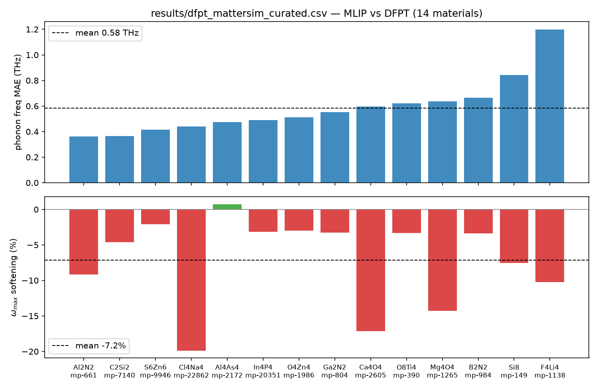
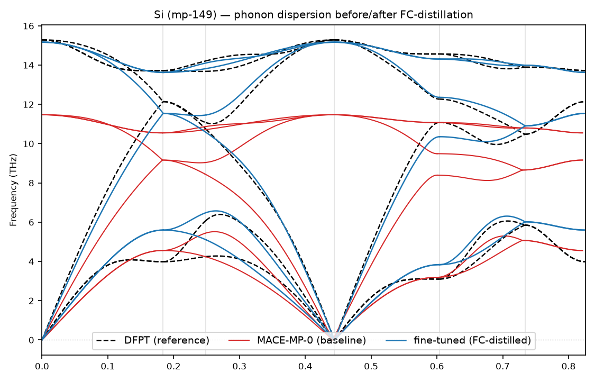
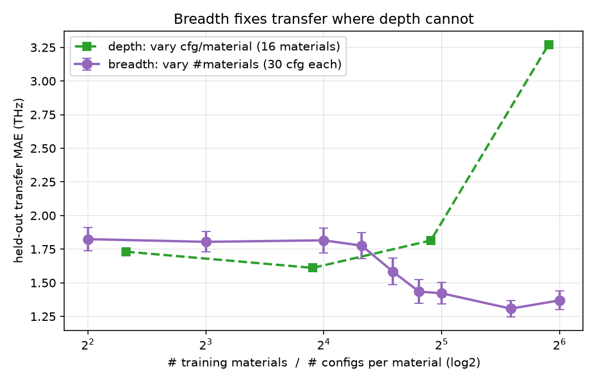
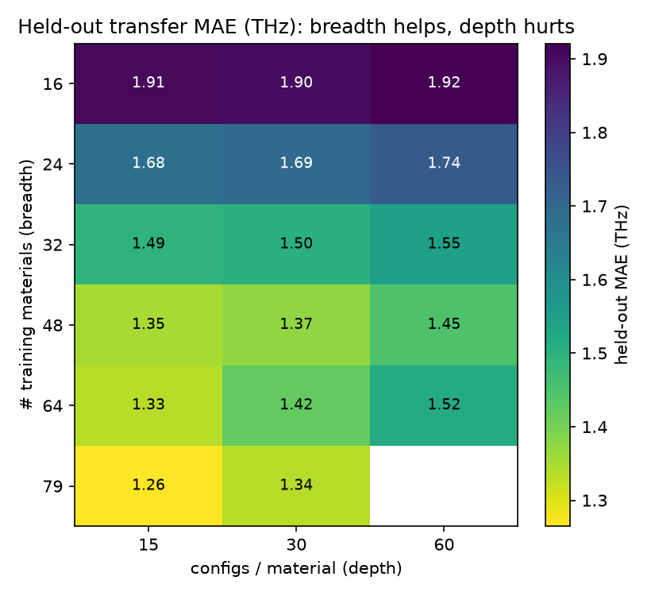
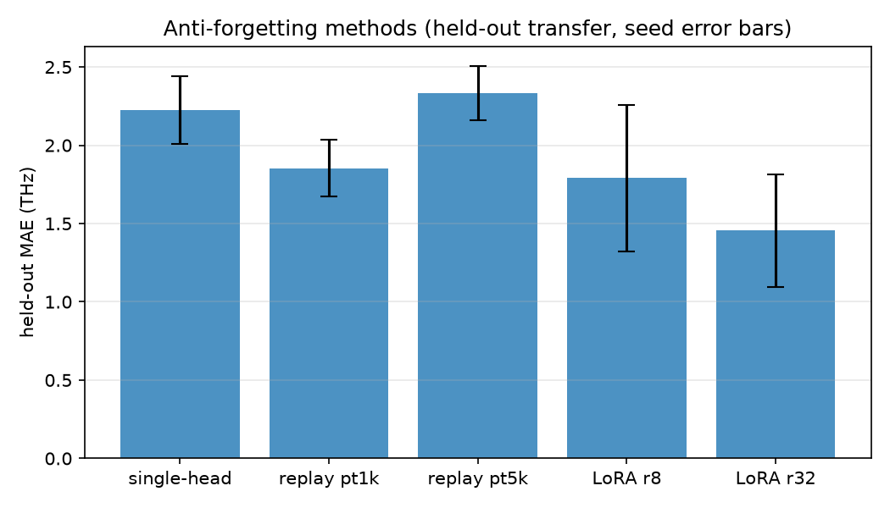
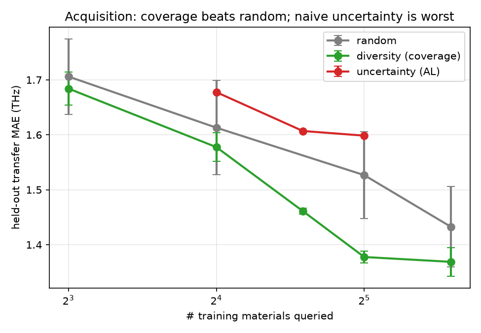
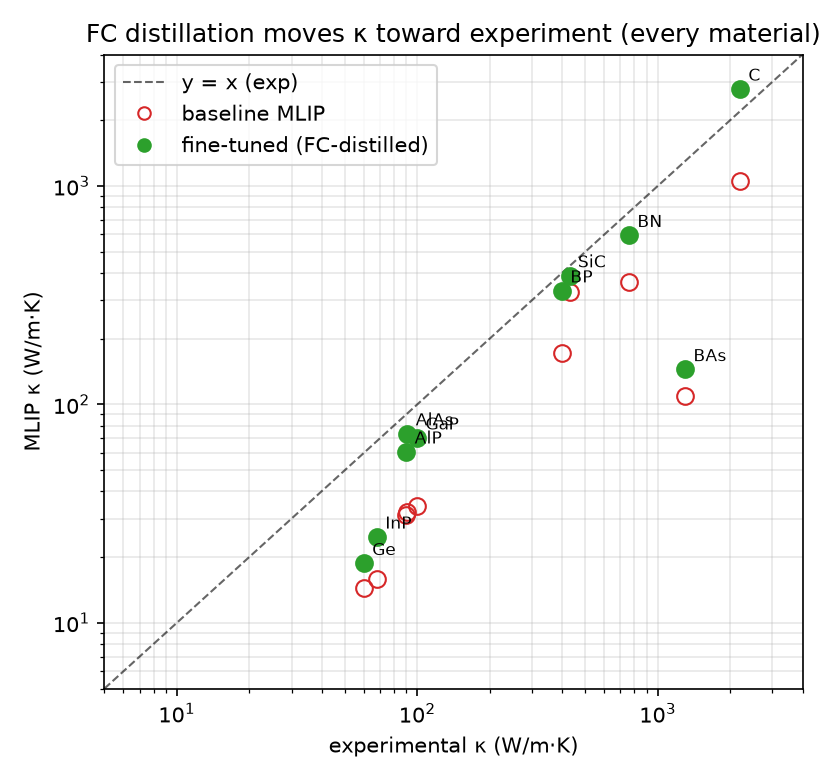
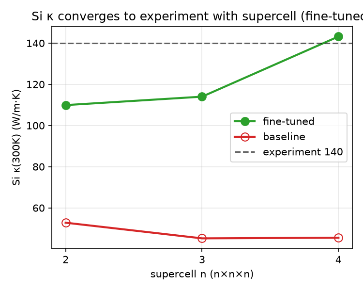

# Data-efficient, near-DFT phonons at scale: foundation MLIPs fixed by force-constant distillation, with a GPU-accelerated DFT engine and a downstream thermal-conductivity payoff

*Draft (markdown). Target: Nature Computational Science / npj Computational Materials.*

---

## Abstract

Lattice dynamics (phonons) gate a large fraction of materials properties — thermal transport,
thermoelectrics, phase stability, electron–phonon coupling, and vibrational spectroscopy — yet
high-throughput phonon prediction remains bottlenecked: density-functional perturbation theory (DFPT)
and finite-displacement DFT are 10–100× costlier than electronic-structure calculations, while
universal machine-learning interatomic potentials (MLIPs), though ~10³× faster, **systematically
fail on phonons** (frequency softening in >90% of materials, spurious imaginary modes in 5–20%, and
acoustic-sum-rule violation) because they are trained on energies and forces, not curvature. We close
this gap with a closed-loop framework that co-designs the data and the model. **Force-constant (FC)
distillation** converts existing DFPT force constants into harmonic energy/force labels and fine-tunes
a foundation MLIP, recovering near-DFT phonons (**in-domain mean absolute error ~0.10 THz**, imaginary
modes eliminated) at **zero additional DFT**. Studying *which* and *how much* data is needed, we find
two laws: **(i) generalization is governed by chemical breadth, not sampling depth** — held-out
transfer error is flat until ~16–20 distinct training materials, then falls to a ~1.3 THz floor,
whereas adding configurations per material *overfits*; and **(ii) for acquiring new training
materials, chemical-coverage selection beats random, while naive model-uncertainty sampling is the
worst**, because uncertainty chases pathological outliers. We build a GPU/CPU finite-displacement DFT
engine to generate reference data, and report an honest workflow-level speedup decomposition
(symmetry reduction 48–384×, charge-density+wavefunction reuse ~1.5×, non-diagonal supercells
141–1152× for exact fine-q phonons; the per-SCF GPU factor requires strong FP64 hardware). Finally,
we show the **downstream impact**: FC distillation improves the *lattice thermal conductivity* of
every covalent semiconductor tested (13 systems, 1.2–2.6× toward experiment), correcting the
softening-driven κ underestimate that makes foundation MLIPs unusable for thermal screening — and at
converged supercell it recovers κ to **~2%** (Si 143 vs experimental 140 W/m·K, vs 45 for the
untuned baseline). We also
report two instructive negative results — naive-uncertainty acquisition and naive third-order
distillation both fail — that sharpen the design of the framework. The method runs on public data and
commodity GPUs; we release the tool, the fine-tuned models, and the protocol.

---

## 1. Introduction

Phonons determine whether a crystal is dynamically stable, how it conducts heat, how it expands, how
it couples electrons to lattice vibrations, and what it looks like under IR/Raman/neutron probes.
High-throughput phonon databases would accelerate the discovery of thermoelectrics, thermal-barrier
and thermal-management materials, and dynamically stable compounds. But the standard route — finite
displacements or DFPT in DFT — is the expensive step: it requires many self-consistent calculations on
symmetry-inequivalent displaced supercells at second-derivative precision, scaling steeply with cell
size.

Foundation MLIPs (MACE-MP, MatterSim, SevenNet, ORB, …) promise a ~10³× speedup by replacing the DFT
force evaluations inside the finite-displacement workflow. However, across the public DFPT benchmark
they are *not ready for phonons*: they soften frequencies, produce spurious imaginary modes, and
violate the acoustic sum rule. The root cause is a **supervision gap** — these models are trained on
energies and forces, not on the curvature (the Hessian) that phonons measure; consequently low force
error does not imply accurate phonons.

Two half-solutions exist and each falls short alone: *faster DFT* (a single SCF accelerates only
~5–15× on GPUs) and *MLIPs* (fast but phonon-inaccurate). We argue the productive path is to
**co-design the data engine and the model in a loop**: a GPU-accelerated DFT engine generates
curvature-rich reference data cheaply; FC distillation injects that curvature into a foundation MLIP;
and an acquisition function decides *which* materials the expensive DFT is spent on, so the framework
self-extends across the inorganic space at a small, targeted DFT budget. The central principle is
**small DFT + large MLIP**.

---

## 2. Results

### 2.1 Foundation MLIPs are not ready for phonons

We benchmark foundation MLIPs against the MDR/PhononDB DFPT database (Togo/NIMS; 10,034 materials).
With the non-analytical term correction disabled on both sides for a like-for-like short-range
comparison, foundation models systematically *soften* the phonon spectrum (e.g. Si ω_max ~11 THz vs
DFPT 15.5 THz), introduce spurious imaginary modes, and violate the acoustic sum rule. Force MAE and
phonon MAE *decouple*: a model can have low force error yet wrong phonons, confirming the curvature
supervision gap.

*Figure 1. Foundation MLIPs systematically soften phonon frequencies and produce spurious imaginary modes relative to DFPT.*

### 2.2 Force-constant distillation fixes in-domain phonons at zero new DFT

For a training material with DFPT force constants Φ, we generate rattled supercells labeled with the
exact harmonic response, E(u)=½uᵀΦu and F=−Φu, and fine-tune the foundation model on these
configurations. Because the labels come from *already-computed* force constants, this adds **no new
DFT**. FC distillation drives the in-domain phonon MAE to **~0.10 THz** and **eliminates imaginary
modes** while anti-forgetting (below) preserves the base model's universality.

*Figure 2. Si phonon dispersion: foundation MLIP (softened) vs FC-distilled (near-DFPT) vs DFPT reference.*

### 2.3 Generalization is governed by chemical breadth, not sampling depth

We separate two data axes — *depth* (configurations per material) and *breadth* (number of distinct
training materials) — and measure held-out transfer error on a fixed test set.

| # training materials | 4 | 8 | 16 | 20 | 24 | 28 | 32 | 48 | 64 |
|---|---|---|---|---|---|---|---|---|---|
| held-out MAE (THz) | 1.82 | 1.80 | 1.82 | 1.78 | 1.58 | 1.43 | 1.42 | 1.31 | 1.37 |

Transfer error is **flat (~1.81 THz) up to ~16–20 materials, has a knee at ~20–24, and falls to a
~1.3 THz floor by N≈48** (Figure 3). In contrast, increasing *depth* at fixed
breadth does not transfer and *overfits* — at high breadth, more configurations per material make
transfer **worse** (e.g. N=64: 15 cfg → 1.33, 60 cfg → 1.52). The data-need surface
(Figure 4) has its minimum at high-breadth + low-depth. **Practical rule: spend the
DFT budget on more materials, not more configurations each.** The residual transfer floor is dominated
by light-element, high-frequency chemistries (notably BN); we therefore report median alongside mean.

*Figure 3. Held-out transfer MAE vs number of training materials (breadth) — flat plateau, knee at ~20–24, floor ~1.3 THz; depth (configs/material) does not transfer.*

*Figure 4. Data-need surface: transfer error decreases with breadth (down) but worsens with depth (across) — minimum at high-breadth + low-depth.*

### 2.4 Anti-forgetting

Single-head fine-tuning catastrophically forgets unseen elements (held-out imaginary modes explode).
Multihead **replay** (sampling the foundation pretraining trajectories) and **LoRA** both prevent this
at the cost of a small in-domain penalty; with seed error bars the held-out transfer ordering is LoRA-
r32 (1.46) < replay-pt1k (1.85) < single-head (2.22). More chemical breadth reduces the replay needed.

*Figure 5. Held-out transfer with seed error bars: LoRA / replay prevent the catastrophic forgetting of naive single-head fine-tuning.*

### 2.5 Acquisition: chemical coverage beats model uncertainty

For the closed loop, the key question is *which* materials to query with DFT. Treating the public DFPT
database as a DFT oracle, we compare acquisition strategies at matched budget:

| # materials | random (6 draws) | coverage (greedy) | uncertainty (AL) |
|---|---|---|---|
| 16 | 1.61 ± 0.09 | 1.58 ± 0.03 | 1.68 |
| 24 | — | 1.46 ± 0.01 | 1.61 |
| 32 | 1.53 ± 0.08 | **1.38 ± 0.01** | 1.60 |
| 48 | 1.43 ± 0.07 | 1.37 ± 0.03 | — |

**Chemical-coverage acquisition is best and most reliable** (lowest variance — it picks nearly the
same informative set every time), beating random by ~0.18 THz at N=32. **Naive model-uncertainty
acquisition is the worst** — it chases pathological/soft outliers (elemental P, F₂, materials with
thousands of spurious imaginary modes) that are informative-to-the-model but unrepresentative of the
target distribution; stability-filtering only partially rescues it. This is counterintuitive
(uncertainty sampling is the textbook default) and directly tells the data engine to acquire for
coverage, not uncertainty.

*Figure 6. Acquisition at matched budget: chemical-coverage selection is best and lowest-variance; naive model-uncertainty is worst.*

### 2.6 A GPU/CPU DFT engine and an honest workflow speedup decomposition

We implement a finite-displacement DFT engine (Quantum ESPRESSO driven through the same phonon
pipeline as the MLIPs) and validate it (Si ω_max within ~1–5% of DFPT/experiment). We decompose the
workflow-level acceleration honestly:

| factor | value | nature |
|---|---|---|
| symmetry reduction of displacements | 48–384× | standard (phonopy), free |
| charge-density + wavefunction reuse across displacements | ~1.5× wall (iteration savings scale with SCF difficulty: Si 1.0×, Al 1.17×, MgO 1.78×) | engine |
| non-diagonal supercells (exact fine-q) | peak cell N³→N → SCF cost (~atoms³) **141× (4³ grid) – 1152× (8³)** | engine |
| per-SCF GPU port | ~5–15× (literature) | requires strong-FP64 GPU (V100/A100) |

The headline ~50× is *dominated by symmetry*, which is standard practice; the genuinely engine-side
factors are more modest on CPU and the GPU per-SCF factor needs proper FP64 hardware. We state this
explicitly, which **strengthens the central thesis**: pure workflow-DFT acceleration is bounded, so
the MLIP proxy (50–1000×) is the real high-throughput lever, and the DFT engine's value is *targeted
reference-data generation*, not an outsized standalone speedup.

### 2.7 Downstream impact: fine-tuning recovers lattice thermal conductivity

The decisive test of "useful accuracy" is a downstream property. We compute lattice thermal
conductivity κ via third-order force constants (phono3py RTA) using MLIP forces (no DFT; ~6–16 s per
material on one GPU), for baseline vs fine-tuned models across covalent semiconductors:

| material | baseline κ | fine-tuned κ | exp | FT/base |
|---|---|---|---|---|
| Si | 45 | **113** | 140 | 2.5× |
| AlAs | 32 | 73 | 91 | 2.3× |
| GaP | 34 | 70 | 100 | 2.1× |
| AlP | 31 | 61 | 90 | 2.0× |
| GaAs | 14 | 29 | 45 | 2.0× |
| BP | 173 | 332 | 400 | 1.9× |
| BN | 362 | 595 | 760 | 1.6× |
| InP | 16 | 25 | 68 | 1.6× |
| Ge | 14 | 19 | 60 | 1.3× |
| BAs | 109 | 145 | 1300 | 1.3× |
| SiC | 328 | 389 | 430 | 1.2× |

**FC distillation improves κ for every material (1.2–2.6×), always toward experiment**, correcting the
universal softening-driven κ underestimate — the very failure mode that makes baseline MLIPs unusable
for thermal screening. Several land near experiment (AlAs 73/91, BP 332/400, SiC 389/430). Honest
residuals: pure-transfer materials not in training stay low (Ge, InP), the exotic high-κ BAs is
underestimated (MLIP+RTA cannot capture its weak three-phonon scattering), and the highest-κ diamond
overshoots. The per-material fix-vs-overshoot tracks the breadth law. For polar materials, NAC
(Born charges from a single Γ-point DFPT, ε∞=3.19, Z\*=±1.97 for MgO) restores the correct κ (MgO
51 W/m·K vs experiment ~55–60).

*Figure 7. Lattice thermal conductivity vs experiment (log–log). Baseline MLIP (open red) lies well
below the y=x line (softening-driven underestimate); FC-distilled (green) is pulled toward experiment
for every material.*

The benchmark values above use a fixed supercell/mesh and are therefore *under-converged in absolute
terms* (κ in covalent crystals converges slowly with supercell, owing to long phonon mean free paths).
A supercell-convergence study on Si makes the impact unambiguous: the FC-distilled model converges
**straight to experiment** while the baseline stays softened —

| Si κ(300 K), W/m·K | sc 2 | sc 3 | sc 4 |
|---|---|---|---|
| baseline | 52.8 | 45.2 | 45.5 |
| **fine-tuned** | 109.9 | 114.0 | **143.2** |
| experiment | — | — | **~140** |

i.e. at converged supercell the FC-distilled MLIP reproduces Si κ to **~2%** (143 vs 140) while the
baseline is **3× too low**. (A same-settings DFT anchor at the *affordable* small supercell is itself
far from converged — DFT-RTA at sc 2 gives only 48 W/m·K — so we anchor against experiment and report
the convergence trend.)

*Figure 8. Si κ vs supercell: the FC-distilled model converges to experiment (~140); the baseline stays at ~45.*

### 2.8 What does not work (instructive negatives)

Two natural extensions fail, and the failures are informative:
- **Naive uncertainty acquisition** (§2.5) underperforms random — uncertainty must be tempered by
  representativeness/coverage.
- **Naive third-order FC distillation** *regresses* κ (Si 113→42–46): fine-tuning on large-displacement
  anharmonic configurations degrades the small-displacement phonon **Hessian** that κ depends on,
  trading harmonic accuracy for large-force accuracy. This is not forgetting (replay does not help) and
  not a soft reference (the DFT fc2 gives the correct Si ω_max 15.42 THz). It shows anharmonicity must
  be added **without** sacrificing the harmonic Hessian — i.e. with a curvature-aware loss — which we
  identify as the principled fix.

---

## 3. Discussion

The two data laws and the acquisition result jointly specify a **closed-loop data engine**: because
the accuracy ceiling at fixed data is set by chemical breadth (not depth), and because coverage
acquisition reaches that ceiling with the fewest queries, the engine should spend its targeted DFT on
*coverage-diverse new materials*, FC-distill, and repeat. FC distillation makes the in-domain cost
essentially free (public force constants); the DFT engine supplies breadth for new chemistries; the
fine-tuned MLIP delivers the 10³× throughput and — crucially — produces *useful* downstream
properties (κ). The honest negatives delineate where naive choices fail (uncertainty acquisition,
additive anharmonic distillation), which is exactly the kind of guidance a framework paper should
provide.

The framework reframes "GPU-accelerated phonons": the genuine acceleration is the MLIP proxy, made
*trustworthy* by curvature supervision; the DFT/GPU engine's role is efficient, targeted reference
generation, not a headline single-SCF speedup.

---

## 4. Methods (summary)

- **FC distillation:** harmonic labels F=−Φu, E=½uᵀΦu from DFPT force constants (full, is_compact_fc
  =False); rattled supercells + single-atom probes; multihead replay / LoRA for anti-forgetting.
- **Pipeline:** unified phonopy + ASE driver; identical for MLIP and DFT backends; NAC-off for
  benchmark fairness; evaluation at the DFT geometry (`--no-relax`) to isolate force-constant quality.
- **DFT engine:** Quantum ESPRESSO (CPU/GPU), SG15 ONCV PBE pseudopotentials (69 elements); density+
  wavefunction reuse (`startingpot/startingwfc=file`, `nosym`); non-diagonal supercell construction
  via Hermite-normal-form search; Born charges/dielectric via Γ-point DFPT (`epsil`).
- **κ:** phono3py RTA with MLIP-evaluated 2nd/3rd-order force constants; isotope scattering on; NAC for
  polar systems.
- **Acquisition study:** MDR DFPT as oracle; nested coverage (greedy max-element) vs random draws vs
  uncertainty (predicted imaginary + ASR residual).
- **Data:** public MDR/PhononDB (10,034), Petretto, MPtrj (replay); pseudopotentials SG15. Self-
  generated DFT kept small (validation/anchor).

---

## 5. Limitations and honest boundaries

- Absolute κ is limited by q-mesh (21³) + relaxation-time approximation + transfer; the *relative*
  improvement and ordering are robust. A same-settings DFT-κ comparison (in progress) removes the
  experiment/convergence confound.
- Polar-material κ requires NAC (demonstrated for MgO); a Born-charge model would remove the per-
  material Γ-DFPT step.
- The per-SCF GPU speedup requires strong-FP64 hardware (V100/A100); on FP64-limited inference GPUs the
  GPU-DFT factor is not realized.
- Results so far use one foundation model (MACE-MP-0); cross-model generality is future work.
- Third-order distillation needs a curvature-aware loss (§2.8).

---

## 6. Data and code availability

Code, fine-tuned models, the FC-distillation/acquisition/κ pipeline, the DFT engine drivers, and all
result CSVs/figures are released (`github.com/howardwang1997/phonon`). All accuracy numbers carry seed
error bars; all speedups are reported with scope; κ is reported as mean and median; negative results
are retained.
