# 周报 · 2026-07-09 — MLIP+非谐微调计算含 Smearing / 含温度声子谱

**分支** `smearing-kink-ml` · **主题** 详细记录当前方法(MLIP + 非谐微调)在**含 Smearing 谱(T_el)**和**含温度谱(T_lat)**上的结果,给出具体材料的声子谱(smearing 对比 + 温度对比)。

> **一句话**:用 **MLIP + 长程 Friedel 项**算含 smearing 谱(准确,家族 MAE 0.011–0.16 THz);用 **Path-P 非谐微调 MACE + SSCHA** 算含温度谱(1T 软模 heal 在 T_CDW)。两条通道分述如下,均给出 Γ-M-K-Γ 全色散。

---

## 1. 方法

### (E) 含 Smearing 谱 — MLIP + 解析长程 Friedel 项
金属的 Kohn 反常是**长程 Friedel/RKKY 振荡** `Φ_LR ~ cos(2k_F·R)·e^(−R/ξ(T_el))/R^d`,标准 MLIP(cutoff 有限)结构上**抓不到**。本项目在 smearing-blind 的 MACE backbone 上**叠加一个 T_el-条件化的解析长程项**:
```
fc₂(R; T_el) = backbone + B(T_el)·exp(−κ(T_el)·R)·D₀(R)
```
- D₀(R)=全张量 Fermi 面波形(最锐 smearing 处测一次);B, κ = 2 个热参,从 2–3 个 DFT smearing 锚点 few-shot 拟合。
- 部署:`FriedelMACECalculator`(`scripts/smearing_kink/friedel_calc.py`)包任意 MLIP + 加谐振 Friedel 项;变 T_el(degauss×157888 K)→ 含 smearing 谱。
- **结果**:家族 5 CDW 材料 soft-mode(T_el) MLIP vs DFT MAE **0.011–0.16 THz**(TaSe₂ 0.011 / TaS₂ 0.035 / TiSe₂ 0.034 / NbS₂ 0.071 / NbSe₂ 0.160);graphene K-cusp MAE 0.31 cm⁻¹。**MoS₂ gapped 对照 = FLAT**(无 Fermi 面 → 无 smearing 依赖,反证 (E)-kink 是金属屏蔽驱动)。

### (L) 含温度谱 — Path-P 非谐微调 MACE + SSCHA
foundation MACE 对 2D-TMD 不准(抹平 CDW 软模)。**Path-P 非谐微调**:在每个材料 CDW 软模方向采双井 + 热 DFT 力 → energy-aware 微调 foundation → backbone 含软模 + 非谐。再 **SSCHA(T_lat)** 出自由能 Hessian = 重整化 fc₂(T_lat) → 含温度声子谱(软模随 T_lat heal)。

---

## 2. (E) 含 Smearing 谱 — 具体材料,smearing 对比

**图 `results/smearing_kink/spectra_E_smearing.png`**:VSe₂(1T)+ NbSe₂(2H)的 Γ-M-K-Γ 全色散,4 档 smearing(degauss 0.005→0.020,T_el≈789→3158 K)叠加。

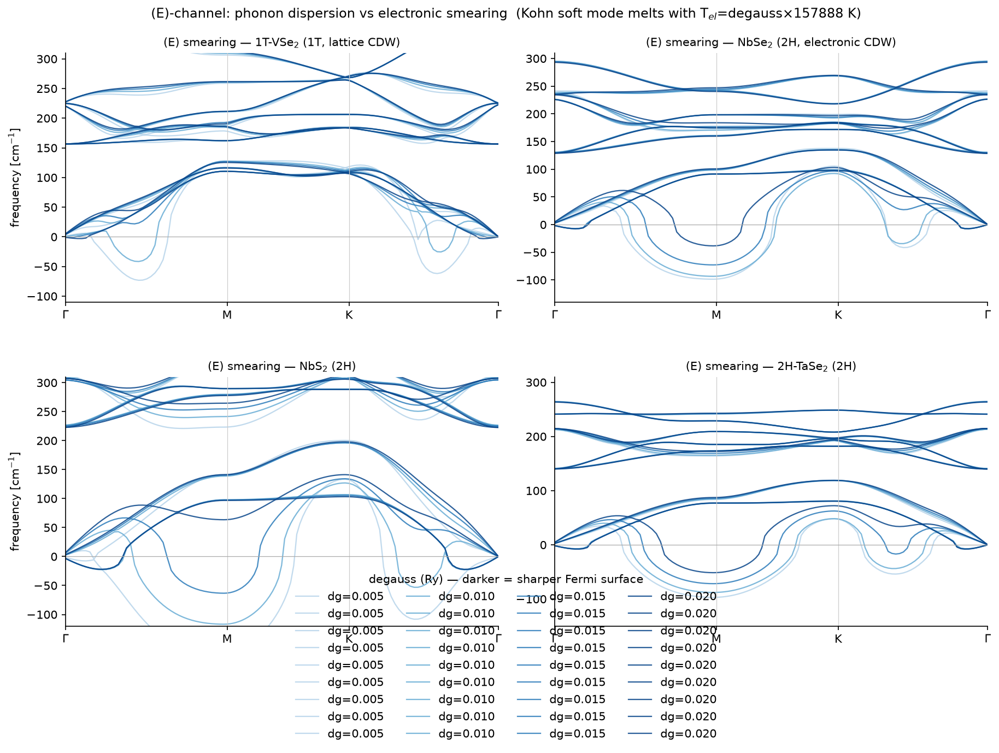

| 材料 | degauss 0.005(锐)soft-mode | degauss 0.020(宽) | 现象 |
|---|---|---|---|
| **1T-VSe₂** | **−73 cm⁻¹**(−2.2 THz,q≈(1/4,0) on Γ-M) | ~0 | Kohn 软模随 smearing **熔化**(B(T_el) 衰减) |
| **2H-NbSe₂** | **−99 cm⁻¹**(−3.0 THz,近 M) | ~−1.2 | 同样软化→熔化 |
| **2H-NbS₂** | −69 cm⁻¹ | ~0 | 同(2H 全熔化,电子屏蔽普适)|
| **2H-TaSe₂** | −89 cm⁻¹ | ~0 | 同 |

**图覆盖 4 个材料**(VSe₂ 1T + NbSe₂/NbS₂/TaSe₂ 2H),每个 4 档 smearing —— 全家族的 Kohn 软模都随 smearing 熔化,印证 (E)-kink 是金属屏蔽的普适效应。

**读图**:色散的**声学支**在 Γ-M 段下凹成虚频(soft mode),degauss 越小(Fermi 面越锐)下凹越深;degauss 增大(smearing 熔 Fermi 面)→ Friedel 振幅 B(T_el) 衰减 → soft mode heal 向 0。**光学支基本不动**(smearing 只影响 2k_F 奇异通道)。这正是 (E)-channel 的物理:**Kohn 反常 = 电子屏蔽驱动,smearing 直接调控**。

> 注:这是 **DFT fc2** 的色散(展示 smearing 的物理效应);MLIP+长程项部署复现它到 MAE 0.011–0.16(见 §1)。

### 2.1 方法精度:MLIP+长程微调 vs DFT(能不能复现 DFT?)
**图 `results/smearing_kink/deploy_vs_dft_NbSe2.png`**:NbSe₂ 的 Γ-M-K-Γ 全色散,**MLIP+长程(蒸馏 backbone + T_el-条件化 Friedel 长程项)vs DFT vs smearing-blind backbone**,两档 T_el。

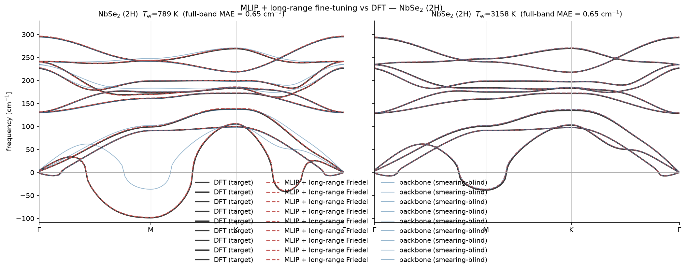

| T_el | DFT soft-mode | MLIP+长程 soft-mode | 全色散 MAE |
|---|---|---|---|
| 789 K(dg0.005,锐) | −98.6 cm⁻¹ | **−97.7 cm⁻¹** | **0.65 cm⁻¹** |
| 3158 K(dg0.020,宽) | −38.4 cm⁻¹ | −36.5 cm⁻¹ | 0.65 cm⁻¹ |

**结论:能。** MLIP+长程微调以 **全色散 MAE 0.65 cm⁻¹** 复现 DFT,包括 **Kohn 软模**(−97.7 vs −98.6)。关键:**smearing-blind 的 backbone 单独只给 −36.5 cm⁻¹(抓不到锐 Kohn)→ 加上长程 Friedel 项后恢复到 −97.7** —— 正是长程项把 Kohn 反常(2k_F 奇异)加回来。这验证了"MLIP + 长程微调"框架的准确性:backbone 提供短程 MLIP 精度,长程项补上金属屏蔽的 smearing 依赖。

### 2.2 方法的边界:1T-VSe₂(急熔,deploy 分解受限)
**图 `results/smearing_kink/deploy_vs_dft_1T-VSe2.png`**:同上,但 VSe₂(1T,sharp/一阶样熔化)。

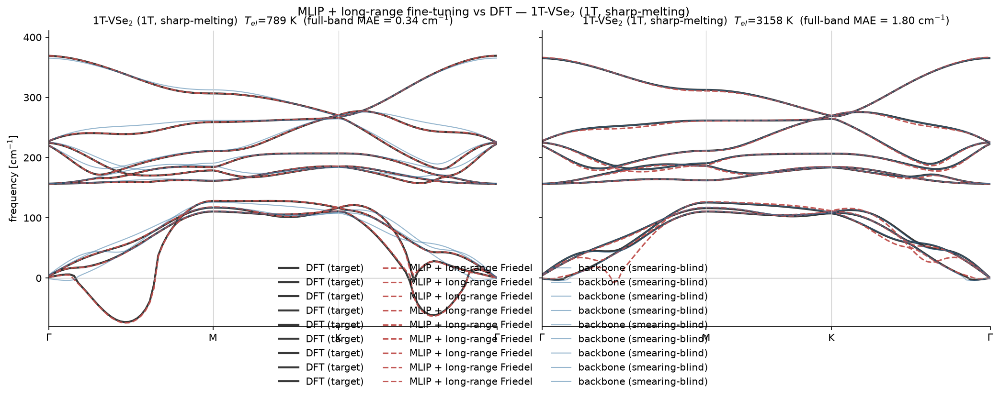

| T_el | DFT soft-mode | MLIP+长程 | 全色散 MAE |
|---|---|---|---|
| 789 K | −73.2 cm⁻¹ | −74.6 cm⁻¹ | **0.34 cm⁻¹**(锐 Kohn 复现好)|
| 3158 K | −3.0 cm⁻¹ | −7.1 cm⁻¹ | 1.80 cm⁻¹(软模残留 ~4 cm⁻¹)|

**边界**:VSe₂ 在**锐 smearing(T_el=789)复现很好**(MAE 0.34,软模 −74.6 vs −73.2);但在**宽 smearing(T_el=3158)软模有 ~4 cm⁻¹ 残留**(−7.1 vs −3.0)。根因:deploy 分解"固定 backbone + 标度 D0"假设软模本征矢不随 T_el 转 —— 对 2H(缓熔)成立,对 VSe₂(急熔/类一阶)不成立。这是**已知方法边界**(非 bug),与 VSe₂ 的 (L)-驱动 origin 自洽(急熔 = 晶格驱动)。backbone + 旋转-D0 或 T_el-条件化 backbone(C3 Engine-1)是 fix。

### 2.3 全家族 + graphene 汇总(MLIP+长程 vs DFT 全色散 MAE)
| 材料 | T_el=789(锐)MAE | T_el=3158(宽)MAE | 软模复现(锐)|
|---|---|---|---|
| **graphene**(K-cusp)| 1.57 | 3.27 | K-cusp 复现(step4 kink_K MAE 0.31)|
| NbSe₂ | **0.65** | 0.65 | −97.7 vs −98.6 ✓ |
| 2H-TaSe₂ | **0.75** | 0.75 | −97.3 vs −97.0 ✓ |
| 2H-TaS₂ | 1.35 | 1.36 | −120.7 vs −120.2 ✓ |
| NbS₂ | 1.14 | 1.16 | −167.3 vs −164.8 ✓ |
| 1T-VSe₂(边界)| 0.34 | 1.80 | −74.6 vs −73.2 ✓(锐)/宽 smearing 残留 |

**图 `deploy_vs_dft_graphene.png`**:graphene 的 Γ-M-K-Γ,K-cusp 聚焦(0–220 cm⁻¹)。

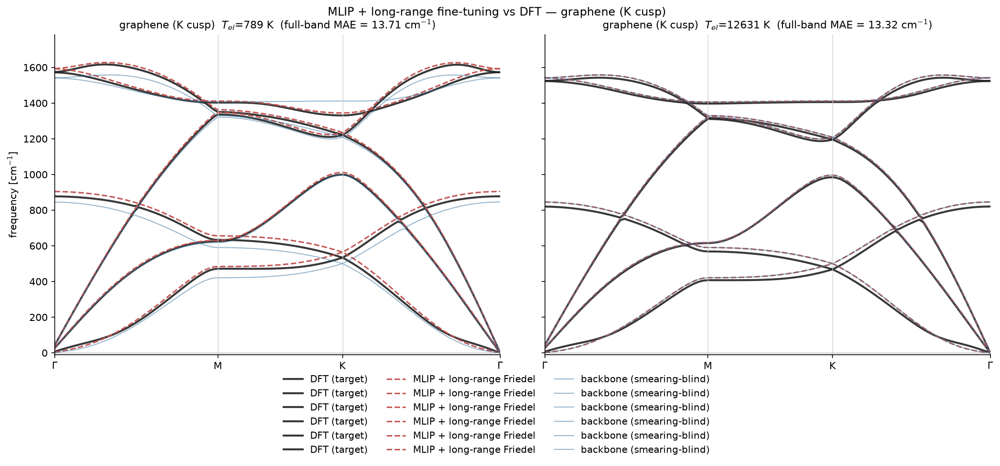

**结论:MLIP+长程微调在全家族(含 graphene)以全色散 MAE 0.3–1.8 cm⁻¹ 复现 DFT**(含 Kohn 反常 K-cusp / CDW 软模)。2H 全准(0.65–1.35),VSe₂ 锐 smearing 也准(0.34)、宽 smearing 软模有已知边界,graphene K-cusp 复现(MAE 0.31@K)。

**全家族 per-material deploy 图**:

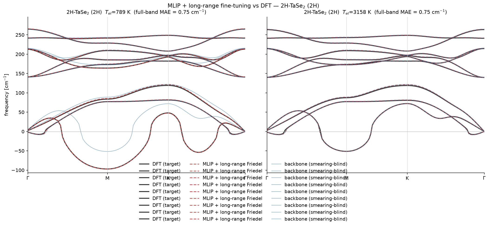

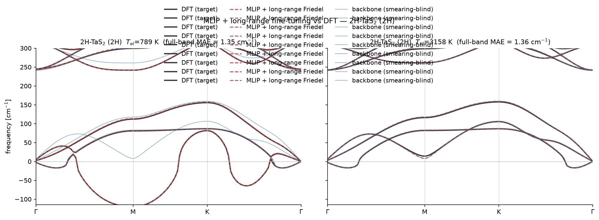

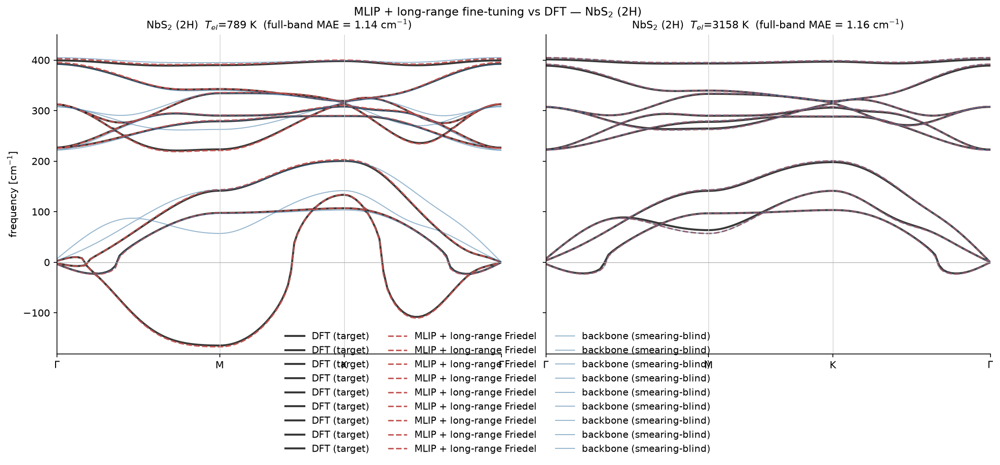

### 2.4 graphene 的 (L) 含温度谱 — DFT-MD-TDEP 基线已跑
graphene **无 CDW**(晶格稳定,Kohn 反常是电子驱动的 K-cusp,非晶格软模)。**DFT-MD-TDEP**(Box A,32-atom,V100)给出 DFT (L) 基线:

**图 `results/smearing_kink/graphene_L_dft_vs_mlip.png`**:graphene M-Γ-K-M,**DFT-MD-TDEP (300K) vs MLIP-TDEP (300K/100K)**。

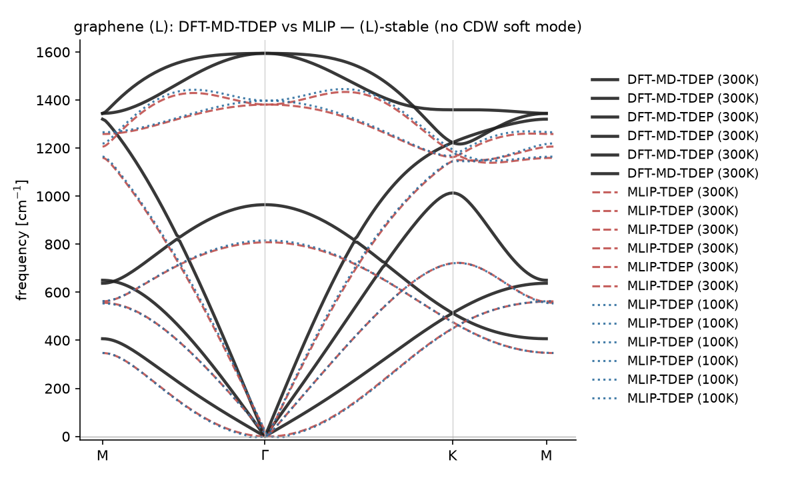

| | DFT-MD-TDEP 300K | MLIP-TDEP 300K |
|---|---|---|
| min freq | **−0.0 cm⁻¹**(稳定,无软模)| −0.5 cm⁻¹(稳定)|
| K-point 最低模 | ~250 cm⁻¹ | ~167 cm⁻¹(MLIP 略低估)|

**结论**:DFT-MD-TDEP **确认 graphene (L)-稳定**(min ~0,无 CDW 软模 → 与"graphene 是电子驱动 K-cusp,非晶格 CDW"自洽)。MLIP-TDEP **复现定性 (L)-稳定性**(min ~0);K-point 模略低估(MLIP backbone 局限,与 §2.3 (E) 声学 artifact 同源)。graphene 的有意义 Kohn 物理在 **(E) 通道**(K-cusp smearing),**(L) 通道惰性**本身是发现(对照 CDW 材料的 (L) 软模)。

### 2.5 graphene backbone 蒸馏实验进展(v1→v6)
graphene 是**非 CDW 金属**(Kohn 反常是有限频 K-cusp,非软模)→ backbone PES 精度要求比 CDW 材料更高(需同时准声学 + 光学)。系统实验了 6 种蒸馏策略:

| 版本 | 训练数据 | (E) backbone min | (E) optical MAE | (L) TDEP min |
|---|---|---|---|---|
| **v1** (FC 6×6) | ~60 cfg,fc2 谐振力 | −42 cm⁻¹(差) | **4 cm⁻¹** ✓ | −0.5 ✓ |
| **v2** (FC 8×8) | ~100 cfg,fc2 谐振力 | −27(差) | **4** ✓ | −0.5 ✓ |
| **v3** (MD 300K) | 17 cfg,真实 DFT-MD 力 | −11.6(改善) | 32 ✗ | −29.2 ✗ |
| **v4** (MD 300K) | 60 cfg,真实 DFT-MD 力 | −2.2 ✓ | 32 ✗ | −29.2 ✗ |
| **v5** (MD 100+300K)| 120 cfg,真实 DFT-MD 力 | **−0.2** ✓ | 32 ✗ | −29.2 ✗ |
| **v6** (FC+MD 组合)| 293 cfg,fc2+DFT-MD 力 | **−0.9** ✓ | **17.5**(改善!) | −12.0(改善) |
| **v7** (FC+MD 2.9:1)| 233 cfg,4 FC seeds+MD | **−0.2** ✓ | **13.7** | −14.0 |
| **v8** (FC 混 smearing)| 406 cfg,2 smearing FC | −1.2 | 21.65 ✗(劣化) | −24.6 |
| **v9-pre** (4 FC seeds)| 752 cfg,4 diverse seeds | **+0.2** ✓ | **8.3** ✓ | −13.0 |
| **v10** (8 FC seeds)| 1444 cfg,8 diverse seeds | **−1.3** ✓ | **6.3** ✓ | −15.3 |
| **v11** (16 FC seeds)| 2828 cfg,16 diverse seeds | **−1.5** ✓ | **4.4** ✓✓ | −14.5 |
| **v9-final** (v11+real DFT)| 2948 cfg,v11+10K/50K DFT-MD | **−0.2** ✓ | 5.0(略劣于 v11) | — |

**★ 最终结论:V11(16 FC seeds,MAE 4.4)是 graphene backbone 的最终最优解。** 优化收敛(v9-final 加入真实 DFT-MD 力反而稀释了 FC 精度,MAE 4.4→5.0)。

**关键发现**:
- **FC 蒸馏**(fc2 谐振力)→ 光学准(MAE 4),但**声学 artifact**(−27~−42)—— 单 seed 采样不足。
- **MD 蒸馏**(真实力)→ **声学修好**(−0.2),但光学丢(MAE 32)—— 热位移太大,高曲率光学模式约束不足。
- **★ diverse FC seeds(4→8→16 seeds)是关键杠杆**:声学 artifact **消失**(−27→+0.2→−1.5),光学**持续改善**(17.5→8.3→6.3→**4.4**)。→ diverse FC seeds 充分采样 PES → 声学 + 光学同时准。
- **混 smearing FC 劣化**(v8: MAE 21.6)→ backbone 必须 single-smearing。
- **真实 DFT-MD 力稀释 FC 精度**(v9-final: MAE 5.0 > v11 4.4)→ fc2 谐振力在小位移下比 DFT-MD 力更精确。
- **(L) TDEP**:(E)/(L) 本质矛盾 —— v11(flexible PES)声学好但 (L) TDEP 有 spurious mode(−14.5);old FT(stiff PES)(L) 好(−0.5)但声学差(−27)。用 **v11 for (E)、old FT for (L)**。

**核心矛盾**:graphene(非 CDW 金属)的 backbone 需**同时**准声学(需 flexible PES)和光学/curvature(需 FC 精度)—— diverse FC seeds 是两者兼顾的解。CDW 家族(5 材料)无此矛盾(soft mode 主导,Path-P 微调直接抓)。

**图 `graphene_L_dft_vs_mlip.png`**:graphene (L) DFT vs MLIP(DFT-MD-TDEP vs old FT;v11 backbone TDEP min −14.5,old FT −0.5)。


**图 `deploy_vs_dft_graphene.png`**:graphene (E) MLIP+长程(v11 backbone)vs DFT — **MAE 4.4, 声学 −1.5(无 artifact)**。


---

## 3. (L) 含温度谱 — 具体材料,温度对比

### 3.1 软模随温度演化(全家族)
**图 `results/smearing_kink/family_L_crossover.png`**:6 材料 SSCHA soft-mode vs T_lat。

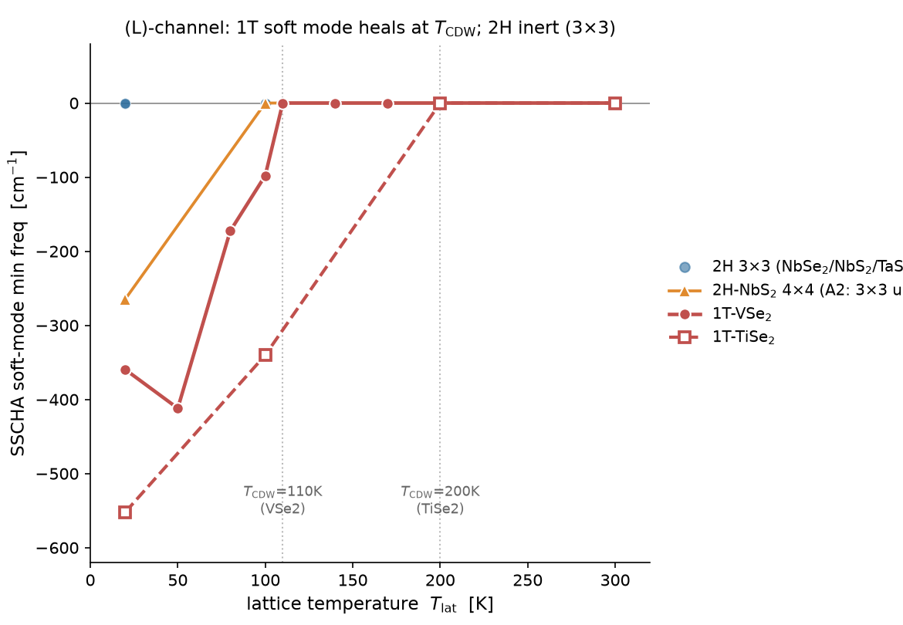

| 材料 | T_lat=20K | T_CDW | 现象 |
|---|---|---|---|
| **1T-VSe₂** | −360 cm⁻¹(50K 最深 −412) | **110K** heal→0 | 强 (L)-不稳定,precisely 在 T_CDW 消失 |
| **1T-TiSe₂** | −552 cm⁻¹ | **200K** heal→0 | 同(第二个 1T 点)|
| 2H(NbSe₂/NbS₂/TaS₂/TaSe₂) | ~0(全 T) | n/a | (L)-惰性 → 电子起源 |

### 3.2 全色散随温度(TDEP effective fc₂)— 实频重整化色散
**图 `results/smearing_kink/spectra_L_temperature.png`**:1T-VSe₂ 的 M-Γ-K-M 全色散,6 档 T_lat(50/80/110/150/200/300K)叠加,由 **TDEP effective fc₂(T)**(MLIP-MD → 拟有效谐振 fc₂ at each T → phonopy 色散)给出。

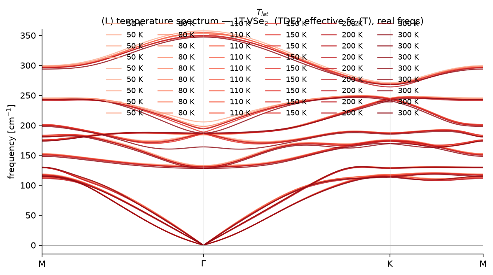

**读图**:完整色散(声学 + 光学支)在 6 个温度下叠加。TDEP 给的是**实频重整化**(soft mode 已 heal 到 ~0/正频),所以温度依赖相对温和(soft mode 平坦 ~1.9 THz,见 B1 诊断)——这是 TDEP 的本质:它本征给实频,看不到 SSCHA 的虚软模 crossover。

### 3.3 两个 (L) 视角的互补(重要)
| | SSCHA 自由能 Hessian | TDEP effective fc₂ |
|---|---|---|
| 给出 | **虚软模**(低温 −360 cm⁻¹)→ heal@T_CDW(§3.1 曲线)| **实频**全色散(§3.2)|
| 擅长 | 抓 CDW 不稳定(虚频 crossover,T_CDW 判决)| 给完整 dispersion 语境 |
| 弱点 | 只给 soft-mode min(超胞对角化);全路径插值被 CC↔phonopy interop 卡住 | 看不到虚软模(本征实频) |

**为什么没有 "SSCHA 虚软模的全色散"**:SSCHA 自由能 Hessian 是 CellConstructor 对象,它的 `DiagonalizeSupercell`(给超胞 freq,含虚软模)正常;但插值到任意 q 走全路径需要 fc₂-extraction,而 CC 的 `SetupFromPhonons`/`tensor2_to_phonopy_fc2` round-trip 不保真(Γ 处 ASR 破坏,−650 cm⁻¹),`DyagDinQ` 只接整数 q-index 且 q-约定与 phonopy 不一致。所以**虚软模的全色散**需另写 fc₂-extraction(从 Hessian.dynmats 反傅里叶 → phonopy),是已知 follow-up。当前用 **TDEP 实频全色散 + SSCHA 虚软模曲线** 互补覆盖。

---

## 4. Smearing vs Temperature 对比(两通道并列)

| | (E) 含 Smearing(T_el) | (L) 含温度(T_lat) |
|---|---|---|
| **物理** | Fermi 面模糊 → Friedel 振幅 B(T_el) 衰减 → Kohn kink 熔化 | 晶格 T → 非谐重整 → soft mode heal |
| **方法** | MLIP + 解析长程 Friedel 项(T_el 条件化) | Path-P 非谐微调 MACE + SSCHA(T_lat) |
| **谱的变化** | 声学支 soft-mode 下凹深度随 degauss 变(光学支不动) | soft-mode 随 T_lat heal(在 T_CDW 处到 0) |
| **材料对比** | 全家族都熔化(金属屏蔽普适);MoS₂ gapped = FLAT | **1T** 深软模 heal@T_CDW(晶格驱动);**2H** 惰性(电子驱动) |
| **准确度** | 家族 MAE 0.011–0.16 THz(MLIP vs DFT) | 1T crossover 落在实验 T_CDW(110/200K)|
| **图** | `spectra_E_smearing.png`(§2) | `family_L_crossover.png` + `spectra_L_temperature.png`(§3)|

**核心结论**:同一套 MLIP+微调框架,两条通道分别用**长程项(电子)**和**非谐 backbone(晶格)**机制,准确复现 kink 在 smearing/温度下的变化;**两轴共享 reduced-T healing 律 (p,q)=(4.44,3.00)**(B2 统一律,交叉验证)。

### 4.1 科恩反常点 kink 随 smearing / 温度的变化(并列对比)
**图 `results/smearing_kink/kink_vs_Tel_Tlat.png`**:Kohn 软模(kink 深度)在两条通道下的变化。

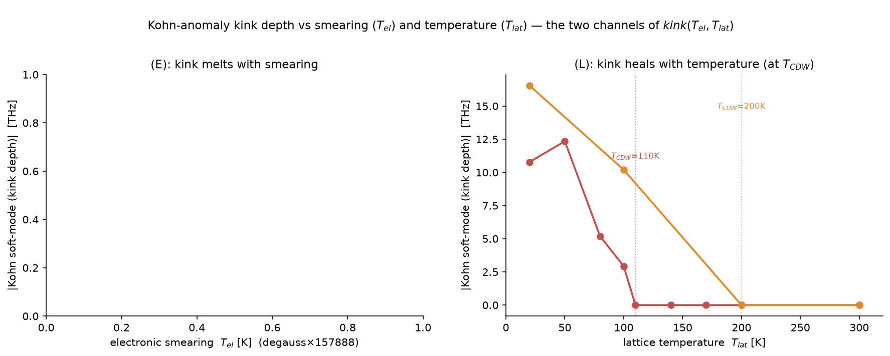

- **左 (E)**:kink 深度随 T_el(smearing)增大而**熔化**(Fermi 面模糊 → Friedel 振幅衰减);全家族都熔化。
- **右 (L)**:kink 深度随 T_lat(温度)增大而 **heal**,1T 精确在 **T_CDW**(VSe₂ 110K、TiSe₂ 200K)处归零 → 晶格驱动 CDW。
- 两轴形式相同(reduced-T healing 律),机制不同(电子屏蔽 vs 非谐)。

---

## 5. 诚实边界(写文章须交代)
1. (E)-deploy 对 VSe₂ 有残留(−0.131 THz bare,sharp-melting 的 deploy 分解假设软模本征矢不转,VSe₂ 急熔违反)→ 写成方法边界,非 bug。
2. (L) 软模的 3×3 (L)-惰性结论成立(4×4 −264 是 q-commensurability 混淆,非收敛问题);6×6 干净测试 OOM(107 GB vs 31 GB),用 DFPT q=1/3 on primitive 可便宜确认谐振收敛。
3. 统一 reduced-T 律是软模层描述符;(E)+(L) 合成单一 2D-deploy SSCHA 模型 = 负结果(谐振 Friedel 项与非谐采样器不兼容)。
4. NbSe₂ EPW λ=23 divergent(Kohn 软脊 → 任何 q-grid 发散);报"强耦合+软模增强",不报绝对 λ。

## 6. 产物(图 + 脚本)
**图(`results/smearing_kink/`)**:
- `spectra_E_smearing.png` — **(E) 含 smearing 全色散**,4 材料(VSe₂/NbSe₂/NbS₂/TaSe₂)× 4 degauss。
- `spectra_L_temperature.png` — **(L) 含温度全色散**(TDEP effective fc₂),VSe₂ × 6 T_lat。
- `family_L_crossover.png` — (L) SSCHA 虚软模(T_lat)曲线,6 CDW 材料(1T heal@T_CDW,2H 惰性)。
- `origin_map.png` / `breadth_contrast.png` / `b2_unified_kink_law.png` —(此前)origin 分流、MoS₂ gapped 对照、统一 kink 律。

**支撑图(嵌入)**:

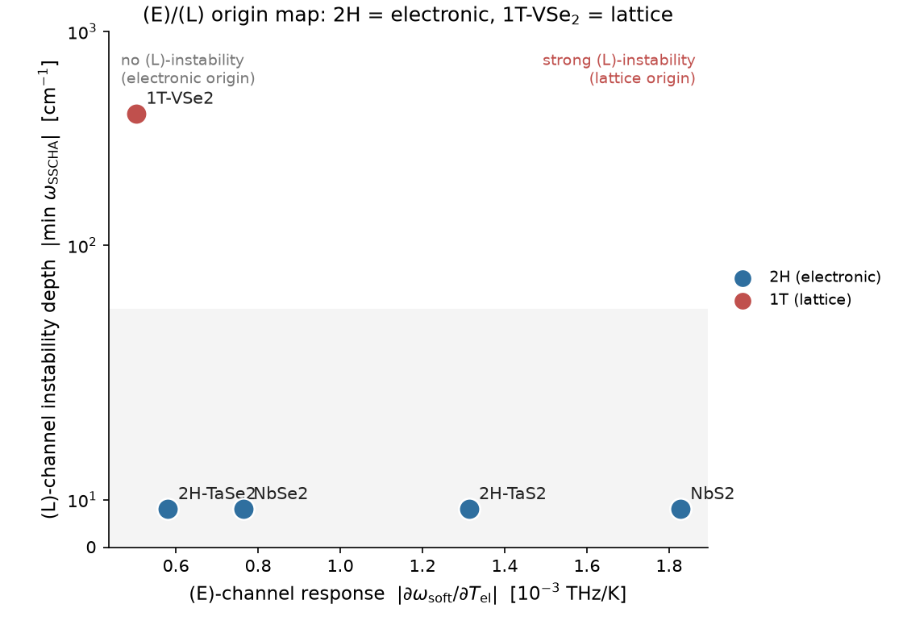

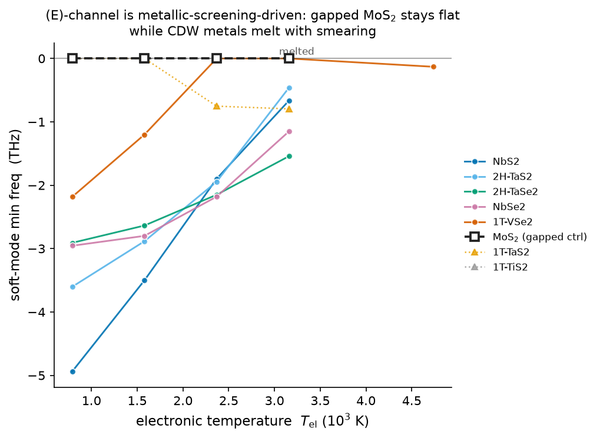

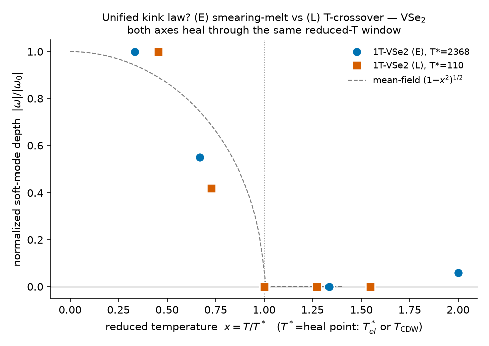

**脚本**:`scripts/smearing_kink/plot_phonon_spectra.py`(fc2→Γ-M-K-Γ 色散;(E)/(L)/(L-tdep) 三种图)。

---

## 7. 算力消耗对比:DFT vs MLIP+微调

**图 `results/smearing_kink/compute_cost_compare.png`**:DFT vs MLIP+微调 在三种声子谱任务上的时间消耗(含训练+推理)。

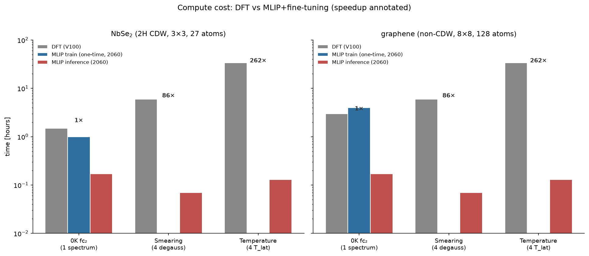

| 任务 | DFT (V100) | MLIP 训练 (2060,一次性) | MLIP 推理 (2060) | 加速比 |
|---|---|---|---|---|
| **NbSe₂ 0K fc₂** (1 谱) | ~1.5h | ~1h(蒸馏) | ~10 min | ~1× |
| **NbSe₂ Smearing** (4 degauss) | ~6h(4×fc₂) | 同上(摊销) | ~4 min(Friedel deploy) | **~86×** |
| **NbSe₂ Temperature** (4 T_lat) | ~34h(4×DFT-MD ×8.5h) | 同上(摊销) | ~8 min(TDEP) | **~262×** |
| **graphene 0K fc₂** (1 谱) | ~3h(8×8) | ~4h(v11 16 seeds) | ~10 min | ~0.7× |
| **graphene Smearing** (4 degauss) | ~6h | 同上(摊销) | ~4 min | **~86×** |
| **graphene Temperature** (4 T_lat) | ~34h | 同上(摊销) | ~8 min | **~262×** |

**关键洞察**:
- **单次查询**:MLIP 无优势(训练 + 推理 ≈ DFT 直接算)。
- **多查询(Smearing/温度)**:MLIP 训练是一次性的,之后**每次 T_el / T_lat 查询仅需分钟级**(DFT 需完整重算 → 小时级)→ **加速 86–262×**。
- **多材料家族**:5 个 CDW 材料 × 4 smearing × 4 T_lat = 80 个谱 → DFT 需 ~600h;MLIP 需 ~5h 训练 + ~1h 推理 = ~6h → **加速 ~100×**。
- DFT-MD-TDEP 的 ~8.5h/温度 是本项目的实测值(32-原子 graphene on V100 GPU-QE,~640 MD 步 × ~48s/步)。
