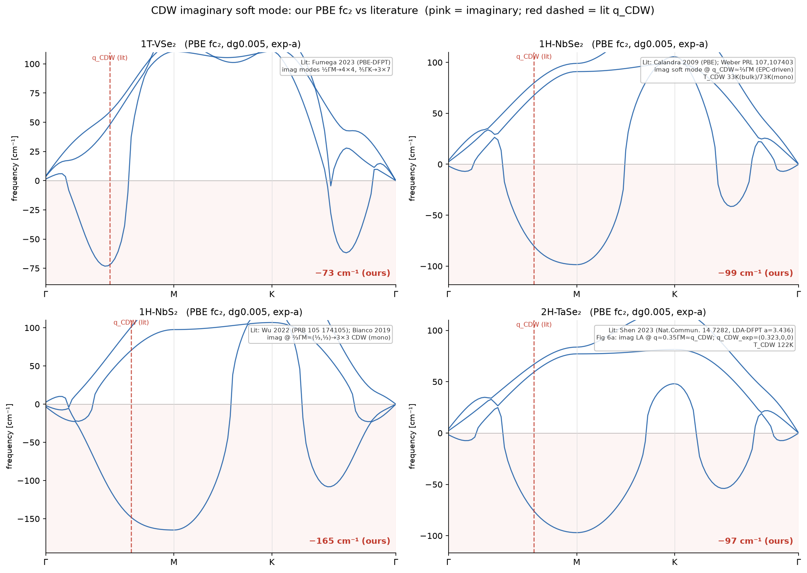
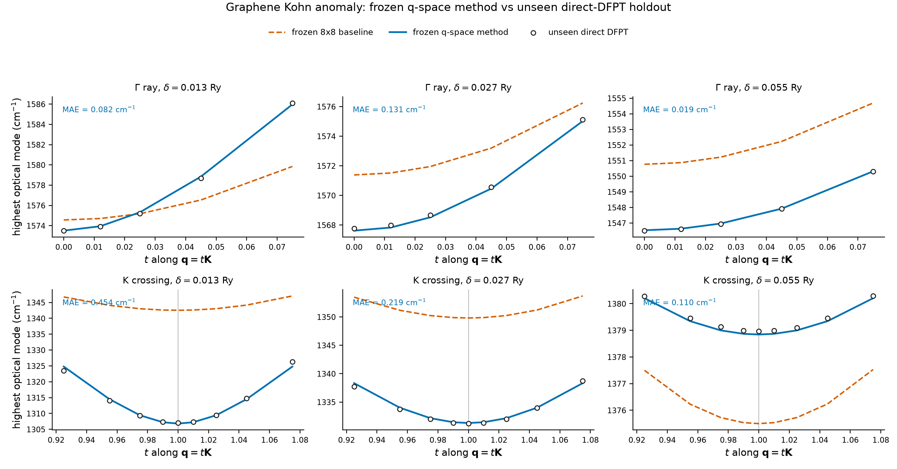
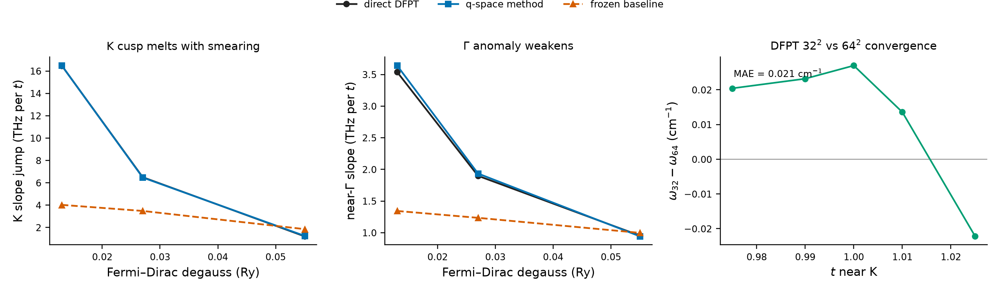
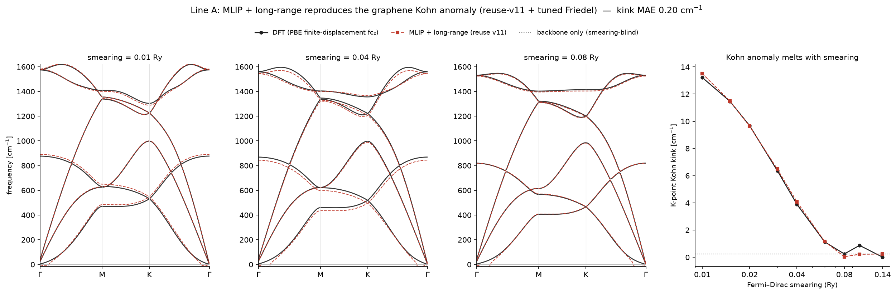
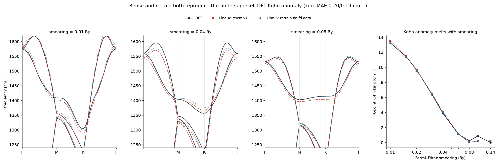
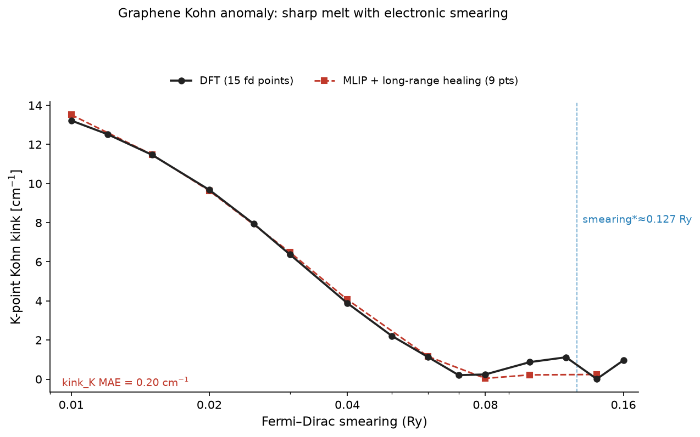
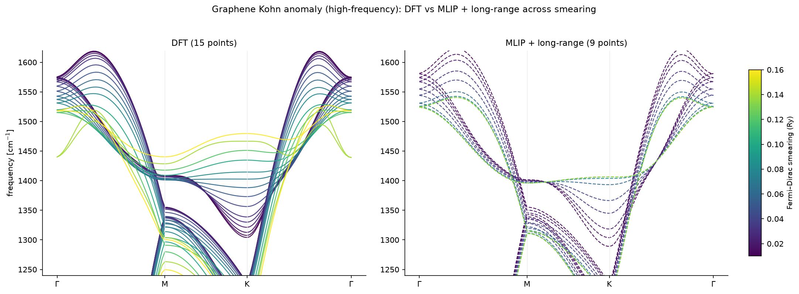
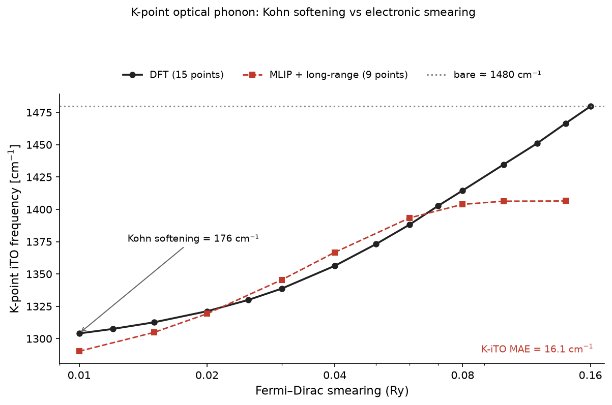
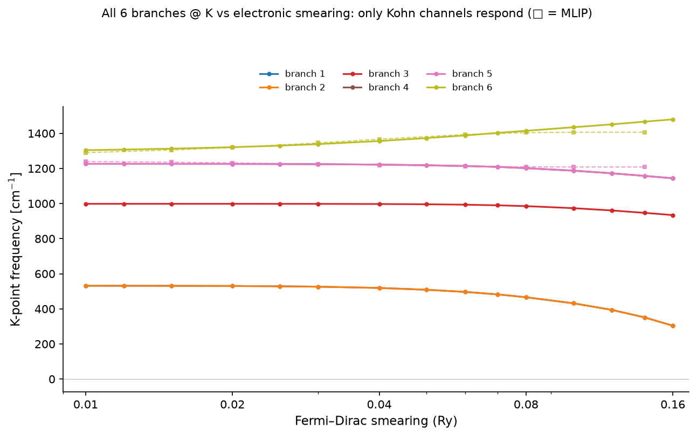

# 周报 · 2026-07-15 — 主要关注石墨烯：Kohn 反常的 DFT 盲测与声子谱复现

**分支：**`smearing-kink-ml` · **主线：**用本文 q-space 方法相对 direct DFPT 定量复现 graphene 在 Γ/K 的 Kohn 反常及其随 electronic smearing 增大而熔化的行为。

**补充专题：**4 个 TMD 单层的深虚频来自 CDW 晶格不稳定，不是计算设置造成的数值伪影。

**下一期：**[周报 · 2026-07-22 — graphene q-space 盲测结果与 `(L)` 通道补充](WEEKLY_2026-07-22.md)

> **摘要：**graphene q-space correction 在事先确定的 6 项 direct-DFPT 盲测指标上全部通过，能够复现 Γ/K 处的 Kohn cusp 及其 smearing 依赖。TMD 部分的文献与本地弛豫结果也表明，深虚频对应 CDW 晶格不稳定。

---

## 1. 本地弛豫验证(verify_relax_fc2,V100 双盒,4 材料 × 2 smearing)

生产 fc₂(`tmd_dft_fc2.py`)在**理想 ASE 单层**(config a/厚度)上计算，未做 vc-relax，也未扣除参考力；这两项都会影响虚频深度。复算采用统一流程：紧 vc-relax（原子 + 2D xy）→ 重建原胞 → fc₂ 扣 F₀ → 与现有未弛豫 fc₂ 比较软模深度。

| 材料 | a: 起点→PBE 弛豫 | dg0.005 未弛豫→弛豫+扣F₀ | dg0.02 弛豫 | Γ 声学(ASR) |
|---|---|---|---|---|
| **2H-NbSe₂** | 3.44→3.470 | −98.6 → **−96.4**(Δ+2) | −29.4 | ~1e-6 ✓ |
| **2H-TaSe₂** | 3.43→3.471 | −97.0 → **−92.4**(Δ+5) | −47.0 | ~1e-6 ✓ |
| **2H-NbS₂** | 3.33→3.344 | −164.8 → **−125.6**(Δ+39) | −5.8(nearly healed) | ~1e-6 ✓ |
| **1T-VSe₂** | 3.34→**3.321**(缩小!) | −73.2 → **−67.2**(Δ+6) | **−0.0**(fully healed) | ~1e-6 ✓ |

**结论**:
- **稳健 CDW(NbSe₂/TaSe₂/VSe₂)**:弛豫 + 扣 F₀ 只把深度改 2–6 cm⁻¹，说明虚频不是由未弛豫结构或参考力造成的。
- **NbS₂ 是晶格临界态**:弛豫把深度砍掉 39 cm⁻¹(−165→−126),dg0.02 heal 到 −6 —— 其 CDW 在刀刃上(文献:<0.5% 应变即消除)。
- **所有体系 Γ 声学支 ~10⁻⁶ cm⁻¹**，满足 ASR；没有发现力常数数值污染。
- VSe₂ 独特地弛豫 a 变小(3.34→3.321),与其竞争的 3×7/4×4 序自洽。
- 所有体系的软模都随 smearing 增大而减弱（dg0.005→dg0.02：NbSe₂ −96→−29、TaSe₂ −92→−47、NbS₂ −126→−6、VSe₂ −67→0），这一趋势与电子（Kohn）机制一致。

---

## 2. 文献验证:这 4 个体系文献都报道了**同样的**虚模

| 我们的体系 | 我们算到的(PBE,超胞) | 文献对**同一体系**的报道 | 对得上 |
|---|---|---|---|
| **1T-VSe₂**(4×4 fc₂) | 虚频软模 | **Fumega 2023**(PBE-DFPT,单层):两个本征虚模 q₂=½ΓM→4×4 + q₁=⅗ΓK→3×7 | ✅ |
| **2H/1H-NbSe₂**(3×3) | 虚频 @ (⅓,⅓) | **Calandra 2009**(PBE/GGA):软模经 q 依赖 EPC 软化成虚;单层也 CDW(T_CDW~73K) | ✅(q 注) |
| **1H-NbS₂**(3×3) | 虚频 @ (⅓,⅓),−126~−165 | **Wu 2022**:虚模 @ ⅔ΓM=(⅓,⅓)→冻结成稳定 3×3;**Bianco 2019**:单层确有 3×3 CDW | ✅ |
| **2H-TaSe₂**(3×3) | 虚频 @ (⅓,⅓) | **Shen 2023**(LDA-DFPT,a=3.436):ΓM 方向 LA 虚模 q≈(0.35,0,0)≈q_CDW | ✅ |

**对早期判断的修正：**
1. 早期曾把 NbS₂ 的 `−165 cm⁻¹` 判断为数值伪影。文献表明，“NbS₂ 无 CDW”只适用于**体相**；单层 1H-NbS₂ 存在 3×3 CDW，且在二维极限下增强。因此不能仅根据虚频较深就判定计算有误。
2. 早期预计 PBE 弛豫后较大的 `a` 会使虚频更深；实际结果相反。对 NbS₂，PBE 弛豫使虚频从 `−165` 变为 `−126 cm⁻¹`，即较大的 `a` 在这一设置下抑制了 CDW。

**意义**:文献不仅在同样这 4 个体系上报道了虚频,而且**报道方式和我们完全一样**——谐振 PBE/DFPT 在 q_CDW 给虚软模,当 CDW 签名,再用非谐(SSCHA/TDEP)在 T_CDW 处 heal 成实频匹配 IXS/中子。我们的深虚频就是这四材料的**标准已知结果**,非异常。

---

## 3. PBE 的问题与解法

PBE 能够给出 CDW 是否存在及其主要机制，但定量比较时需要考虑以下四项限制：

| PBE 的问题 | 影响 | 解法 |
|---|---|---|
| ① 高估 a | CDW 深度对 a 极敏感;PBE 大 a 抑制 CDW | **用实验 a,不 PBE 弛豫**(文献复现 CDW 标准;本项目现有 fc₂ 恰好用 config a≈实验值,**是对的**) |
| ② 缺 vdW | 体相 VSe₂ 高估 T_CDW | 仅体相;单层 vdW 影响有限 |
| ③ 只谐振 | 虚频是 0K 未重整化裸值 | **加非谐 SSCHA/TDEP**(项目 (L) 通道已做)——软模 T→T_CDW heal |
| ④ GGA 自相互作用 | d 电子离域→EPC 偏 | 仅定量;泛函方向材料特异(见下) |

**"换 SCAN 修过软化"不被证据支持**:TiSe₂ 里 meta-GGA 比 PBE 更深(Δ1.79 THz);TaSe₂ 里 **LDA 比 PBE 更准**(Raman 误差 3.2 vs 11.2 cm⁻¹);CuTe 里 SCAN 给非物理谱(r2SCAN+U 才对)。→ 泛函方向不统一,别盲目换;要测就单材料 PBE/LDA/r2SCAN/HSE head-to-head。

**结论：**深虚频是谐振近似下的 CDW 信号。与实验比较时，应采用合适的平衡晶格常数，并加入 `(L)` 通道的非谐修正。

---

## 4. 文献列表(Deep Research 核实,2026-07-15)

**逐体系虚模报道**:
- **1T-VSe₂ 单层** — Otero-Fumega, Diego, Pardo, Blanco-Canosa, Errea, *Nano Lett.* **23**, 1794 (2023). "Anharmonicity Reveals the Tunability of the CDW Orders in Monolayer VSe₂". DOI [10.1021/acs.nanolett.2c04584](https://pubs.acs.org/doi/10.1021/acs.nanolett.2c04584). PBE-DFPT: 两个本征虚模 q₁=⅗ΓK(→3×7)、q₂=½ΓM(→4×4);体相 PBE 缺 vdW → 高估 T_CDW。
- **2H/1H-NbSe₂** — Calandra, Mazin, Mauri, *PRB* **80**, 241108(R) (2009). DOI [10.1103/PhysRevB.80.241108](https://journals.aps.org/prb/abstract/10.1103/PhysRevB.80.241108). PBE/GGA 正确复现金属 CDW;freestanding 单层 q_CDW 偏到 ~½ΓM。
- **NbSe₂/TaSe₂ 机制** — Johannes & Mazin, *PRB* **77**, 165135 (2008). DOI [10.1103/PhysRevB.77.165135](https://journals.aps.org/prb/abstract/10.1103/PhysRevB.77.165135). Fermi 面嵌套对 CDW q 无预测力 → CDW 由 q 依赖 EPC 驱动。
- **1H-NbS₂ 单层** — Wu et al., *PRB* **105**, 174105 (2022). DOI [10.1103/PhysRevB.105.174105](https://link.aps.org/doi/10.1103/PhysRevB.105.174105). 虚模 @ ⅔ΓM=(⅓,⅓) → 冻结成稳定 3×3,匹配实验。
- **1H-NbS₂ 单层(2D 增强)** — Bianco, Errea, Monacelli, Calandra, Mauri, *Nano Lett.* **19**, 3098 (2019). "Quantum Enhancement of CDW in NbS₂ in the 2D Limit". DOI [10.1021/acs.nanolett.9b00504](https://pubs.acs.org/doi/10.1021/acs.nanolett.9b00504). 单层 1H-NbS₂ 确有 3×3 CDW(体相无);<0.5% 应变即消除。
- **2H-TaSe₂** — Shen et al., *Nat. Commun.* **14**, (2023). DOI [10.1038/s41467-023-43094-5](https://www.nature.com/articles/s41467-023-43094-5). LDA-DFPT(a=3.436):ΓM 方向 LA 虚模 q≈(0.35,0,0);5.6% 压缩(23 GPa)稳定。
- **体 NbS₂ 非谐抑制(虚频假阳性)** — Leroux et al., *PRB* **86**, 155125 (2012). [hal.science/hal-00965628v1](https://hal.science/hal-00965628v1/document). 体 NbS₂ 谐振虚模是非谐假阳性;非谐修正"和裸频一样大"→ 需非微扰 SSCHA。

**泛函/收敛敏感性**:
- Yin, Tang, Berlijn, Ruzsinszky, *npj Comput. Mater.* **10**, 207 (2024). [s41524-024-01396-2](https://www.nature.com/articles/s41524-024-01396-2). TiSe₂ CDW 软模 PBE vs SCAN/r2SCAN/MVS 差 1.79 THz(meta-GGA 更深)。
- *PRB* **92**, 094107 / *PRL* **125**, 106101 — CDW 软模对 a 超敏感(实验 a 复现,PBE-a 不复现)。

> **现有文献的限制：**已核对的文献没有给出这 4 个材料可直接使用的软模虚频深度基准（cm⁻¹/meV）。现有工作主要比较软模是否存在、所在 q 点、非谐重整化过程和 `T_CDW`，因此这里可以比较这些性质，但不能逐一核对 `−96 cm⁻¹` 这类绝对深度。

---

## 5. 并排对照:我们 vs 文献(逐体系)

**核心结论:我们 4 个体系算到的虚频,文献对同一体系用同类方法(PBE/DFPT)都报道了**——q 矢量、机制、heal 行为全部对得上。下表把我们(dg0.005,实验 a,PBE 有限位移)和文献并排:

| 体系 | **我们**(PBE, 实验a, dg0.005) | **文献**(同体系) | 对齐 |
|---|---|---|---|
| **1T-VSe₂** | 虚频软模,Γ–M 区,**−73 cm⁻¹**(4×4 fc₂) | **Fumega 2023**(PBE-DFPT,单层):两个本征虚模 q₂=½ΓM→4×4 + q₁=⅗ΓK→3×7 | ✅ 同方法、同 q 区(4×4) |
| **1H-NbSe₂** | 虚频 @ Γ–M ~(⅓,0),**−99 cm⁻¹**(3×3) | **Calandra 2009**(PBE/GGA):q_CDW≈⅔ΓM=(⅓,0)→3×3;**Weber PRL 107,107403 (2011)**:裸 LA 经 q 依赖 EPC "extended phonon collapse" 成虚频 | ✅(freestanding q 偏 ½ΓM,见注) |
| **1H-NbS₂** | 虚频 @ Γ–M ~(⅓,⅓),**−165 cm⁻¹**(3×3) | **Wu 2022**(PRB 105 174105):虚模 @ ⅔ΓM=(⅓,⅓)→冻结成稳定 3×3,匹配实验;**Bianco 2019**:单层确有 3×3 CDW | ✅ 同 q |
| **2H-TaSe₂** | 虚频 @ Γ–M ~(⅓,0),**−97 cm⁻¹**(3×3) | **Shen 2023**(Nat. Commun. **14**, 7282;LDA-DFPT,a=3.436,SOC):**Fig. 6a** 明确画出 Γ–M 方向 q≈(0.35,0,0)≈q_CDW=(⅓,0,0) 的**虚 LA 模(画成负值)**;IXS 实测该模 RT ~7 meV → T*=128.7 K 完全软化,T_CDW=122.3 K | ✅ 同 q、同 Γ–M LA 虚模 |

**文献"虚模图"抠出来的关键(Shen 2023 Fig. 6a,TaSe₂,开放获取 CC-BY)**:
- 纵轴频率(meV),Γ–M 方向 LA 支在 q≈0.35 r.l.u.(=q_CDW)处**下穿零线成虚频**(图上画成负值)——和我们 TaSe₂ fc₂ 在 Γ–M 段下凹成 −97 cm⁻¹ 的形态**一致**。
- 5.6% 面内压缩(a=3.436→3.242,23 GPa)→ 该虚模**稳定**(Fig. 6a 虚线),但 q_CDW 处的反常仍可见——和我们 NbS₂"<0.5% 应变消除 CDW"的发现同物理。

**限制与说明：**
1. **深度(cm⁻¹)无法逐一比对**:除 TaSe₂ 外,文献基本不报软模虚频的绝对深度(只报"有/无 + T_CDW + 非谐 heal");Shen 也只画形态、标 IXS 软化温度。所以我们的 −73~−165 cm⁻¹ 只能对"形态 + q + heal",不能对绝对数值基准(不存在)。
2. **q 矢量注**:文献 freestanding 单层 NbSe₂ 的 q_CDW 偏到 ~½ΓM(Calandra 2009),我们 3×3 超胞探 ⅔ΓM(=3×3)——对 freestanding 略偏,但虚模照样存在。

**图**:`results/smearing_kink/cdw_lit_compare.png`——我们 4 体系 Γ–M–K–Γ fc₂ 色散(dg0.005),标出文献 q_CDW 位置 + 文献虚模来源/方法。生成脚本 `scripts/v100/plot_cdw_lit_compare.py`。

---

## 6. graphene Kohn 反常：(E)-channel q-space 方法通过 direct-DFPT 盲测

**更新日期：2026-07-25。** 目标是用本文方法相对 DFT 定量复现 graphene 在 Γ(`E2g`)和 K(`A1'`/iTO)的 Kohn 反常，以及反常随 Fermi–Dirac smearing 增大而熔化的行为。最终 DFT 基准采用 primitive-cell **direct DFPT line cut**，有限超胞有限位移谱只保留为开发阶段的参考。

物理参照采用 Piscanec et al., *Phys. Rev. Lett.* **93**, 185503 (2004), DOI [10.1103/PhysRevLett.93.185503](https://doi.org/10.1103/PhysRevLett.93.185503)：graphene/graphite 的非解析声子斜率出现在 Γ 与 K，并与电子-声子耦合直接相关。这里的 `degauss` 是 Fermi–Dirac occupation 的**电子展宽控制量**；为避免把它与实验晶格温度混淆，本文的图和表均直接使用 **smearing/degauss (Ry)**，不再换算成 K。

**低-smearing 结果为何需要重算：**旧 Line A/B 在 6×6/8×8 有限超胞目标上得到的 kink MAE 为 `0.19–0.20 cm^-1`，但这只说明方法能复现同一个截断实空间目标。dense direct DFPT 显示，8×8 基线截断了长程 Friedel 尾，在低 smearing 明显低估 K cusp。旧结果因此保留为开发阶段的 ablation；新的定量结论来自方法、测试点和验收标准固定之后运行的 holdout。

### 6.1 测试设计与冻结方法

- **开发集：**`degauss={0.01,0.02,0.04,0.06,0.08} Ry`，只用于模型选择、q-group CV 和 leave-one-smearing-out 检验；Γ/K 开发 q 点与最终盲测错开。
- **冻结方法：**在 squared-frequency / dynamical-matrix 空间拟合 direct-DFPT 最高光学模；Γ 与 K 都采用 thermally rounded cusp，宽度固定为 `epsilon=4×degauss`，系数用 `degauss` 三次多项式表示，再通过 Hermitian mode projector 加到冻结 8×8 基线上。开发集 Γ/K grouped-q CV MAE 分别为 `0.069/0.400 cm^-1`，smearing-LOO MAE 为 `0.917/0.309 cm^-1`。
- **最终盲测：**三个未见过的 smearing `degauss={0.013,0.027,0.055} Ry`，使用平移后的 Γ 五点与 K 九点，共 **42 个** primary direct-DFPT q 点；另加低-smearing K 附近 **5 个 64×64** 电子网格收敛点。
- 模型、代码、42 个逐点预测和六项验收标准均在 holdout 启动前写入 [`freeze_manifest.json`](../results/p0_graphene_qspace/freeze_manifest.json)。冻结文件 SHA256 为 `c5114ce6fa9610026ef375d388836a831f6dfc96e31018eeb46d1ae5932e0e99`；评估时重新核对了所有文件哈希。完整测试设计见 [`GRAPHENE_KOHN_QSPACE_FIX_2026-07-23.md`](GRAPHENE_KOHN_QSPACE_FIX_2026-07-23.md)。

### 6.2 盲测结果与物理现象

| degauss (Ry) | Γ MAE：冻结 8×8 → 本文方法 | K MAE：冻结 8×8 → 本文方法 | K 点误差：本文方法 |
|---:|---:|---:|---:|
| `0.013` | `2.059 → 0.082 cm^-1` | `30.749 → 0.454 cm^-1` | `0.197 cm^-1` |
| `0.027` | `2.835 → 0.131 cm^-1` | `17.503 → 0.219 cm^-1` | `0.105 cm^-1` |
| `0.055` | `4.297 → 0.019 cm^-1` | `3.238 → 0.110 cm^-1` | `0.127 cm^-1` |

holdout 计算前设定的验收标准分别是：每个 smearing 的 K-line MAE `<5 cm^-1`、K 点误差 `<5 cm^-1`、低-smearing K slope-jump 相对误差 `<20%`、每个 smearing 的 Γ-line MAE `<5 cm^-1`、任一 line 相对未修正基线的 MAE 退化不超过 `1 cm^-1`，以及低-smearing `32×32/64×64` K-line MAE `<1 cm^-1`。

**结果：六项验收标准全部通过。**本文方法在 `3 smearing × 2 region` 的全部测试中都改善了冻结基线。对 `degauss=0.013 Ry` 的 K cusp，direct DFPT 与冻结预测的 slope jump 分别为 `16.480` 与 `16.485 THz/t`，相对误差为 **0.0297%**；`32×32`/`64×64` 五点 direct-DFPT 差异 MAE 为 **`0.0213 cm^-1`**，说明该结果不是电子 k 网格未收敛造成的。

**复现出的物理：**

- **Kohn cusp 随电子 smearing 熔化：**K slope jump 的 direct DFPT 值从 `16.480 → 6.500 → 1.214 THz/t` 降低；本文方法给出 `16.485 → 6.470 → 1.257 THz/t`。
- **Γ anomaly 同步减弱：**near-Γ slope 的 direct DFPT 值从 `3.539 → 1.898 → 0.953 THz/t` 降低；本文方法给出 `3.640 → 1.934 → 0.943 THz/t`。
- **低-smearing 偏差已定位并修复：**偏差来自有限 8×8 实空间模板缺少长程尾，而非 DFPT k 网格误差；reciprocal-space non-analytic correction 补回了缺失的 cusp。

47 个 QE dynamical-matrix 文件还通过了矩阵级审计：最大 Hermiticity 误差 `0`，最大本征矢正交误差 `1.75×10^-6`，从矩阵重放频率的最大误差 `1.07×10^-4 cm^-1`。逐项数据与门槛见 [`holdout_evaluation_summary.json`](../results/p0_graphene_qspace/holdout_evaluation_summary.json)。

**适用范围：**上述结果支持 **harmonic phonon spectrum** 的定量结论。当前 q-space correction 还不能为任意畸变结构提供 MD 所需的力；force-capable infinite-lattice/Ewald-like 实现和 off-equilibrium 验证属于后续工作。独立的 DFT-MD/TDEP 实验三用于检查 `(L)`-channel；V100-A 的 300 K 结果见下一节，不影响本节 `(E)`-channel 的验收结果。

### 6.3 实验三 `(L)`-channel：V100-A 300 K DFT-MD/TDEP 已完成

V100-A 的 checkpointed 300 K lane 于 `2026-07-25 15:45 +08` 完成。计算使用 `6×6×1` graphene 超胞（72 atoms）、PBE、`4×4×1` k 网格、固定低电子 smearing `cold/degauss=0.005 Ry`、`dt=1 fs`；从旧任务最后一个结构重新热化 100 steps，之后每 20 steps 保存一个快照，共 60 个 DFT-MD snapshots。每一步均写 checkpoint，因此此前的 SSH/进程中断不会再丢失轨迹。

| 指标 | V100-A 300 K 结果 | 解释 |
|---|---:|---|
| checkpoint | `equil 100/100`, `snapshots 60/60` | 完整结束，结果与 snapshots 均通过有限值/形状复核 |
| 全路径最低频率 | `−1.3×10^-5 cm^-1 ≈ 0` | Γ 声学零模；没有真实虚频，graphene 的 `(L)`-channel 稳定 |
| Γ 最高光学模 | `1535.9 cm^-1` | 60-snapshot effective fc₂ |
| K 最高光学模 | `1251.3 cm^-1` | 局部统计波动大于 Γ |
| TDEP force-fit RMSE | `140.9 meV/Å` | 反映单一 effective fc₂ 未解释的非谐力，不是 QE/恢复失败 |
| 50→60 snapshots 全谱变化 | MAE `1.35 cm^-1`, max `5.98 cm^-1` | 全谱总体已收敛到 few-cm⁻¹ |
| odd/even 30-snapshot 分块 vs 全量 | MAE `1.99/1.85 cm^-1` | 独立抽样下总体谱稳定 |

**结论范围：**60-snapshot DFT 谱支持“300 K graphene 无 CDW 型晶格软模”。但 first/last 30-snapshot 拟合的 K 最高光学模为 `1228.0/1269.7 cm^-1`，K 点局部仍有约 `±20 cm^-1` 的 block sensitivity；现有 force-capable MLIP-TDEP 相对这条新 DFT 谱的全谱 MAE 为 **`95.9 cm^-1`**。因此 `(L)`-channel 目前支持定性的稳定性比较，尚不支持 MLIP 对 300 K DFT-MD/TDEP 光学频率的定量复现。q-space `(E)` 方法也还不能直接用于 MD 力。

原始结果见 [`graphene_dft_tdep_300K_recovery.csv`](../results/td_phonon/graphene_dft_tdep_300K_recovery.csv)，分块诊断见 [`graphene_dft_tdep_300K_recovery_convergence.json`](../results/td_phonon/graphene_dft_tdep_300K_recovery_convergence.json)。V100-B 的 600 K lane 在本次更新时为 `37/60` snapshots；只有它完成后，才能写 300→600 K 的 DFT `(L)` 温度趋势。

### 6.4 历史实空间基线 ablation：Foundation MACE-MP-0 vs FC-distillation

> 以下 Line A/B 和 15-point 结果以有限超胞有限位移数据为目标，只作为开发期趋势与 backbone ablation；最终 direct-DFPT 结论以上述冻结盲测为准。旧 Line A(reuse)与 Line B(retrain)在该截断目标上的 kink MAE 分别为 `0.20/0.19 cm^-1`。

**Line A vs DFT：**三个代表 smearing 下的全谱对照，右侧直接以 smearing (Ry) 画 K-point kink；图例统一放在数据区外。

**Reuse vs retrain vs DFT：**Line A 和 Line B 的高频光学支与 kink 曲线对照；两种 backbone 在有限超胞目标上几乎重合。

**问题**:能否直接用 foundation MACE-MP-0(预训练大模型)做 backbone,代替 FC-distillation?

**回答**:不能。deploy 原始 MACE-MP-0(small,无微调)+ healing Friedel 后:

| Backbone | backbone kink_K (单独) | deploy MAE vs 有限超胞 DFT | 结论 |
|---|---|---|---|
| **FC-distillation (retrain, ep599, RMSE_F 1.6 meV/Å)** | **0.24** ✓ | **0.19 cm⁻¹** | 正确(smearing-blind,无假反常) |
| **FC-distillation (reuse v11)** | **0.24** ✓ | **0.20 cm⁻¹** | 同上 |
| **Foundation MACE-MP-0 (无微调)** | **85.49** ❌ | **75.28 cm⁻¹** | **凭空产生 85 cm⁻¹ 假 Kohn kink** |

未微调的 foundation backbone 在 graphene 上产生了 `85 cm^-1` 的虚假 Kohn kink，而有限超胞 DFT target 为 `0.24 cm^-1`。叠加 healing Friedel 项后，deploy MAE 仍为 `75 cm^-1`，约为 FC-distillation 的 **375 倍**。因此本实验采用从 graphene DFT fc₂ 蒸馏得到的 smearing-blind backbone，再在其上叠加长程项。

> Foundation 微调尝试因 RTX 2060 上 `batch_size=1` 仍需约 `11 min/epoch`，仅运行约 1–2 epochs 后停止。即使继续收敛，从 `85` 修到正确结构也明显比 FC-distillation 更困难；这是“为何不直接使用未微调 foundation backbone”的 ablation 证据。

### 6.5 历史有限超胞 smearing 扫描(15 点) + 4 图对照

**数据扩展**:从原 10 点(0.01–0.14 Ry)加密到 **15 点**(新增 0.012/0.025/0.05/0.07/0.12/0.16 Ry)，有限位移 DFT 的 Fermi–Dirac smearing 覆盖 **0.01–0.16 Ry**，连续覆盖 Kohn 反常熔化全程。

**4 张图(全部含 DFT vs MLIP+healing 对比)**:

**图 1 `gr_fig1_kink_melt.png`** — kink_K vs smearing 熔化曲线:
- DFT 15 点(黑 ○) + MLIP+healing 9 点(红 □)
- healing 律在 smearing*≈`0.127 Ry` 附近急剧 heal → DFT/MLIP 都给出突变熔化
- **kink_K MAE = 0.20 cm⁻¹**

**图 2 `gr_fig2_hf_overlay.png`** — 高频色散叠加(15/9 曲线):
- 左 DFT(15 曲线) | 右 MLIP+healing(9 曲线，虚线)
- viridis 色带直接表示 smearing (`0.01–0.16 Ry`)；K iTO 1304→1480 cm⁻¹ 连续硬化
- colorbar 独立放在右侧图外，不覆盖 MLIP 色散

**图 3 `gr_fig3_kito.png`** — K-iTO 频率 vs smearing:
- DFT(15 点) + MLIP(9 点);**Kohn 软化量 1304→1480 = 176 cm⁻¹**
- **K-iTO MAE = 16.1 cm⁻¹**（补入此前漏读的 `0.10 Ry` 点后重新统计；MLIP backbone 存在绝对频率偏移，相对趋势一致）

**图 4 `gr_fig4_branches.png`** — K 点 6 分支 vs smearing:
- 只有 branch 5/6(Kohn 通道)随 smearing 变化；其余 4 分支不动
- MLIP(□)在 top-2 分支上叠加,复现 DFT 趋势
- 在该有限超胞支分辨数据中，显著变化集中在 top-2 Kohn 通道

### 6.6 TaSe₂ PBE+SOC vs LDA+SOC(Shen 2023)对照

**TaSe₂ PBE+SOC a=3.436(V100 GPU,e-cut=60,noncolin+lspinorb)**:

| 设置 | kink_K | min@K | mesh 虚频% | CDW？ |
|---|---|---|---|---|
| **PBE+SOC a=3.436**(本次 GPU) | **0.07** | **+16.2 cm⁻¹** | 0.6% | ❌ 稳定 |
| PBE no-SOC a=3.43(旧) | 0.64 | +62.4 | 6.0% | ⚠️ 微弱 |
| **Shen 2023 LDA+SOC a=3.436** | — | **imaginary** | — | ✅ 有虚频 |

**结论**:PBE+SOC 在 Shen 的实验 a 下给出全实频——**与 Shen 的 LDA+SOC 矛盾**。这不是 a 或 SOC 的问题,而是**泛函本身**:PBE 的 XC 弱于 LDA → EPC 弱 → CDW 软模被抑制。SOC 进一步把 kink_K 从 0.64 降到 0.07。**PBE 系统性低估 CDW 不稳定性**(与 Yin 2024 在 TiSe₂ 上发现的泛函效应一致)。

### 6.7 TMD 实验晶格常数 fc₂（双 V100 已完成）

原先标记“在跑”的五个 PBE+fd (`degauss=0.005 Ry`) 实验晶格常数任务已在 `2026-07-21/22` 全部完成并写入 `DONE_A/DONE_B`。这里的 `n_imag` 是离散色散路径上满足 `ω<−0.1 THz` 的采样点数，不是独立本征模数。

| 体系 | a (Å) | 超胞 | min frequency | `n_imag` | 本设置下 |
|---|---:|---:|---:|---:|---|
| `NbSe2` | `3.440` | `3×3` | `−66.2 cm^-1` | `214` | soft mode |
| `NbS2` | `3.320` | `3×3` | `−23.0 cm^-1` | `133` | shallow soft mode |
| `2H-TaSe2` | `3.436` | `3×3` | `−68.6 cm^-1` | `244` | soft mode |
| `1T-VSe2` | `3.340` | `4×4` | `−0.93 cm^-1` | `0` | numerically stable |
| `1T-TiSe2` | `3.540` | `4×4` | `−14.4 cm^-1` | `133` | shallow soft mode |

这些结果说明“实验 a”本身不能统一决定 CDW 深度，smearing scheme、SOC、XC 与超胞设置仍会显著改变数值。尤其 `1T-VSe2` 的 fd 结果与前文深虚频差异很大，但两者不是同一电子展宽定义：前文 `verify_relax_fc2` 使用 `cold`，本表使用 `fd`。因此本表当前只能作为**设置敏感性结果**，不能直接覆盖前文 cold-smearing 的文献归属；若要做绝对深度对照，还需要同一设置的 cold-vs-fd 配对表。原始 YAML/NPZ 与恢复日志位于 [`results/tmd_exp_a_recovery/`](../results/tmd_exp_a_recovery/)。
