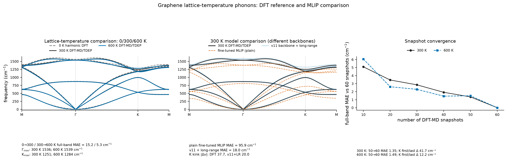
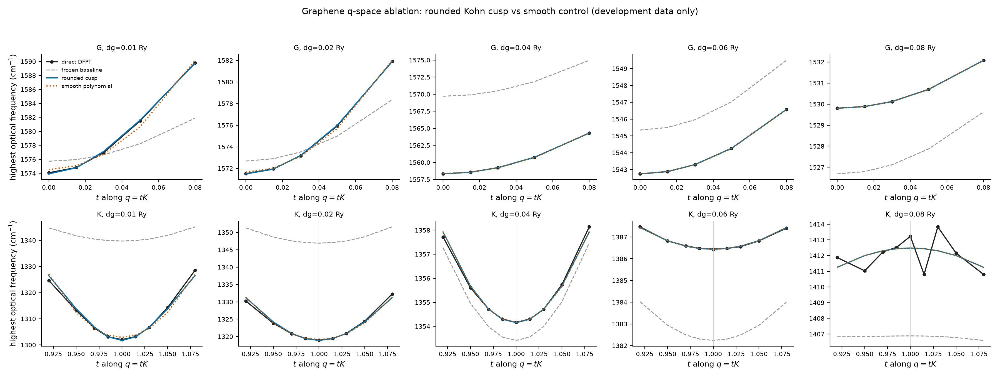

# 周报 · 2026-07-22 — graphene q-space 盲测结果与 `(L)` 通道补充

**工作周期：**2026-07-22–2026-07-28 
**状态更新：**2026-07-28 
**承接文档：**[`WEEKLY_2026-07-15.md`](WEEKLY_2026-07-15.md)

> **摘要：**graphene `(E)`-channel 的冻结 q-space 方法通过了全部 direct-DFPT 独立测试；300 K 和 600 K DFT-MD/TDEP 也已完成，两条 `(L)`-channel 谱都保持晶格稳定，300→600 K 全谱 MAE 为 `5.3 cm^-1`。现有 v11 backbone + 长程方案相对 300 K DFT 的全谱 MAE 为 `18.0 cm^-1`，plain fine-tuned MLIP 对照为 `95.9 cm^-1`；两者 backbone 不同，这一差值不能全部归因于长程项。

---

<!-- AUTO-EXPERIMENT-STATUS:START -->
## 实验监控

**最近状态变化：**2026-08-01T01:33+12:00

| 任务 | 状态 |
|---|---|
| V100-A · 300 K k=144 确认 | 完成；8/8 q points |
| V100-B · 600 K 加密 Γ/K 线 | 完成；19/19 q points |
| V100-A · 300 K 加密 Γ/K 线 | active；16/19 q points |
| V100-B · degauss→0 扫描 | active；7/15 q points |
| V100-A · 300 K physical-FD thermal labels | 完成；15/15 labels |
| V100-B · 600 K physical-FD thermal labels | 完成；15/15 labels |
| V100-A · 第二批 300 K thermal labels | 完成；15/15 labels |
| V100-B · 第二批 600 K thermal labels | 完成；15/15 labels |
| V100-A/B · 条件第三批 thermal labels | A: 完成；15/15 labels；B: 完成；15/15 labels |
| V100-A · physical FD 0.0019000869 Ry direct-DFPT | 完成；3 个 k 网格、24 个 q points |
| V100-B · physical FD 0.0038001738 Ry direct-DFPT | 完成；3 个 k 网格、24 个 q points |
| V100-A · 300 K physical-FD force k-grid | 完成；12/12 thermal-snapshot force labels |
| V100-B · 600 K physical-FD force k-grid | 完成；12/12 thermal-snapshot force labels |
| RTX 2060 · v11 同底座无长程项对照 | 完成；300/600 K 同底座、无长程项 TDEP |
| RTX 2060 · physical-FD thermal fine-tune | 完成；300/600 K 微调、验证集 force、TDEP |
| RTX 2060 · wave2 扩充训练与 DFT-label TDEP | 完成；24 train + 6 validation，三组 TDEP seeds |
| RTX 2060 · 条件 wave3 | 最终短程门槛未通过；停止使用不稳定的 600 K 轨迹 |
| 2060/V100-B · 固定数据模型消融与三种子 TDEP | 已停止；300 K 三种旧配比均明显破坏 v11 谐波曲率，已转入回放 + 联合早停的原始总力诊断 |
| 2060/V100-B · 保守微调（回放 + 联合早停） | 诊断完成；至少一个温度没有模型同时通过热受力与谐波保持门槛 |
| RTX 2060 · q-space 长程项与 degauss→0 | active；wave3 failed; waiting for long-range-subtracted residual model: 2026-07-31T21:27:34+08:00 |
| V100-B · 600 K DFT-MD/TDEP | 完成；60/60 snapshots |
| V100-A · graphene 完整路径 pilot | 完成；8/8 q points |
| V100-A · TMD cold/fd 配对 | 完成；5/5 exact-setting pairs |
| RTX 2060 · graphene 15 点 MLIP | 完成；15/15 smearing points |

**已经同步并复核的结果：**

- FD300_CONV direct-DFPT：`24/24` 个 q points；Fermi–Dirac smearing `0.0019000869 Ry`，k 网格 `72,96,120`。
- FD600_CONV direct-DFPT：`24/24` 个 q points；Fermi–Dirac smearing `0.0038001738 Ry`，k 网格 `72,96,120`。
- FD300_K144 direct-DFPT：`8/8` 个 q points；Fermi–Dirac smearing `0.0019000869 Ry`，k 网格 `144`。
- FD600_LINE direct-DFPT：`19/19` 个 q points；Fermi–Dirac smearing `0.0038001738 Ry`，k 网格 `120`。
- Fermi–Dirac smearing `0.0019000869 Ry` 的 k 网格检查：`k=120→144` 时，Γ/K 顶支最大变化 `0.48 cm^-1`；下一步为 `increase k mesh beyond 144`。
- Fermi–Dirac smearing `0.0038001738 Ry` 的 k 网格检查：`k=96→120` 时，Γ/K 顶支最大变化 `0.12 cm^-1`；下一步为 `dense line cut`。
- 300 K thermal snapshots 的 physical-FD force 收敛：`k=8` 相对 `k=12` 的最大构型 RMSE `1.3 meV/Å`，最大分量差 `3.1 meV/Å`。
- 600 K thermal snapshots 的 physical-FD force 收敛：`k=8` 相对 `k=12` 的最大构型 RMSE `0.6 meV/Å`，最大分量差 `1.3 meV/Å`。
- 300 K physical-FD thermal labels：`12` 个训练构型、`3` 个 validation 构型；Fermi–Dirac smearing `0.0019000869 Ry`，k 网格 `8`。
- 600 K physical-FD thermal labels：`12` 个训练构型、`3` 个 validation 构型；Fermi–Dirac smearing `0.0038001738 Ry`，k 网格 `8`。
- 300 K physical-FD validation-set force：同一 v11 backbone 微调前/后 RMSE `123.4→48.2 meV/Å`，微调后最大分量误差 `225.4 meV/Å`。
- 600 K physical-FD validation-set force：同一 v11 backbone 微调前/后 RMSE `229.0→51.2 meV/Å`，微调后最大分量误差 `287.4 meV/Å`。
- physical-FD wave2 固定门槛未通过：300 K force RMSE 47.6 meV/Å，MLIP–DFT 全谱 MAE 最大 9.2 cm^-1；600 K force RMSE 62.0 meV/Å，MLIP–DFT 全谱 MAE 最大 7.3 cm^-1。
- physical-FD wave3 最终短程门槛未通过：300 K force RMSE 37.7 meV/Å，最大分量 420.4 meV/Å；600 K force RMSE 60.7 meV/Å，最大分量 412.0 meV/Å；600 K 轨迹稳定性检查未通过。
- v11 同底座、不加长程项的 TDEP 对照：300 K: K=1402.5 cm^-1, kink=0.01, 600 K: K=1399.2 cm^-1, kink=0.15。
- 300 K DFT-MD/TDEP：与匹配的 0 K harmonic DFT 参考谱的全谱 MAE `15.2 cm^-1`；plain fine-tuned MLIP 方案为 `95.9 cm^-1`，v11 backbone + 长程方案为 `18.0 cm^-1`；两者 backbone 不同，不作为单变量 ablation。
- 600 K DFT-MD/TDEP 已同步并完成收敛检查；300→600 K 全谱 MAE `5.3 cm^-1`。
- 完整路径 pilot：`8/8` 个 direct-DFPT q points 已同步。
- TMD cold/fd：`5/5` 个完全同设置配对通过检查；最低频率 cold−fd 范围为 `-141.8` 到 `-21.1 cm^-1`。
- graphene MLIP + 长程项：`15/15` 个 smearing points 已完成。

监控脚本只改动本区块；任务完成后会同步结果、重跑分析和图片。
<!-- AUTO-EXPERIMENT-STATUS:END -->

---

## 1. 上周结转后已经完成

| 项目 | 当前结论 | 证据 |
|---|---|---|
| graphene q-space direct-DFPT holdout | **6/6 项验收指标通过**；低-smearing K-line MAE `30.749→0.454 cm^-1`，K slope-jump 相对误差 `0.0297%` | [`holdout_evaluation_summary.json`](../results/p0_graphene_qspace/holdout_evaluation_summary.json) |
| V100-A 实验三，300 K DFT-MD/TDEP | `equil 100/100`, `snapshots 60/60`；全路径 min `≈0 cm^-1`，无 CDW 型虚模 | [`graphene_dft_tdep_300K_recovery.csv`](../results/td_phonon/graphene_dft_tdep_300K_recovery.csv) |
| 300 K snapshot 收敛 | 50→60 snapshots 全谱 MAE `1.35 cm^-1`；odd/even 分块 MAE `1.99/1.85 cm^-1` | [`graphene_dft_tdep_300K_recovery_convergence.json`](../results/td_phonon/graphene_dft_tdep_300K_recovery_convergence.json) |
| V100-B 实验三，600 K DFT-MD/TDEP | `equil 100/100`, `snapshots 60/60`；平均瞬时温度 `604.7 K`，全路径 min `-2.59 cm^-1` | [`graphene_dft_tdep_600K_recovery.csv`](../results/td_phonon/graphene_dft_tdep_600K_recovery.csv) |
| 600 K snapshot 收敛 | 50→60 snapshots 全谱 MAE `1.49 cm^-1`；前后 30 snapshots 的 K 最高光学模相差 `12.2 cm^-1` | [`graphene_dft_tdep_600K_recovery_convergence.json`](../results/td_phonon/graphene_dft_tdep_600K_recovery_convergence.json) |
| TMD 实验晶格常数 fc₂ | 双 V100 五个任务全部完成；结果对 cold/fd 定义高度敏感 | [`results/tmd_exp_a_recovery/`](../results/tmd_exp_a_recovery/) |

---

## 2. 本周优先完成（P0）

### 2.1 V100-B 600 K DFT-MD/TDEP 收尾

V100-B 于 `2026-07-28 00:13 +08` 完成。最终 checkpoint 为 `equil=100/100, snapshots=60/60, stride=0/20`；服务正常退出，`ExecMainStatus=0`、`NRestarts=0`。60 帧 positions/forces/momenta/energies/cells 均为有限值，平均瞬时温度 `604.7 K`，末帧 `602.6 K`。远端结果、checkpoint 和本地副本的 SHA-256 逐项一致。

600 K TDEP 谱的最低频率为 `-2.59 cm^-1`，没有 CDW 型虚模；fc₂ 拟合 RMSE 为 `255.4 meV/Å`。50→60 snapshots 的全谱 MAE 为 `1.49 cm^-1`，前后 30 snapshots 的 K 最高光学模相差 `12.2 cm^-1`。

**完成标准：**

- [x] `snapshots=60/60` 且 `/data/gr_dftmd_recovery/B/DONE` 存在；
- [x] 结果 NPZ/CSV、60 snapshots 与最终 checkpoint 同步回仓库；
- [x] 对 600 K 做与 300 K 相同的 prefix、odd/even、first/last block 收敛检查；
- [x] 生成 300 K vs 600 K DFT-MD/TDEP 全谱与 Γ/K 光学模对照图；
- [x] 在本周周报中补写 300→600 K 的 `(L)`-channel 结论。

### 2.2 `(L)`-channel 的结论范围

V100-A 新 DFT 谱与 plain fine-tuned MLIP-TDEP 的 300 K 全谱 MAE 为 **`95.9 cm^-1`**；现有 v11 backbone + Friedel 长程方案的 MAE 为 **`18.0 cm^-1`**。这两个结果分别使用 `results/finetune_mace/ft_phonon.model` 和 `results/gr_backbone_v11/ft_graphene.model`，因此只能比较当前两个完整方案，不能把差值全部归因于长程项。要做单变量 ablation，还需要补一条同一 v11 backbone、不加长程项的 300 K TDEP 谱。

在高对称点上，300 K DFT 的 Γ/K 最高光学模为 `1535.9/1251.3 cm^-1`，v11 + 长程模型为 `1577.0/1321.2 cm^-1`；全谱更接近 DFT，但 K 点仍高约 `70 cm^-1`。插值到同一 q 网格后，K 点斜率跳变 `|Δv|` 为 DFT `37.7`、plain MLIP `71.0`、v11 + 长程模型 `20.0`（THz/路径坐标）。当前长程方案保留了 cusp，但尚未定量对齐。

> DFT 与两种 MLIP 都给出 graphene 晶格稳定、无 CDW 型软模。现有 v11 + 长程方案的 300 K 全谱更接近 DFT，但 K 点绝对频率还没有达到定量一致。

`(E)`-channel 仍以 direct DFPT 做定量检验；`(L)`-channel 现在有 300 K 和 600 K 两条 DFT-MD/TDEP 参照。300→600 K 全谱 MAE 为 `5.3 cm^-1`；Γ 最高光学模由 `1535.9` 变为 `1539.1 cm^-1`，K 最高光学模由 `1251.3` 变为 `1284.3 cm^-1`。同一 q 网格上的 K 点斜率跳变 `|Δv|` 由 `37.7` 变为 `21.6`（THz/路径坐标）：两种晶格温度都保留 K 点 cusp，600 K 时变钝。

这支持“有限晶格温度下 Kohn anomaly 仍可见”的判断，但还不是完整的非绝热电子-声子计算。两条 DFT-MD 轨迹都固定使用 `smearing='cold', degauss=0.005 Ry`，TDEP 也只给有效二阶力常数和频率。现有 q-space correction 仍是 harmonic 方法，不能直接替代 MD 中的力。

### 2.3 计算设置与现有温度点

- **电子 smearing：**graphene `(E)`-channel 的 direct DFPT 明确使用 Quantum ESPRESSO `occupations='smearing', smearing='fd'`，即 Fermi–Dirac；横轴直接写 `degauss`（Ry），不换算成电子温度。
- **晶格温度：**DFT-MD 用 Langevin thermostat 产生 300/600 K 轨迹。SCF 中另有 `smearing='cold', degauss=0.005 Ry`，这里只是金属占据的数值设置，不是晶格温度，也不是本节扫描的电子温度。
- **DFT 全声子谱：**已有 300 K 和 600 K 两条 DFT-MD/TDEP 谱，另有同一结构、6×6 超胞和 `degauss=0.005 Ry` 的 0 K harmonic DFT 参考。0 K YAML 没有保存原始 QE 的 k 网格和 cutoff provenance，因此它是一条匹配参考谱，不能写成所有电子参数都已逐项核对。
- **MLIP 全声子谱：**plain fine-tuned MLIP 已有 `10/50/100/200/300/400/500/600 K` 八个温度；v11 backbone + 长程方案已有 `100/300/600 K` 三个温度。两组数据的 backbone 不同。
- **300 K 结果的精度边界：**60 snapshots 的 50→60 全谱 MAE 为 `1.35 cm^-1`，没有 CDW 型虚模；但轨迹平均瞬时温度约 `275 K`，K 点最高光学模在前后 30 snapshots 间相差 `41.7 cm^-1`，fc₂ 拟合 RMSE 为 `140.9 meV/Å`。这组结果足以判断稳定性和整体温移；若正文要引用精确的 300 K K 点频率，还应追加更长轨迹或独立 seed。
- **600 K 结果的精度边界：**轨迹平均瞬时温度 `604.7 K`；50→60 snapshots 全谱 MAE `1.49 cm^-1`，前后 30 snapshots 的 K 最高光学模相差 `12.2 cm^-1`，fc₂ 拟合 RMSE 为 `255.4 meV/Å`。频率谱的 snapshot 收敛优于 300 K，但较大的力拟合残差仍需保留在误差说明中。

匹配的 0 K harmonic DFT 参考与 300 K DFT-MD/TDEP 的全谱 MAE 为 `15.2 cm^-1`，300→600 K 为 `5.3 cm^-1`。下图同时给出 0/300/600 K DFT、300 K plain fine-tuned MLIP、300 K v11 backbone + 长程方案，以及 300/600 K snapshot 收敛；legend 和数值说明均放在数据区外。

### 2.4 电子 smearing 与文献对应到什么程度

[Piscanec et al., PRL 93, 185503 (2004)](https://doi.org/10.1103/PhysRevLett.93.185503) 给出的核心物理是：graphene/graphite 的明显 Kohn cusp 位于 Γ-`E2g` 与 K-`A1'`，cusp 斜率与电子-声子耦合相关，其余 Γ/K 模式的耦合很弱。当前 direct DFPT 与该图景一致：反常集中在 Γ/K 的最高光学支，并随 Fermi–Dirac smearing 增大而变钝。

计算层面的检查比较完整：最终 `(E)` 结果用 primitive-cell direct DFPT、PBE/ONCV、`ecutwfc/ecutrho=60/240 Ry`、`k=32×32×1` 和 `smearing='fd'`；低-smearing K 子集的 `k32→k64` MAE 为 `0.021 cm^-1`，47 个 dynamical matrices 的 Hermiticity、频率重放和本征矢正交检查均通过。三个独立 smearing 上，q-space 方法相对 direct DFPT 的 K-line MAE 为 `0.454/0.219/0.110 cm^-1`。

15 点有限超胞扫描现在也已补齐为 DFT/MLIP 各 `15/15` 点：K kink MAE `0.24 cm^-1`、K-iTO MAE `17.8 cm^-1`、全谱 MAE `16.8 cm^-1`。不过 MLIP 的 K-iTO 在 `0.10 Ry` 以上约饱和在 `1415 cm^-1`，而 DFT 继续升到 `1480 cm^-1`；这组扫描只保留为趋势图，最终定量结论仍以 direct DFPT line cuts 为准。

这里不能把 `degauss` 直接当成实验电子温度。它确实控制 Fermi–Dirac occupation，但本计算仍是静态、绝热 PBE-DFPT；没有显式动态/非绝热 phonon self-energy，也没有 linewidth。近期对 graphene 电子温度与声子温度的分离计算会固定声子温度、单独改变电子温度，并加入动态 EPC self-energy；这比单纯 smearing 扫描包含更多物理，见 [npj Computational Materials 11, 114 (2025)](https://www.nature.com/articles/s41524-025-01610-9)。因此当前结果可以和文献对应 **cusp 的位置、模式选择性和随电子占据变钝的趋势**，但还不能直接对应实验中的绝对电子温度、Raman shift 或 linewidth。

晶格温度方面，[Bonini et al., PRL 99, 176802 (2007)](https://doi.org/10.1103/PhysRevLett.99.176802) 同时讨论了 Γ-`E2g`、K-`A1'` 的有限温度 line shift、linewidth 和寿命。当前 DFT-MD/TDEP 只给有效二阶力常数和频率，没有 linewidth，也没有量子核统计与热膨胀；因此可比较频率温移和稳定性，不能声称已经复现整套有限温度 Raman/寿命结果。

---

## 3. 本周优先补充（P1）

### 3.1 完整 Γ–M–K–Γ 六分支谱

当前冻结盲测覆盖 Γ/K 邻域的最高光学支，可以验证 Kohn cusp，但尚未覆盖完整的 direct-DFPT 声子谱。

**需要补：**

- [ ] 至少一个低 smearing 和一个高 smearing 的完整 Γ–M–K–Γ 六分支对照；
- [ ] 在同一图中区分 direct DFPT、冻结 8×8 基线与 q-space 方法；
- [ ] 标出 Γ-`E2g`、K-`A1'`/iTO，并说明其他四支没有被 correction 破坏；
- [x] 在大规模计算前先做非 Γ/K pilot q 点，确定单点耗时并检查六支频率输出。

pilot 已于 `2026-07-26 20:52 +08` 在 V100-A 完成。计算固定 `k=32`，比较 `degauss=0.013/0.055 Ry`，每个 smearing 覆盖 `Γ–M` 中点、M、`M–K` 中点和 `K–Γ` 中点，共得到 `8/8` 个 direct-DFPT q points；六支频率均为有限值。总墙钟时间约 2 小时，单个 `ph.x` 约 7–20 分钟、平均约 15 分钟。该结果足以估算后续密路径的算力，但还不是连续 Γ–M–K–Γ 对照图。

### 3.2 q-space ablation 与显式对称性审计

现有矩阵审计已经覆盖 Hermiticity、本征矢正交性和频率重放；本周又完成：

- [x] rounded-cusp 与 smooth polynomial control 的同图对比；只使用 development data，未用 final holdout 重新拟合；
- [x] acoustic sum rule / Γ 声学零模；
- [x] time reversal：`D(q)=D^*(-q)`；
- [x] K-star / point-group 等价点；
- [x] Γ-`E2g` 简并在 correction 前后保持。

三组 final-holdout smearing 的对称性与不变量检查均通过：Γ 声学模最大残差 `0.548 cm^-1`，correction 引起的声学模变化为 `8.64×10^-10 cm^-1`；time-reversal 矩阵误差为 `0`；Γ/K 六重星全分支最大频率 spread `2.17×10^-11 cm^-1`；Γ-`E2g` 最大 splitting `2.27×10^-13 cm^-1`；Hermiticity 误差 `6.94×10^-18`。结果见 [`qspace_symmetry_audit.json`](../results/p0_graphene_qspace/qspace_symmetry_audit.json)。

control ablation 进一步区分了 Γ/K 两个区域：在 K 区，rounded cusp 的 q-group CV / smearing-LOO MAE 为 `0.400/0.309 cm^-1`，优于 smooth polynomial 的 `0.664/1.403 cm^-1`；在 Γ 区，rounded cusp 的 q-group CV 更低（`0.069` vs `0.310 cm^-1`），但 smooth control 的 smearing-LOO 更低（`0.565` vs `0.917 cm^-1`）。因此 rounded cusp 在 K 区的优势较明确，而 Γ 区的两项指标各有优劣。

### 3.3 TMD cold-vs-fd 配对说明

新实验晶格常数表使用 `fd`，前文 `verify_relax_fc2` 使用 `cold`；VSe₂ 等体系的软模深度因此不能直接横比。

**需要补：**

- [x] 审计现有 YAML/NPZ，筛出晶格常数、超胞、k 网格、cutoff、SOC 均匹配的 cold/fd pairs；
- [x] 只重算缺失的配对点，避免重复消耗 V100；
- [x] 输出逐材料 `min frequency`、软模 q、cold→fd 差值表；
- [x] 将结论限定为 smearing-scheme sensitivity，而不是用一种设置覆盖另一种设置的文献归属。

五个完全同设置的 cold/fd 配对均已完成并通过 provenance 检查。除 QE `smearing='cold'/'fd'` 外，晶格、厚度、超胞、cutoff、k 网格、位移和 `degauss=0.005 Ry` 均一致。cold−fd 最低频率差值为 `-141.8` 到 `-21.1 cm^-1`；逐材料结果见 [`tmd_cold_fd_pairs.json`](../results/tmd_exp_a_recovery/tmd_cold_fd_pairs.json)。这说明这些 TMD 的软模深度对 smearing scheme 很敏感，后续比较必须固定同一种设置。

---

## 4. 可延后（P2 / 条件触发）

- **300 K 独立轨迹或更多 snapshots：**当前全谱已收敛到 few-cm⁻¹，但 first/last block 的 K 最高光学模仍相差约 `42 cm^-1`。只有在正文要引用精确 300 K K 点绝对频率时，才值得追加独立 seed 或更多 snapshots。
- **force-capable infinite-lattice correction：**这是把已通过的 harmonic q-space 方法扩展到 MD 的独立研究任务；需要能量/力一致实现和畸变构型验证，不作为本周周报完成条件。
- **更密 direct-DFPT 全路径：**pilot 给出的单点耗时约为 15 分钟；后续按目标 q 点密度估算总量，再决定是否扩大。

---

## 5. 本周算力顺序

1. **V100-B：**600 K DFT-MD/TDEP 已完成，计算 service 正常退出；watchdog timer 保留，但 `DONE` 存在时不会重启任务。
2. **V100-A：**完整路径 pilot 与五个 TMD cold/fd 配对均已完成，CPU/GPU lane 已释放。
3. **RTX 2060 / 本地：**15 点 MLIP、symmetry audit、control ablation、600 K 同步和 300/600 K 作图均已完成。

---

## 6. 本周完成条件

本周阶段工作的完成条件：

- [x] V100-B 600 K 完成并同步；
- [x] 300/600 K `(L)`-channel 对照图和结论完成；
- [x] 明确维持“定量 `(E)`、定性 `(L)`”边界；
- [x] q-space ASR/time-reversal/point-group 审计完成；
- [x] 完整声子路径 pilot 给出可行性与算力预算；
- [x] TMD cold/fd 现有数据配对审计完成。

其中前 3 项用于完成实验三，后 3 项用于补齐 graphene 部分的方法验证和设置说明。
