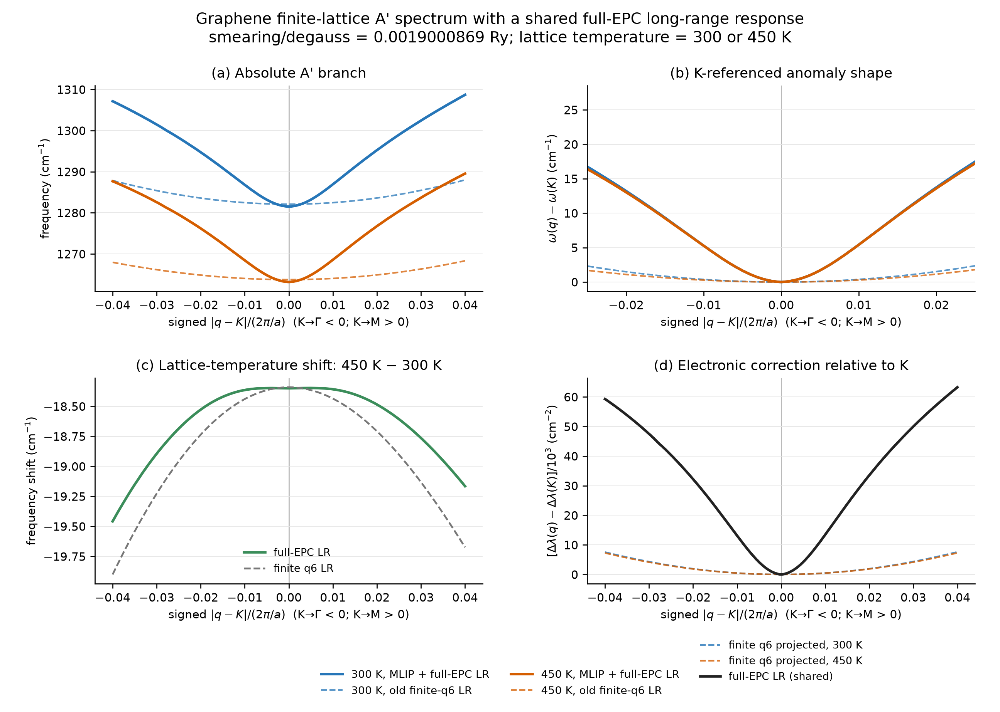
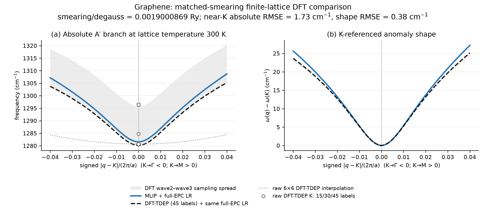
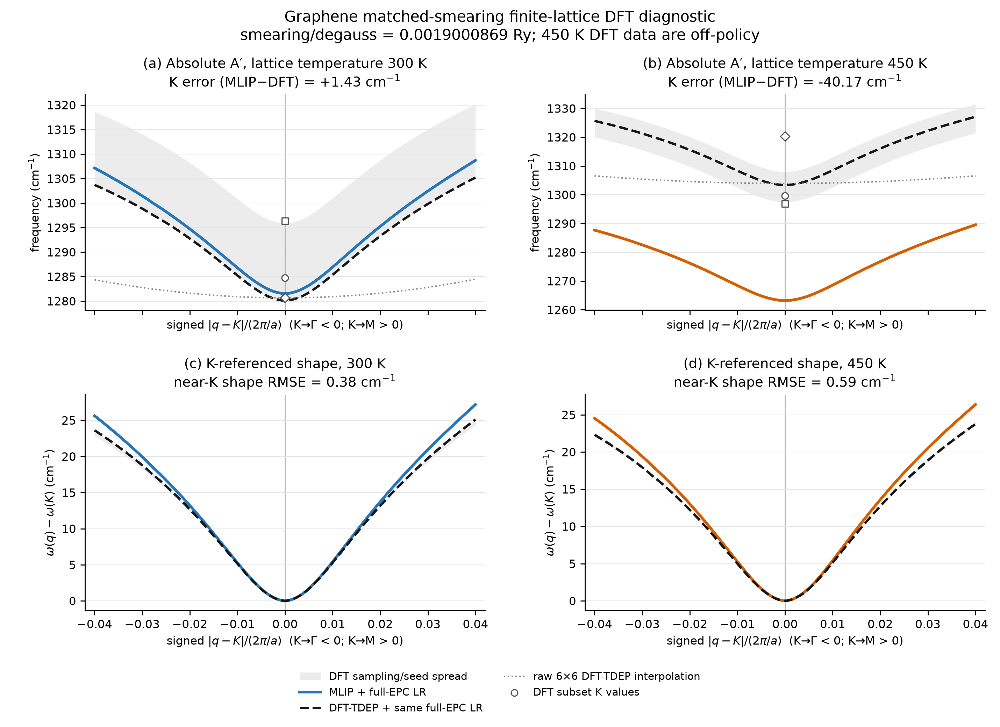
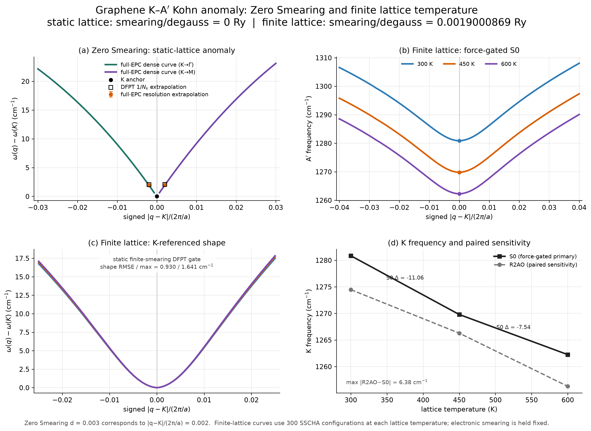

# 周报 · 2026-08-19 — graphene Kohn anomaly 的 smearing 与晶格温度分离

**工作周期：**2026-08-13–2026-08-19  
**状态更新：**2026-08-27（新西兰时间）

**承接文档：**[`GRAPHENE_LONG_RANGE_MODEL_PIVOT_2026-08-18.md`](GRAPHENE_LONG_RANGE_MODEL_PIVOT_2026-08-18.md)  
**低数据接口：**[`LOW_DATA_EPC_GENERATOR_CONTRACT_2026-08-18.md`](LOW_DATA_EPC_GENERATOR_CONTRACT_2026-08-18.md)

> 摘要：本周把 graphene K 点 A′₁ Kohn anomaly 的电子展宽效应和晶格温度效应分开检查。Zero Smearing 静态晶格计算中，完整 EPC 积分在 KG/KM 的 `d=0.003` cusp depth 为 `1.965±0.058 / 1.976±0.064 cm⁻¹`，相对 DFPT k 网格外推值的差异为 `3.94% / 4.92%`。8 月 27 日完成固定 `smearing/degauss = 0.0019000869 Ry` 的 300/450/600 K 有限晶格温度验收：通过力门槛的 S0 主结果在 K 点分别为 `1280.854/1269.796/1262.252 cm⁻¹`，相邻温区位移为 `−11.058/−7.544 cm⁻¹`。配对 R2AO 对照与 S0 的 K 点差异不超过 `6.377 cm⁻¹`，两段温移差异不超过 `2.866 cm⁻¹`；静态 full-EPC 对直接 DFPT 的 K-referenced shape RMSE/max 为 `0.930/1.641 cm⁻¹`。矩阵重构、配对采样、静态 DFPT cusp 和超胞稳定性门槛全部通过。结果支持当前模型在固定电子展宽下定量给出 300/450/600 K 的 A′ 分支和 Kohn anomaly；尚缺独立、收敛的有限温 DFT-TDEP 热力学参考，因此不把有限温绝对频移表述为已由第一性原理独立验证。

---

## 1. 本周完成的工作

本周工作围绕三个问题展开：

1. 在同一个静态短程 MLIP 背景上扫描零展宽和六个有限 `smearing/degauss (Ry)`，避免混入 lattice temperature；
2. 把直接 DFPT 点及其受约束拟合叠加到 MLIP + full-EPC long-range 曲线上，检查绝对频率和 K-referenced shape；
3. 从已经完成但未同步的 X0 结果中提取相同 smearing、不同 lattice temperature 的实际 SSCHA 谱，补充受控温度对比。

方法上，当前主模型已经从经验的平滑 q-space 核转为

\[
D(q,s)=D_{\mathrm{MLIP}}^{\mathrm{SR}}(q)
+U_{A'}(q)\left[c_K(s)+\alpha\,\Delta\Pi_{A'}(q,s;s_{\mathrm{ref}})\right]
U_{A'}^\dagger(q),
\]

其中 `smearing/degauss (Ry)` 只通过 Fermi–Dirac 占据进入显式 EPC band-sum。零展宽使用 K-valley 局部积分，有限展宽使用统一 Wannier Hamiltonian 和 EPC 顶角，不为每个 smearing 重新训练短程 MLIP 或长程顶角。

## 2. 固定晶格背景下的不同 smearing 对比

图中所有实线使用同一个静态 `D_MLIP^SR(q)`，没有加入 TDEP/SSCHA 晶格温度背景，也没有按 smearing 重新锚定 K 点。上排把模型诊断范围扩展到 `|d|≤0.10`；下排显示直接 DFPT 支持下的近 K 区域。零展宽绿色曲线是 k 网格外推后的 DFPT guide；三个有限展宽的空心圆为直接 DFPT，虚线为受约束拟合。

### 2.1 数值变化

| smearing/degauss (Ry) | K 频率 (cm⁻¹) | KG `d=0.003` rise | KM `d=0.003` rise | KG/KM `d=0.023` rise (cm⁻¹) |
|---:|---:|---:|---:|---:|
| 0 | 1282.183 | 1.932 | 1.940 | 13.146 / 13.488 |
| 0.0019000869 | 1285.738 | 0.328 | 0.330 | 9.186 / 9.501 |
| 0.00285013035 | 1287.273 | 0.234 | 0.236 | 7.481 / 7.765 |
| 0.0038001738 | 1288.856 | 0.178 | 0.180 | 6.045 / 6.287 |
| 0.005 | 1290.882 | 0.133 | 0.135 | 4.657 / 4.849 |
| 0.010 | 1299.460 | 0.054 | 0.055 | 1.755 / 1.828 |
| 0.020 | 1317.030 | 0.00020 | 0.00019 | 0.013 / 0.010 |

结果显示，增大 electronic smearing 同时抬高 K 点绝对频率并圆化 Kohn anomaly。到 `0.020 Ry` 时，`d=0.003` 和 `d=0.023` 的局部下凹在当前分辨率下已经接近消失。零展宽则保留明确的单侧非解析斜率。

零展宽参考值还做了独立的数值积分检查：

| 方法 | KG `d=0.003` depth (cm⁻¹) | KM `d=0.003` depth (cm⁻¹) |
|---|---:|---:|
| 完整 EPC，triangle-centroid patch 外推 | 1.965 ± 0.058 | 1.976 ± 0.064 |
| optimized-tetrahedron DFPT，`1/N_k` 外推 | 2.046 | 2.079 |
| 相对差异 | 3.94% | 4.92% |

因此 k288 的 `4.827/4.856 cm⁻¹` 还不是收敛极限，不能把 k288 与 MLIP + long-range 的差值直接解释为模型低估。当前平滑零展宽实线在 `d=0.003` 给出 `1.932/1.940 cm⁻¹`，落在冻结的完整 EPC 积分误差区间内。

### 2.2 与直接 DFPT 的比较

| smearing/degauss (Ry) | DFPT k 网格 | 直接点数 | 绝对 RMSE (cm⁻¹) | K-referenced shape RMSE (cm⁻¹) |
|---:|---:|---:|---:|---:|
| 0.0019000869 | 144 | 4 | 3.059 | 0.930 |
| 0.00285013035 | 144 | 4 | 3.060 | 0.731 |
| 0.0038001738 | 120 | 4 | 3.035 | 0.675 |

有限展宽 DFPT 目前只有 K→Γ 的 `d=0、0.008、0.015、0.025` 四点。拟合使用

\[
\Delta\omega(d)=a d^2+b d^3+c d^4,
\qquad \left.\frac{\partial\omega}{\partial d}\right|_K=0,
\]

曲线只画在已有数据区间，没有镜像到 K→M，也没有向 `d>0.025` 外推。`0.005、0.010、0.020 Ry` 尚无新增直接 DFPT 点，其曲线属于 full-EPC 模型预测。显示的 `|d|≤0.10` 区间全部单调；计算到 `|d|=0.15` 时外侧出现最大约 `0.56 cm⁻¹` 的数值回摆，因此未把该段放进正式图。

## 3. 相同 smearing 下的晶格温度对比

在最终三温度验收前，RTX 节点上已有一个满足控制条件的 300/450 K 阶段性结果：

- 300 K：正式 Q0 quantum SSCHA，电子算符对应 `smearing/degauss = 0.0019000869 Ry`；
- 450 K：X0 实际 coupled quantum SSCHA，使用同一个 300 K 电子算符，即相同 `0.0019000869 Ry`；
- 两条计算均为 fixed cell、300 个 SSCHA configurations，并在 population 1 收敛；低于 `-1 cm⁻¹` 的虚频数均为 0。

| lattice temperature | smearing/degauss (Ry) | K 频率 (cm⁻¹) | KG `d=0.025` rise | KM `d=0.025` rise |
|---:|---:|---:|---:|---:|
| 300 K | 0.0019000869 | 1282.100 | 2.323 | 2.357 |
| 450 K | 0.0019000869 | 1263.759 | 1.704 | 1.795 |
| 450 K − 300 K | 0 | −18.341 | −0.619 | −0.562 |

这组阶段性数据表明，即使 electronic smearing 完全不变，lattice temperature 仍会明显降低 K 点绝对频率，并减小近 K 区域的上升量。在 `|d|≤0.04` 内，两条 K-referenced 曲线的最大差异为 `1.561 cm⁻¹`，RMSE 为 `0.664 cm⁻¹`。因此不能用改变 smearing 的静态谱代替晶格温度效应，也不能把原先沿 300/450/600 K 对角线同时变化的结果当成单变量温度扫描。后续完成的 full-EPC 三温度最终结果见 3.3 节。

这一结果的适用范围需要单独说明：

- 图中是实际收敛的 SSCHA 结果，不是把 300/450 K 对角结果线性插值得到的曲线；
- E47 图中的早期有限 q6 电子算符会把 K cusp 过度圆化；其 dense-q full-EPC 替换结果见 3.1 节；
- X0 的简单可分离公式 `Φ_Q0(Tlat,Tlat) − Φ_operator(Tlat) + Φ_operator(Tel)` 没有通过量子门槛：最高光学支最大差异 `17.962 cm⁻¹`，RMSE `9.058 cm⁻¹`，K kink 相对变化 `27.02%`，分别高于 `2 cm⁻¹` 和 `20%` 的固定门槛；
- E47 阶段只有 300→450 K 这一对相同 smearing 的实际量子结果；600 K 的受控计算后来已完成并纳入 3.3 节最终验收；
- 两条曲线来自统一 MLIP/SSCHA 开发流程，不是独立 DFT-MD trajectory 验证。

已有的 300/450/600 K L0/Q0 总谱没有放入本节，因为它们分别使用 `0.0019000869、0.00285013035、0.0038001738 Ry`，同时改变了 lattice temperature 和 electronic smearing，不满足本节的控制条件。

### 3.1 full-EPC 长程项替换结果（8 月 21 日更新）

新的矩阵组合直接使用已经收敛的 T300/T450 SSCHA 自由能 Hessian：

\[
D(q,T_{\mathrm{lat}},s)=D[\Phi_{\mathrm{SSCHA}}(T_{\mathrm{lat}},q6_s)-\Phi_{q6_s}](q)
+\Pi_{\mathrm{full\mbox{-}EPC}}(q,s)P_{A'}(q,T_{\mathrm{lat}}).
\]

这里固定 `smearing/degauss = 0.0019000869 Ry`。E42 中用于静态 MLIP 绝对频率对齐的公共常数不属于旧 q6 算符，因此没有在热背景上重复加入。若把这个常数也加进去，300 K 的 K 点会被错误压到约 `1213 cm⁻¹`；该结果已作为双重计数诊断排除。

下表的 q 距离为 `|q-K|/(2π/a)`，与 E47 图的横轴一致。

| lattice temperature | 方法 | K 频率 (cm⁻¹) | KG/KM q=0.003 rise | KG/KM q=0.025 rise |
|---:|---|---:|---:|---:|
| 300 K | MLIP + full-EPC LR | 1281.522 | 0.672 / 0.683 | 16.732 / 17.474 |
| 300 K | 旧 finite-q6 LR | 1282.100 | 0.034 / 0.034 | 2.314 / 2.354 |
| 450 K | MLIP + full-EPC LR | 1263.173 | 0.673 / 0.685 | 16.396 / 17.217 |
| 450 K | 旧 finite-q6 LR | 1263.759 | 0.025 / 0.025 | 1.698 / 1.792 |

full-EPC 结果的 K 点 `450−300 K` 位移为 `−18.349 cm⁻¹`，与旧 q6 结果的 `−18.341 cm⁻¹` 接近；主要变化发生在 K 邻域形状，而不是温度软化的绝对量。旧 q6 在 `q=0.025` 只保留约 `0.8–2.4 cm⁻¹` 的上升，dense full-EPC 恢复到约 `16.4–17.5 cm⁻¹`。

数值门槛全部通过：静态 E42 矩阵重放误差 `9.1×10⁻13 cm⁻¹`，SSCHA K 点重放误差 `4.5×10⁻13 cm⁻¹`，最小相邻模式 overlap `0.9999984`，time-reversal 频率残差为 0，K-star spread 为 `1.4×10⁻7 cm⁻¹`。241 点扩展响应与独立 `720×720` full-EPC 29 点的最大等效频率差为 `0.550 cm⁻¹`。

因此，有限晶格温度背景与 full-EPC 长程项的计算链已经实现，旧 q6 导致的插值圆化也已经定位并消除。现有 finite-smearing 静态晶格 DFPT 对相同电子模型给出 `3.059 cm⁻¹` 的绝对 RMSE 和 `0.930 cm⁻¹` 的 K-referenced shape RMSE；E48 的 300/450 K 阶段性曲线没有独立 finite-lattice-temperature DFPT 或自洽 anharmonic-EPC 参考，暂不把“绝对精度已验证”写作结论。

### 3.2 300/450 K 同 smearing 的 DFT-TDEP 诊断

仓库中已有三批 300 K DFT 力标签，均采用 72 原子超胞、`8×8×1` 电子 k 网格、Fermi–Dirac `smearing/degauss = 0.0019000869 Ry` 和 `60/240 Ry` 截断。三批累计得到 15、30、45 个构型。为了与 E48 使用同一长程定义，比较曲线从 DFT-TDEP FC2 中扣除同一个 finite-q6 算符，再接入相同的 dense full-EPC 响应；因此这张图检验的是有限温短程背景和绝对频率，不是对 full-EPC cusp 的独立验证。

| 指标 | 300 K 结果 |
|---|---:|
| MLIP+full-EPC K 频率 | 1281.522 cm⁻¹ |
| 45 标签 DFT-TDEP+同一 full-EPC K 频率 | 1280.092 cm⁻¹ |
| K 点差值，MLIP−DFT | +1.431 cm⁻¹ |
| `|q−K|/(2π/a)≤0.025` 绝对 RMSE | 1.731 cm⁻¹ |
| 同一区间 K-referenced shape RMSE | 0.378 cm⁻¹ |
| DFT 30→45 标签 K 点变化 | −15.733 cm⁻¹ |

近 K 形状和最终 45 标签的绝对频率与 E48 接近，但 DFT-TDEP 的样本收敛尚未达到可用于最终精度声明的程度。300 K 构型还来自旧 cold-smearing DFT-MD 轨迹后按目标 FD 设置重算力，属于 off-policy 重标注；15/30/45 标签也来自同一条轨迹，不能当作三个独立重复。

450 K 的 60 个重标注在 8 月 22 日 04:17 NZST 全部完成。V100-A/B 各计算 30 个构型，服务正常退出；所有标签均为 Fermi–Dirac `0.0019000869 Ry`、`8×8×1` k 网格和 `60/240 Ry` 截断。按 `(trajectory_seed, snapshot_index)` 合并后得到三个 seed、每个 20 个构型，没有重复或缺失。

| 指标 | 450 K 结果 |
|---|---:|
| pooled DFT-TDEP 拟合残差 | 192.634 meV/Å |
| MLIP+full-EPC K 频率 | 1263.173 cm⁻¹ |
| DFT-TDEP+同一 full-EPC K 频率 | 1303.347 cm⁻¹ |
| K 点差值，MLIP−DFT | −40.174 cm⁻¹ |
| `|q−K|/(2π/a)≤0.025` 绝对 RMSE | 39.714 cm⁻¹ |
| 同一区间 K-referenced shape RMSE | 0.588 cm⁻¹ |
| 三个 seed 的原始 DFT K 点 spread | 23.465 cm⁻¹ |
| leave-one-seed-out hybrid K 点 spread | 10.555 cm⁻¹ |

原 `0.00285013035 Ry` 标签的原始 DFT-TDEP K 点为 `1305.049 cm⁻¹`；改成目标 `0.0019000869 Ry` 后为 `1303.915 cm⁻¹`，只改变 `−1.135 cm⁻¹`。因此约 `40 cm⁻¹` 的绝对频率差不能归因于 electronic smearing。其来源是这批构型来自此前已经 failed-C1 的 MLIP on-policy 轨迹，而不是目标 DFT Hamiltonian 的平衡轨迹；原 holdout 中 force RMSE/max error 为 `51.43/611.89 meV/Å`，K-line bootstrap MAE 为 `22.66 cm⁻¹`。这批标签可以用于定位短程模型失配，不能与 300 K DFT-MD 重标注结果拼成受控的 DFT 晶格温度趋势。继续增加同一分布的 DFT 标签不会解决这个问题。

### 3.3 Zero Smearing 与 300/450/600 K full-EPC 最终验收（8 月 27 日更新）

综合图把两个控制问题分开显示。图 (a) 是静态晶格、`smearing/degauss = 0 Ry` 的结果；图 (b)–(d) 固定 `smearing/degauss = 0.0019000869 Ry`，只改变 lattice temperature。所有有限温主曲线都来自通过冻结力门槛的 S0；R2AO 只在图 (d) 中作为严格配对的声谱敏感性对照。

3.1 节的 E48 是早期 300/450 K 矩阵组合诊断。这里的最终验收把同一个冻结 S0 checkpoint 部署到三个温度，并为 S0/R2AO 使用共同初始 Hessian、随机种子和第一轮构型，同时补齐 600 K。因此后续结论和引用以本节数值为准，E48 继续保留为 q6 扣除与双重计数的开发记录。

Zero Smearing 的 `d=0.003` 对应图中 `|q−K|/(2π/a)=0.002`。完整 EPC 积分和 DFPT k 网格外推的比较为：

| 方向 | 完整 EPC depth (cm⁻¹) | DFPT `1/N_k` 外推 (cm⁻¹) | 相对差异 |
|---|---:|---:|---:|
| K→Γ | 1.965 ± 0.058 | 2.046 | 3.94% |
| K→M | 1.976 ± 0.064 | 2.079 | 4.92% |

有限晶格温度的 full-EPC K 点结果为：

| lattice temperature (K) | S0 主结果 (cm⁻¹) | R2AO 敏感性对照 (cm⁻¹) | R2AO − S0 (cm⁻¹) |
|---:|---:|---:|---:|
| 300 | 1280.854 | 1274.478 | −6.377 |
| 450 | 1269.796 | 1266.285 | −3.512 |
| 600 | 1262.252 | 1256.288 | −5.964 |

| 温区 (K) | S0 K 点温移 (cm⁻¹) | R2AO K 点温移 (cm⁻¹) | 两模型温移差的绝对值 (cm⁻¹) |
|---|---:|---:|---:|
| 300→450 | −11.058 | −8.193 | 2.865 |
| 450→600 | −7.544 | −9.996 | 2.452 |

验收使用事先确定的数值门槛，结果如下：

| 检查项 | 结果 | 门槛或判据 |
|---|---:|---:|
| S0 300/450/600 K 测试集总力 RMSE | 26.29 / 22.57 / 27.34 meV/Å | 各温度 < 50 meV/Å |
| 静态 full-EPC K 点误差 | −2.301 cm⁻¹ | 绝对值 < 5 cm⁻¹ |
| 静态 K-referenced shape RMSE / max | 0.930 / 1.641 cm⁻¹ | < 1 / 2 cm⁻¹ |
| 静态 `d=0.003/0.025` cusp depth 相对误差 | 9.22% / 13.16% | 各自 < 15% |
| 静态 rounding width 相对误差 | 12.57% | < 15% |
| R2AO–S0 配对构型坐标最大差 | 0 | < 10⁻¹² |
| 低于 −1 cm⁻¹ 的超胞模数 | 300/450/600 K 均为 0 | 每个温度为 0 |

最终状态为 `R2AT_PAIRED_QUANTITATIVE_KOHN_ANOMALY_SENSITIVITY_PASSED`。这表示当前计算链已经完成固定电子展宽下 300/450/600 K 的 A′ 分支和 Kohn anomaly 定量验收。全路径 Fourier 插值在 Γ 附近仍有 `−2.99/−10.59/−6.40 cm⁻¹` 的小 ZA 下探；它们与超胞本征模稳定性门槛分开记录，当前作为插值残差处理。

适用范围仍有两点限制。R2AO 没有通过逐构型 OOF 力门槛，因此不能作为一般用途 MLIP，只用于配对敏感性检验；目前也没有独立、收敛的 300/450/600 K finite-temperature DFT-TDEP 热力学参考。有限温绝对频移由 S0 力门槛、严格配对模型对照和静态 DFPT cusp 验证共同限定，不能写成已由有限温第一性原理参考独立确认。

## 4. 长程模型与低数据迁移进展

完整 EPC band-sum 已经替代经验 crossover，主要结果如下：

- 在 `720×720` fine-k 网格上重放有限展宽曲线，不重新拟合幅度时频率 RMSE 为 `0.2126 cm⁻¹`，最大点误差 `0.2912 cm⁻¹`；
- 300/450/600 K 对应 smearing 的 cusp depth 误差为 `2.90% / 3.92% / 5.07%`；
- 最优全局幅度比例为 `0.99167`，说明完整 EPC 响应只需要接近 1 的统一校准；
- graphene 的有效 EPC 顶角用 rank 3 即可重放完整响应；五个 coarse-q 标签预测其余 24 点时，频率 RMSE `0.00116 cm⁻¹`，最大 cusp depth 误差 `0.0365%`；
- VSe₂ 首次 rank-3/cubic 测试未通过后，只修改模型为材料自适应 `rank≤4` 和四阶 Chebyshev q-latent，没有增加 q 标签；随后 TaS₂、NbS₂ 两个独立材料测试均通过；
- 两个独立体系中最差频率 RMSE 为 `0.00666 cm⁻¹`，最大点误差 `0.0201 cm⁻¹`，最差窗口形状误差 `0.111%`。

当前可冻结的是“五个模式投影 coarse-q EPC 标签 + 材料自适应 rank≤4 + 四阶 Chebyshev q-latent + 显式 Fermi–Dirac band-sum”的材料适配层。同一组 EPC 标签覆盖全部 smearing，不需要为每个 smearing 重新生成训练谱。它还不是零样本跨材料生成模型；五个标签仍负责确定材料特定的 Wannier-gauge 顶角基底。

## 5. 本周结论

1. 静态晶格 Zero Smearing 的 `d=0.003` cusp depth 与 DFPT k 网格外推在 KG/KM 两个方向分别相差 `3.94%/4.92%`，支持 full-EPC 方法对零展宽非解析 cusp 的定量描述。
2. 在 `smearing/degauss = 0.0019000869 Ry` 下，静态 full-EPC 的 K 点、近 K 形状、`d=0.003/0.025` depth 和 rounding width 均通过直接 DFPT 门槛；K-referenced shape RMSE/max 为 `0.930/1.641 cm⁻¹`。
3. 通过力门槛的 S0 已完成 300/450/600 K 固定电子展宽的有限晶格温度谱。K 点频率为 `1280.854/1269.796/1262.252 cm⁻¹`，300→450 K 和 450→600 K 的位移为 `−11.058/−7.544 cm⁻¹`。
4. 严格配对的 R2AO 对照在三个温度下与 S0 的 K 点差异不超过 `6.377 cm⁻¹`，两段温移差异不超过 `2.866 cm⁻¹`，声谱敏感性门槛通过。R2AO 未通过一般用途的逐构型力门槛，因此不作为主模型。
5. 当前验收支持固定电子展宽下的有限晶格温度 A′ 分支和 Kohn anomaly 定量曲线。有限温绝对频移尚无独立、收敛的 300/450/600 K DFT-TDEP 热力学参考；后续应把计算资源用于获得受控的有限温第一性原理参考，而不是继续扩展同一 off-policy 标签分布。

## 6. 下一阶段安排

| 阶段 | 计算资源与预计时间 | 输出结论 |
|---|---:|---|
| T300/T450、同 smearing 的 SSCHA FC2 扣除 q6 并接入 full-EPC LR | 已完成；本地 CPU 约 2 s（复用已有响应） | 矩阵组合通过；K 位移 `−18.349 cm⁻¹`，dense-q anomaly shape 恢复 |
| full-EPC thermal 图与 E47 对照 | 已完成 | q6 主要损失近 K 形状；K 点温度软化只改变约 `0.008 cm⁻¹` |
| 300 K 同 smearing DFT-TDEP 对比 | 已完成初步图；45 个已有 DFT 标签 | 近 K 绝对/形状 RMSE `1.731/0.378 cm⁻¹`；样本收敛未通过最终验收 |
| 450 K、同 smearing DFT 力重标注 | 已完成；V100-A/B 各 30 个 | electronic smearing 只移动 K 点 `−1.135 cm⁻¹`；当前 on-policy 分布不能作为平衡 DFT 基准 |
| S0 力门槛与 R2AO 配对声谱敏感性 | 已完成；每个模型、每个温度 300 个严格配对构型 | S0 作为主结果通过；R2AO 仅用于敏感性，三温度声谱门槛通过 |
| 600 K、`0.0019000869 Ry` 的 coupled SSCHA 与 full-EPC 验收 | 已完成 | 得到 300/450/600 K、同一 smearing 的受控比较；最终状态为 `R2AT_PAIRED_QUANTITATIVE_KOHN_ANOMALY_SENSITIVITY_PASSED` |
| 独立 finite-temperature DFT-TDEP 热力学参考 | 下一阶段；先固定平衡采样、样本收敛和误差门槛 | 独立检验有限温绝对频移；当前 off-policy 450 K 标签不用于这项结论 |
| leave-one-material-out gauge-invariant prior | 本地 CPU/GPU，4–12 h | 五标签 prior 是否能稳定迁移；未通过则保持每体系五点预算 |
| 冻结后的新体系最小验证 | 现有资产优先；必要时 4–12 V100 GPU-h | 检查真正未见体系；只计算五个 coarse-q EPC 标签，不跑 dense-q DFPT |

T300/T450/T600 的 full-EPC thermal 矩阵组合和配对声谱敏感性已经通过。后续合并不同 smearing 与不同 lattice temperature 时，仍需分别标注两个控制变量，不能把旧 q6 曲线或沿温度对角线同时改变 smearing 的曲线混入受控比较。

## 7. 数据与图表

- Zero Smearing 与 300/450/600 K 综合图：[`graphene_zero_smearing_and_finite_lattice_summary.png`](../results/graphene_physics_temperature/post_p4_feasibility/R2R_multipolar_background/R2AT_paired_full_epc_acceptance_20260827/graphene_zero_smearing_and_finite_lattice_summary.png)
- 综合图生成脚本：[`plot_graphene_weekly_zero_and_finite_lattice.py`](../scripts/smearing_kink/plot_graphene_weekly_zero_and_finite_lattice.py)
- Zero Smearing dense curve：[`zero_dense_curve.csv`](../results/graphene_physics_temperature/post_p4_feasibility/E44_epc_zero_wider_curve/zero_dense_curve.csv)
- Zero Smearing 数值摘要：[`zero_dense_curve_summary.json`](../results/graphene_physics_temperature/post_p4_feasibility/E44_epc_zero_wider_curve/zero_dense_curve_summary.json)
- 300/450/600 K 最终验收报告：[`R2AT_RESULT.md`](../results/graphene_physics_temperature/post_p4_feasibility/R2R_multipolar_background/R2AT_paired_full_epc_acceptance_20260827/R2AT_RESULT.md)
- 最终验收数值与门槛：[`r2ao_full_epc_acceptance_summary.json`](../results/graphene_physics_temperature/post_p4_feasibility/R2R_multipolar_background/R2AT_paired_full_epc_acceptance_20260827/r2ao_full_epc_acceptance_summary.json)
- 最终近 K 曲线数据：[`r2ao_s0_fixed_smearing_full_epc.csv`](../results/graphene_physics_temperature/post_p4_feasibility/R2R_multipolar_background/R2AT_paired_full_epc_acceptance_20260827/r2ao_s0_fixed_smearing_full_epc.csv)
- S0 全 M–Γ–K–M 六分支图：[`s0_full_bands_with_dense_K_full_epc.png`](../results/graphene_physics_temperature/post_p4_feasibility/R2R_multipolar_background/R2AT_paired_full_epc_acceptance_20260827/s0_full_bands_with_dense_K_full_epc.png)
- 不同 smearing 四联图：[`four_panel_wider_smearing_comparison.png`](../results/graphene_physics_temperature/post_p4_feasibility/E46_four_panel_wider_smearing_comparison/four_panel_wider_smearing_comparison.png)
- 不同 smearing 图的 PDF：[`graphene_K_four_panel_wider_smearing_comparison.pdf`](../output/pdf/graphene_K_four_panel_wider_smearing_comparison.pdf)
- 不同 smearing 数值与 DFPT 拟合参数：[`four_panel_wider_smearing_comparison_summary.json`](../results/graphene_physics_temperature/post_p4_feasibility/E46_four_panel_wider_smearing_comparison/four_panel_wider_smearing_comparison_summary.json)
- 固定 smearing 晶格温度图：[`fixed_smearing_lattice_temperature_comparison.png`](../results/graphene_physics_temperature/post_p4_feasibility/E47_fixed_smearing_lattice_temperature_comparison/fixed_smearing_lattice_temperature_comparison.png)
- 固定 smearing 晶格温度指标：[`fixed_smearing_lattice_temperature_summary.json`](../results/graphene_physics_temperature/post_p4_feasibility/E47_fixed_smearing_lattice_temperature_comparison/fixed_smearing_lattice_temperature_summary.json)
- 固定 smearing、有限晶格温度的 full-EPC 四联图：[`fixed_smearing_thermal_full_epc.png`](../results/graphene_physics_temperature/post_p4_feasibility/E48_fixed_smearing_thermal_full_epc/fixed_smearing_thermal_full_epc.png)
- E48 数值摘要：[`fixed_smearing_thermal_full_epc_summary.json`](../results/graphene_physics_temperature/post_p4_feasibility/E48_fixed_smearing_thermal_full_epc/fixed_smearing_thermal_full_epc_summary.json)
- E48 矩阵数据：[`fixed_smearing_thermal_full_epc_matrices.npz`](../results/graphene_physics_temperature/post_p4_feasibility/E48_fixed_smearing_thermal_full_epc/fixed_smearing_thermal_full_epc_matrices.npz)
- E48 独立重跑审计：[`reproducibility_audit.json`](../results/graphene_physics_temperature/post_p4_feasibility/E48_fixed_smearing_thermal_full_epc/reproducibility_audit.json)
- 300 K 同 smearing DFT 对比图：[`MLIP_full_EPC_vs_DFT_TDEP_300K.png`](../results/graphene_physics_temperature/post_p4_feasibility/E49_fixed_smearing_thermal_DFT_comparison/MLIP_full_EPC_vs_DFT_TDEP_300K.png)
- E49 数值摘要：[`MLIP_full_EPC_vs_DFT_TDEP_300K_summary.json`](../results/graphene_physics_temperature/post_p4_feasibility/E49_fixed_smearing_thermal_DFT_comparison/MLIP_full_EPC_vs_DFT_TDEP_300K_summary.json)
- 450 K pooled DFT-TDEP 摘要：[`graphene_fixed_smearing_DFT_TDEP_450K.json`](../results/graphene_physics_temperature/post_p4_feasibility/E50_fixed_smearing_T450_DFT_reference/graphene_fixed_smearing_DFT_TDEP_450K.json)
- 300/450 K DFT 诊断四联图：[`MLIP_full_EPC_vs_DFT_TDEP_300K_450K.png`](../results/graphene_physics_temperature/post_p4_feasibility/E51_fixed_smearing_thermal_DFT_pair/MLIP_full_EPC_vs_DFT_TDEP_300K_450K.png)
- E51 数值摘要：[`MLIP_full_EPC_vs_DFT_TDEP_300K_450K_summary.json`](../results/graphene_physics_temperature/post_p4_feasibility/E51_fixed_smearing_thermal_DFT_pair/MLIP_full_EPC_vs_DFT_TDEP_300K_450K_summary.json)
- 长程模型调整记录：[`GRAPHENE_LONG_RANGE_MODEL_PIVOT_2026-08-18.md`](GRAPHENE_LONG_RANGE_MODEL_PIVOT_2026-08-18.md)
- 低数据 EPC 接口：[`LOW_DATA_EPC_GENERATOR_CONTRACT_2026-08-18.md`](LOW_DATA_EPC_GENERATOR_CONTRACT_2026-08-18.md)
