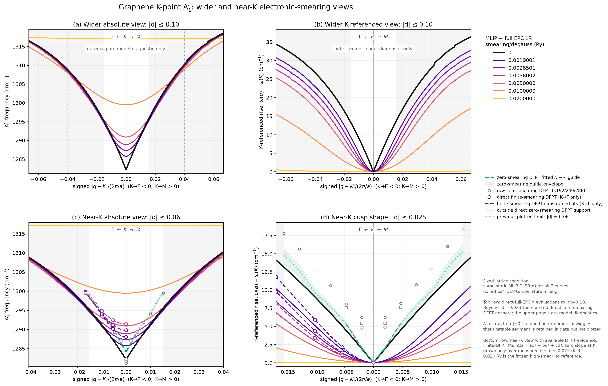
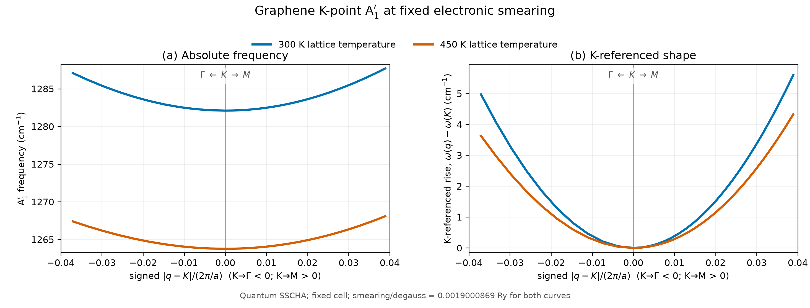

# 周报 · 2026-08-19 — graphene Kohn anomaly 的 smearing 与晶格温度分离

**工作周期：**2026-08-13–2026-08-19  
**状态更新：**2026-08-19（新西兰时间）  
**承接文档：**[`GRAPHENE_LONG_RANGE_MODEL_PIVOT_2026-08-18.md`](GRAPHENE_LONG_RANGE_MODEL_PIVOT_2026-08-18.md)  
**低数据接口：**[`LOW_DATA_EPC_GENERATOR_CONTRACT_2026-08-18.md`](LOW_DATA_EPC_GENERATOR_CONTRACT_2026-08-18.md)

> 摘要：本周把 graphene K 点 A′₁ Kohn anomaly 的电子展宽效应和晶格温度效应分开检查。固定静态晶格背景后，`smearing/degauss` 从 `0` 增加到 `0.020 Ry`，K 点频率从 `1282.183` 升至 `1317.030 cm⁻¹`，而 `d=0.003` 的平均 cusp depth 从 `1.936` 降至约 `0.0002 cm⁻¹`。零展宽完整 EPC 积分在 KG/KM 的 `d=0.003` 深度为 `1.965±0.058 / 1.976±0.064 cm⁻¹`，相对 DFPT k 网格外推值的误差为 `3.94% / 4.92%`。另外补充了一个真正保持 smearing 不变的晶格温度对比：在 `0.0019000869 Ry` 下，量子 SSCHA 的 450 K K 点频率相对 300 K 降低 `18.341 cm⁻¹`，K 邻域曲率也变浅。该温度对比仍使用早期有限 q6 电子算符；简单的电子算符替换公式没有通过 X0 门槛，因此还不能作为可迁移的晶格温度模型。

---

## 1. 本周完成的工作

本周工作围绕三个问题展开：

1. 在同一个静态短程 MLIP 背景上扫描零展宽和六个有限 `smearing/degauss (Ry)`，避免混入 lattice temperature；
2. 把直接 DFPT 点及其受约束拟合叠加到 MLIP + full-EPC long-range 曲线上，检查绝对频率和 K-referenced shape；
3. 从已经完成但未同步的 X0 结果中提取相同 smearing、不同 lattice temperature 的实际 SSCHA 谱，补充受控温度对比。

方法上，当前主模型已经从经验的平滑 q-space 核转为

\[
D(q,s)=D_{\mathrm{MLIP}}^{\mathrm{SR}}(q)
+U_{A'}(q)\left[c_K(s)+\alpha\,\Delta\Pi_{A'}(q,s;s_{\mathrm{ref}})\right]
U_{A'}^\dagger(q),
\]

其中 `smearing/degauss (Ry)` 只通过 Fermi–Dirac 占据进入显式 EPC band-sum。零展宽使用 K-valley 局部积分，有限展宽使用统一 Wannier Hamiltonian 和 EPC 顶角，不为每个 smearing 重新训练短程 MLIP 或长程顶角。

## 2. 固定晶格背景下的不同 smearing 对比

图中所有实线使用同一个静态 `D_MLIP^SR(q)`，没有加入 TDEP/SSCHA 晶格温度背景，也没有按 smearing 重新锚定 K 点。上排把模型诊断范围扩展到 `|d|≤0.10`；下排显示直接 DFPT 支持下的近 K 区域。零展宽绿色曲线是 k 网格外推后的 DFPT guide；三个有限展宽的空心圆为直接 DFPT，虚线为受约束拟合。

### 2.1 数值变化

| smearing/degauss (Ry) | K 频率 (cm⁻¹) | KG `d=0.003` rise | KM `d=0.003` rise | KG/KM `d=0.023` rise (cm⁻¹) |
|---:|---:|---:|---:|---:|
| 0 | 1282.183 | 1.932 | 1.940 | 13.146 / 13.488 |
| 0.0019000869 | 1285.738 | 0.328 | 0.330 | 9.186 / 9.501 |
| 0.00285013035 | 1287.273 | 0.234 | 0.236 | 7.481 / 7.765 |
| 0.0038001738 | 1288.856 | 0.178 | 0.180 | 6.045 / 6.287 |
| 0.005 | 1290.882 | 0.133 | 0.135 | 4.657 / 4.849 |
| 0.010 | 1299.460 | 0.054 | 0.055 | 1.755 / 1.828 |
| 0.020 | 1317.030 | 0.00020 | 0.00019 | 0.013 / 0.010 |

结果显示，增大 electronic smearing 同时抬高 K 点绝对频率并圆化 Kohn anomaly。到 `0.020 Ry` 时，`d=0.003` 和 `d=0.023` 的局部下凹在当前分辨率下已经接近消失。零展宽则保留明确的单侧非解析斜率。

零展宽参考值还做了独立的数值积分检查：

| 方法 | KG `d=0.003` depth (cm⁻¹) | KM `d=0.003` depth (cm⁻¹) |
|---|---:|---:|
| 完整 EPC，triangle-centroid patch 外推 | 1.965 ± 0.058 | 1.976 ± 0.064 |
| optimized-tetrahedron DFPT，`1/N_k` 外推 | 2.046 | 2.079 |
| 相对差异 | 3.94% | 4.92% |

因此 k288 的 `4.827/4.856 cm⁻¹` 还不是收敛极限，不能把 k288 与 MLIP + long-range 的差值直接解释为模型低估。当前平滑零展宽实线在 `d=0.003` 给出 `1.932/1.940 cm⁻¹`，落在冻结的完整 EPC 积分误差区间内。

### 2.2 与直接 DFPT 的比较

| smearing/degauss (Ry) | DFPT k 网格 | 直接点数 | 绝对 RMSE (cm⁻¹) | K-referenced shape RMSE (cm⁻¹) |
|---:|---:|---:|---:|---:|
| 0.0019000869 | 144 | 4 | 3.059 | 0.930 |
| 0.00285013035 | 144 | 4 | 3.060 | 0.731 |
| 0.0038001738 | 120 | 4 | 3.035 | 0.675 |

有限展宽 DFPT 目前只有 K→Γ 的 `d=0、0.008、0.015、0.025` 四点。拟合使用

\[
\Delta\omega(d)=a d^2+b d^3+c d^4,
\qquad \left.\frac{\partial\omega}{\partial d}\right|_K=0,
\]

曲线只画在已有数据区间，没有镜像到 K→M，也没有向 `d>0.025` 外推。`0.005、0.010、0.020 Ry` 尚无新增直接 DFPT 点，其曲线属于 full-EPC 模型预测。显示的 `|d|≤0.10` 区间全部单调；计算到 `|d|=0.15` 时外侧出现最大约 `0.56 cm⁻¹` 的数值回摆，因此未把该段放进正式图。

## 3. 相同 smearing 下的晶格温度对比

RTX 节点上存在一个满足控制条件的两温度结果：

- 300 K：正式 Q0 quantum SSCHA，电子算符对应 `smearing/degauss = 0.0019000869 Ry`；
- 450 K：X0 实际 coupled quantum SSCHA，使用同一个 300 K 电子算符，即相同 `0.0019000869 Ry`；
- 两条计算均为 fixed cell、300 个 SSCHA configurations，并在 population 1 收敛；低于 `-1 cm⁻¹` 的虚频数均为 0。

| lattice temperature | smearing/degauss (Ry) | K 频率 (cm⁻¹) | KG `d=0.025` rise | KM `d=0.025` rise |
|---:|---:|---:|---:|---:|
| 300 K | 0.0019000869 | 1282.100 | 2.323 | 2.357 |
| 450 K | 0.0019000869 | 1263.759 | 1.704 | 1.795 |
| 450 K − 300 K | 0 | −18.341 | −0.619 | −0.562 |

这组数据表明，即使 electronic smearing 完全不变，lattice temperature 仍会明显降低 K 点绝对频率，并减小近 K 区域的上升量。在 `|d|≤0.04` 内，两条 K-referenced 曲线的最大差异为 `1.561 cm⁻¹`，RMSE 为 `0.664 cm⁻¹`。因此不能用改变 smearing 的静态谱代替晶格温度效应，也不能把原先沿 300/450/600 K 对角线同时变化的结果当成单变量温度扫描。

这一结果的适用范围需要单独说明：

- 图中是实际收敛的 SSCHA 结果，不是把 300/450 K 对角结果线性插值得到的曲线；
- 早期有限 q6 电子算符会把 K cusp 过度圆化，尚未替换为本周冻结的 dense-q full-EPC long-range response；
- X0 的简单可分离公式 `Φ_Q0(Tlat,Tlat) − Φ_operator(Tlat) + Φ_operator(Tel)` 没有通过量子门槛：最高光学支最大差异 `17.962 cm⁻¹`，RMSE `9.058 cm⁻¹`，K kink 相对变化 `27.02%`，分别高于 `2 cm⁻¹` 和 `20%` 的固定门槛；
- 当前只有 300→450 K 这一对相同 smearing 的实际量子结果，没有 600 K、同一 smearing 的受控量子计算；
- 两条曲线来自统一 MLIP/SSCHA 开发流程，不是独立 DFT-MD trajectory 验证。

已有的 300/450/600 K L0/Q0 总谱没有放入本节，因为它们分别使用 `0.0019000869、0.00285013035、0.0038001738 Ry`，同时改变了 lattice temperature 和 electronic smearing，不满足本节的控制条件。

## 4. 长程模型与低数据迁移进展

完整 EPC band-sum 已经替代经验 crossover，主要结果如下：

- 在 `720×720` fine-k 网格上重放有限展宽曲线，不重新拟合幅度时频率 RMSE 为 `0.2126 cm⁻¹`，最大点误差 `0.2912 cm⁻¹`；
- 300/450/600 K 对应 smearing 的 cusp depth 误差为 `2.90% / 3.92% / 5.07%`；
- 最优全局幅度比例为 `0.99167`，说明完整 EPC 响应只需要接近 1 的统一校准；
- graphene 的有效 EPC 顶角用 rank 3 即可重放完整响应；五个 coarse-q 标签预测其余 24 点时，频率 RMSE `0.00116 cm⁻¹`，最大 cusp depth 误差 `0.0365%`；
- VSe₂ 首次 rank-3/cubic 测试未通过后，只修改模型为材料自适应 `rank≤4` 和四阶 Chebyshev q-latent，没有增加 q 标签；随后 TaS₂、NbS₂ 两个独立材料测试均通过；
- 两个独立体系中最差频率 RMSE 为 `0.00666 cm⁻¹`，最大点误差 `0.0201 cm⁻¹`，最差窗口形状误差 `0.111%`。

当前可冻结的是“五个模式投影 coarse-q EPC 标签 + 材料自适应 rank≤4 + 四阶 Chebyshev q-latent + 显式 Fermi–Dirac band-sum”的材料适配层。同一组 EPC 标签覆盖全部 smearing，不需要为每个 smearing 重新生成训练谱。它还不是零样本跨材料生成模型；五个标签仍负责确定材料特定的 Wannier-gauge 顶角基底。

## 5. 本周结论

1. 固定晶格背景下，MLIP + full-EPC long-range 已能同时给出零展宽的非解析 cusp 和有限展宽的连续圆化，并保持同一套短程 MLIP 与 EPC 参数。
2. 零展宽 `d=0.003` 深度与 DFPT k 网格外推在 `5%` 内一致；有限展宽的 K-referenced shape RMSE 为 `0.675–0.930 cm⁻¹`。绝对频率仍有约 `3 cm⁻¹` 的系统误差，需要继续处理 K 锚值和短程背景，而不是改变 cusp 形状核。
3. 相同 smearing 的 300/450 K 对比确认 lattice temperature 会独立改变 K 点绝对频率和近 K 曲率。量子 X0 可分离公式失败，说明当前不能简单把电子算符和晶格自由能 Hessian 独立相加后直接迁移到新温度。
4. 现有固定-smearing 晶格温度图仍使用有限 q6 电子算符，不能作为“有限晶格温度下 full-EPC Kohn anomaly 已定量复现”的最终证据。
5. 下一步模型工作应集中在 full-EPC long-range 与有限温 MLIP/SSCHA 背景的矩阵级组合，以及 gauge-invariant 生成 prior；不需要继续增加 dense DFPT 训练谱。

## 6. 下一阶段安排

| 阶段 | 计算资源与预计时间 | 输出结论 |
|---|---:|---|
| 用实际 T300/T450、同 smearing 的 SSCHA FC2 扣除 q6 算符并接入 full-EPC LR | 本地 CPU，2–4 h | 固定 smearing 下的晶格温度对比能否同时保留正确 cusp；检查双重计数和矩阵重放 |
| full-EPC thermal 图与当前 E47 图对照 | 本地 CPU，1–2 h | 目前观察到的 `−18.341 cm⁻¹` K 软化中，绝对背景与 cusp-shape 重整化分别占多少 |
| 是否补算 600 K、`0.0019000869 Ry` 的实际 coupled SSCHA | RTX 2060，预计 2–5 GPU-h；先固定门槛 | 获得三个 lattice temperatures、同一 smearing 的受控量子比较；不能用已失败的 X0 公式代替 |
| leave-one-material-out gauge-invariant prior | 本地 CPU/GPU，4–12 h | 五标签 prior 是否能稳定迁移；未通过则保持每体系五点预算 |
| 冻结后的新体系最小验证 | 现有资产优先；必要时 4–12 V100 GPU-h | 检查真正未见体系；只计算五个 coarse-q EPC 标签，不跑 dense-q DFPT |

在 T300/T450 的 full-EPC thermal 矩阵组合通过之前，不把固定-smearing 晶格温度结果与本周的固定静态晶格 smearing 图合并成一张最终物理图。这样可以避免把旧 q6 圆化误差误判为真实的晶格温度效应。

## 7. 数据与图表

- 不同 smearing 四联图：[`four_panel_wider_smearing_comparison.png`](../results/graphene_physics_temperature/post_p4_feasibility/E46_four_panel_wider_smearing_comparison/four_panel_wider_smearing_comparison.png)
- 不同 smearing 图的 PDF：[`graphene_K_four_panel_wider_smearing_comparison.pdf`](../output/pdf/graphene_K_four_panel_wider_smearing_comparison.pdf)
- 不同 smearing 数值与 DFPT 拟合参数：[`four_panel_wider_smearing_comparison_summary.json`](../results/graphene_physics_temperature/post_p4_feasibility/E46_four_panel_wider_smearing_comparison/four_panel_wider_smearing_comparison_summary.json)
- 固定 smearing 晶格温度图：[`fixed_smearing_lattice_temperature_comparison.png`](../results/graphene_physics_temperature/post_p4_feasibility/E47_fixed_smearing_lattice_temperature_comparison/fixed_smearing_lattice_temperature_comparison.png)
- 固定 smearing 晶格温度指标：[`fixed_smearing_lattice_temperature_summary.json`](../results/graphene_physics_temperature/post_p4_feasibility/E47_fixed_smearing_lattice_temperature_comparison/fixed_smearing_lattice_temperature_summary.json)
- 长程模型调整记录：[`GRAPHENE_LONG_RANGE_MODEL_PIVOT_2026-08-18.md`](GRAPHENE_LONG_RANGE_MODEL_PIVOT_2026-08-18.md)
- 低数据 EPC 接口：[`LOW_DATA_EPC_GENERATOR_CONTRACT_2026-08-18.md`](LOW_DATA_EPC_GENERATOR_CONTRACT_2026-08-18.md)
