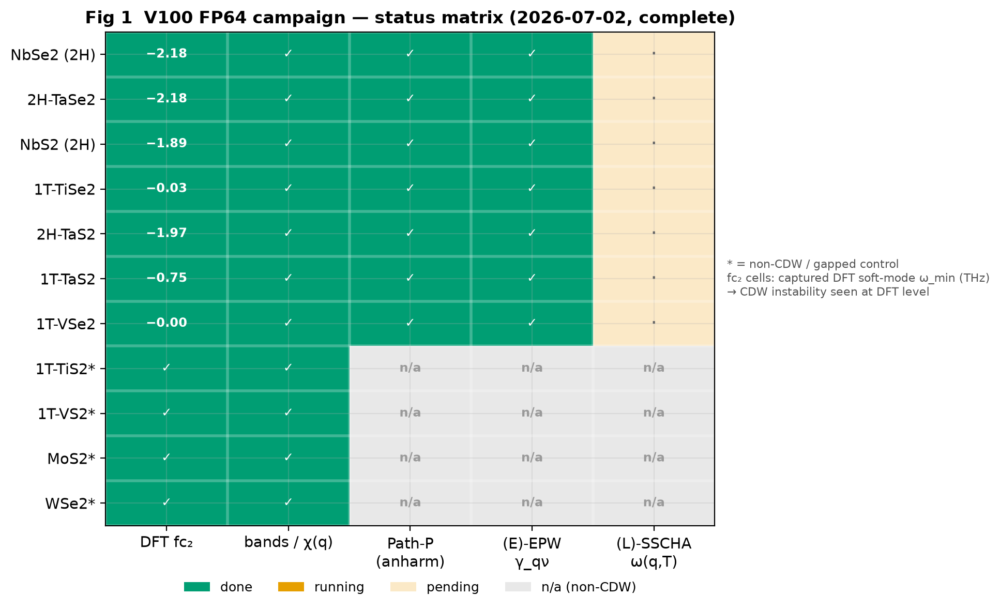
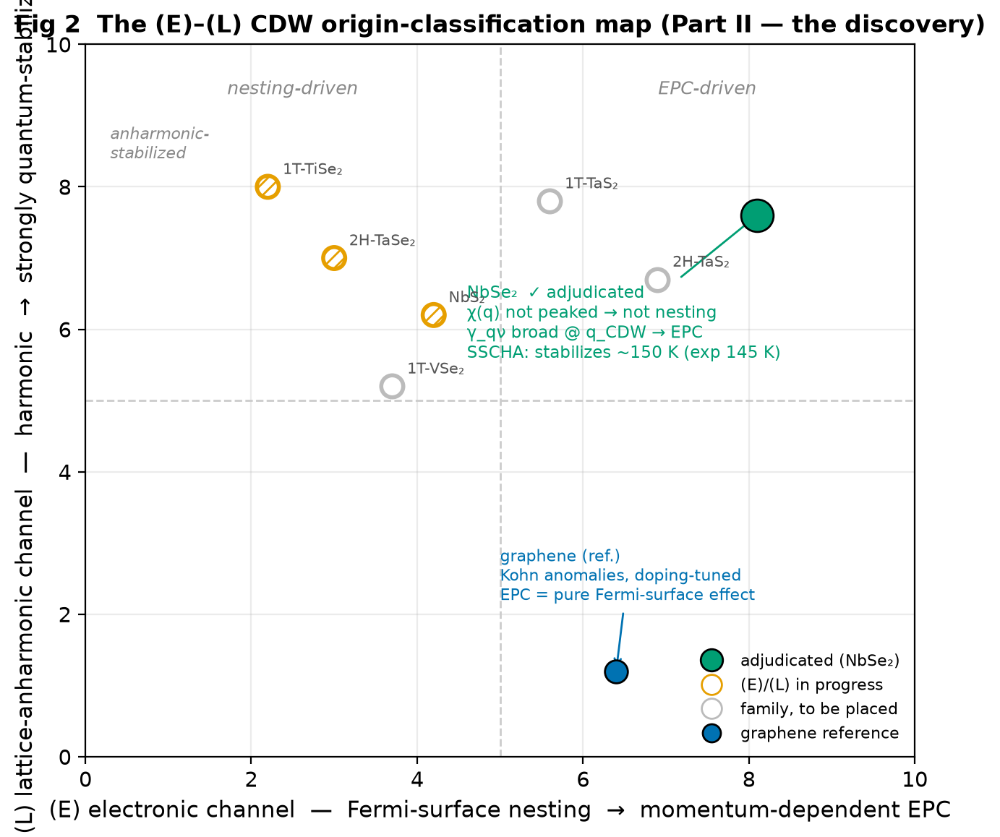
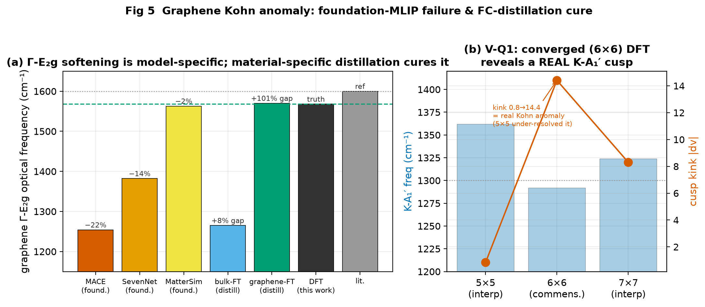
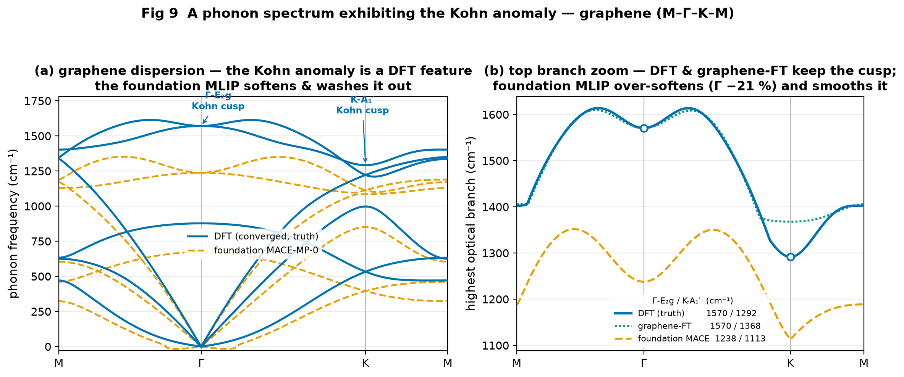
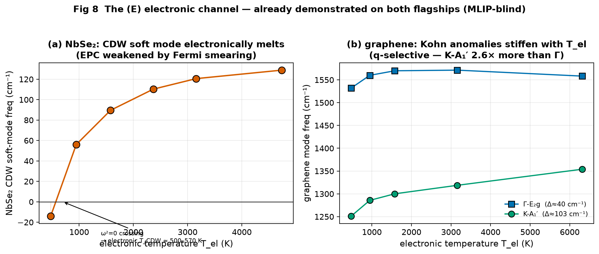
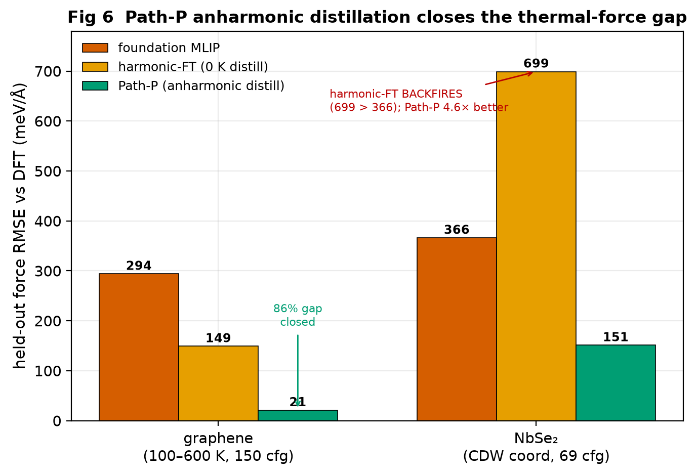
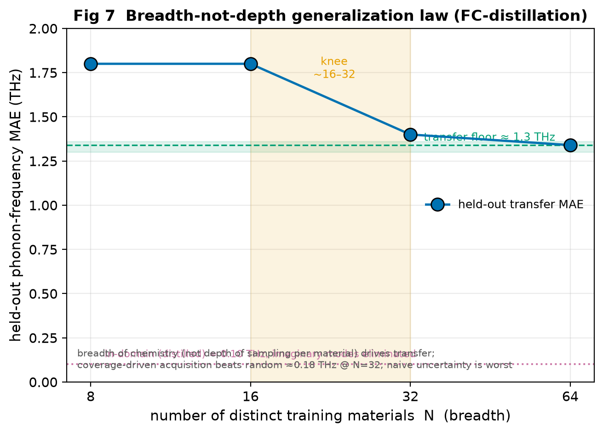
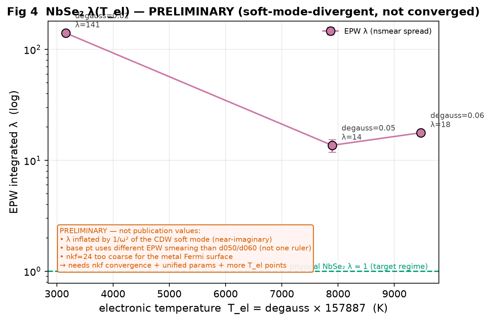
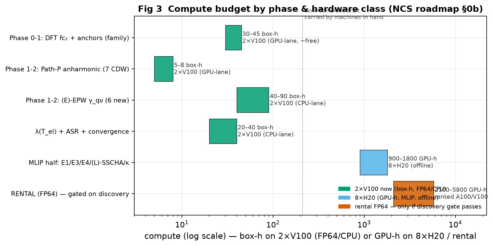

# TD-Phonon / Kohn-Anomaly — Weekly Report

**Week ending 2026-07-01**  ·  **live update 2026-07-02**  ·  branch `td-phonon-anomaly`  ·  machines: 2×V100 (FP64 DFT/EPW) + 1×RTX 2060 (MLIP/proxy); 8×H20 fleet offline this week.

> **One-line status.** The engine (foundation-MLIP failure atlas → material-specific FC-distillation → anharmonic Path-P) and the (E)/(L) origin-decomposition are **validated on both flagships (graphene + NbSe₂)** — the paper's **Part I (method)** is data-complete pending a convergence/ASR pass. This week we launched the **TMD-family FP64 campaign** on the two V100 boxes that builds the **Part II (discovery)** origin-map. *(Live update 2026-07-02 14:25 — campaign complete:)* **all 11 materials have DFT fc₂+bands**, **all 7 CDW Path-P anharmonic datasets are complete**, and **all 7 CDW (E)-channel EPW γ_qν points are banked** — the raw material for the (E)/(L) origin-map is in hand. Both boxes' campaign lanes have exited cleanly (finished ahead of the ~1-day estimate); only `aggregate.py` → origin-map synthesis + two commensurate-cell re-runs (1T-TiSe₂/VSe₂) remain (§3.1, §6).

---

## 0. Executive summary

This project builds a cheap-and-accurate phonon engine and uses it for a science payoff foundation MLIPs cannot reach: **decomposing lattice instabilities (Kohn anomalies, CDW soft modes) into their electronic (E) and lattice-anharmonic (L) origins**, across the 2D-TMD family. **One complete, high-level paper** merges the two halves into a single arc: **Part I (method)** = the engine + (E)/(L) on graphene & NbSe₂; **Part II (discovery)** = the TMD-family origin-map + a non-trivial CDW-origin finding.

**Banked this reporting period and before (all validated):**

| Result | System | Headline number | Status |
|---|---|---|---|
| Foundation-MLIP Kohn-anomaly failure is **model-specific** | graphene Γ-E₂g | MACE −22%, SevenNet −14%, MatterSim −2% vs DFT 1568 cm⁻¹ | ✅ |
| **Material-specific FC-distillation cures the cusp** | graphene Γ-E₂g | graphene-FT 1570 vs DFT 1568 (**101 % gap closed**); bulk-FT only 8 % | ✅ |
| Converged DFT reveals a **real K-A₁′ Kohn cusp** | graphene | 6×6 commensurate K-A₁′ = 1292 cm⁻¹, cusp kink 0.8→**14.4** | ✅ |
| **Distillation transfers a structural instability** (CDW soft mode) | NbSe₂ | foundation −0.20 → distilled-FT **−2.23 THz** ≈ DFT −2.18 (backbone-universal) | ✅ |
| NbSe₂ CDW is **EPC-driven, not nesting** (first family member adjudicated) | NbSe₂ | χ(q) ξ=0.53 at q_CDW (no peak) + EPW γ_qν 40–52 meV **broad** at q_CDW | ✅ |
| **Anharmonic Path-P** closes the thermal-force gap | graphene / NbSe₂ | 149→**21 meV/Å** (86 %); NbSe₂ **4.6×** better than harmonic-FT | ✅ |
| **Breadth-not-depth** generalization law | cross-material | transfer MAE flat ~1.80 THz to N=16, → 1.34 at N=64; floor ~1.3 THz | ✅ |

**Campaign complete (live 2026-07-02 14:25):** both V100 boxes finished the two-lane family campaign (Fig 1) — all 11 DFT fc₂+bands, 7 CDW Path-P, and 7 CDW (E)-channel EPW γ_qν are done; both boxes are now idle (only the legacy `jlq6` NbSe₂ NQ=6 λ-convergence run still grinds on Box B, §3.2). **The full 11-material DFT fc₂ truth table and the 7-material γ_qν table are in §3.1.** Headline: all four **2H** CDWs show the soft mode *and* large EPC γ_qν at the DFT level, and all four non-CDW/gapped controls are stable (0 false positives); the **1T** members (TiSe₂, VSe₂, and the √13 TaS₂) need commensurate supercells before their (E)-verdict is final.

*Fig 1. V100 FP64 campaign status (2026-07-01). Rows = the 11-member TMD family (★ starred = non-CDW / gapped controls); columns = the five per-material pipeline stages. fc₂ cells annotate the captured DFT soft-mode ω_min (THz) — negative = CDW instability seen at the DFT level, the ground truth the MLIP half is calibrated against.*

---

## 1. Framing — one complete, high-level paper (method → discovery)

**Strategy (2026-07-01): merged into a single flagship paper.** The plan is no longer two papers (an npj 保底 + an NCS 冲刺). It is **one complete, high-level paper** whose arc is *method → the discovery it enables*:

- **Part I — the method (engine).** Foundation MLIPs are blind precisely to the electronically-driven phonon anomalies (Kohn anomalies, CDW soft modes) that define quantum materials (blind-spot atlas → Hessian-supervision diagnosis). We repair it by co-designing a GPU finite-displacement DFT data engine (Line B) with material-specific FC-distillation + anharmonic Path-P into a foundation MLIP (Line A) — near-DFT accuracy on exactly the hardest cases, a breadth-not-depth generalization law, and a downstream κ payoff.
- **Part II — the discovery it enables.** Because the repaired framework is cheap *and* accurate on these hardest cases, high-throughput **origin-decomposition of lattice instabilities** becomes feasible for the first time: separate each CDW into its **electronic (Fermi-surface / EPC)** vs **lattice-anharmonic** channel, build the **(E)–(L) origin-classification map** across the 2D-TMD family, and adjudicate the long-debated origin of these CDWs (NbSe₂ = first member: EPC-driven, not nesting).
- **Why one paper, not two:** the method's novelty is *justified by* the discovery it enables (not "yet another phonon framework"); the discovery is *tractable only because of* the method (the cheap (L)-channel screens a whole family full DFPT/EPW could never afford). The two halves are one argument, not two packages.
- **Target:** a single flagship submission (Nature Computational Science / Nature Materials class) — the complete method + discovery.
- **Honest risk:** one flagship = higher variance and a longer runway than an npj — it needs *both* the method airtight *and* the discovery to land; there is **no npj保底 fallback**. (The method half remains independently strong — an implicit floor if repositioning were ever forced.)
- **Out of scope (explicit):** ballistic transport (NEGF/Landauer) — different method family, reads as scope creep.

> **Anti-drift note (per the roadmap's track-vs-drift rule).** This merge changes *packaging, not scope*: **every experiment in the NCS roadmap is retained** — the E1–E10 engine program *and* the family (E)/(L) origin-map + EPW + SSCHA + κ — now as sections of one paper. The long-term goal is unchanged: *origin-decomposition of lattice instabilities, made high-throughput by the engine*. Tracked against `docs/NCS_ROADMAP.md` §0; revisit before each compute campaign and log advance-vs-drift.

*Fig 2. The paper's Part-II headline object: every CDW material placed in the **(E) electronic** (Fermi-surface nesting → momentum-dependent EPC) × **(L) lattice-anharmonic** (harmonic → quantum-stabilized) plane. Only **NbSe₂ is adjudicated so far** (EPC-driven, not nesting; anharmonically stabilized ~150 K ≈ exp 145 K); graphene is the (E)-channel calibrator. Filling this plane for NbS₂/TaS₂/TaSe₂/TiSe₂/VSe₂ is the paper's discovery.*

---

## 2. Completed results (the science banked)

### 2.1 Engine on flagship #1 — graphene Kohn anomaly + FC-distillation

Foundation MLIPs under-predict the zone-centre optical modes and **wash out the most non-analytic Kohn cusp** (Γ-E₂g), and the size/sign of the failure is *model-specific*. Distilling the material's own DFPT fc₂ recovers it; a converged commensurate DFT grid shows the K-A₁′ cusp is physically real.

| Quantity (graphene) | Foundation | Distilled (bulk) | Distilled (graphene) | DFT (this work) | Lit. |
|---|---|---|---|---|---|
| Γ-E₂g @ a=2.46 (cm⁻¹) | 1238 | 1265 | **1570** | 1568 | ~1600 |
| K-A₁′ @ a=2.46 (cm⁻¹) | 1113 | 1107 | **1368** | 1362 | ~1300 |
| Γ-cusp gap closed | — | 8 % | **101 %** | truth | — |
| cross-model Γ-E₂g (relaxed) | MACE 1254 / SevenNet 1382 / MatterSim 1563 | | | 1568 | ~1600 |
| converged K-A₁′ (6×6, commens.) | — | — | — | **1292, kink 14.4** | ~1300 |

*Fig 5. (a) Γ-E₂g softening is model-specific (−22 % to −2 %); bulk-trained distillation barely helps (+8 %), but graphene-specific distillation lands on DFT (+101 %). (b) V-Q1: at the K-commensurate 6×6 grid the K-A₁′ cusp sharpens (kink 0.8→14.4) — a **real Kohn anomaly** the 5×5 grid under-resolved; foundation MLIPs instead over-soften K to ~1110 cm⁻¹ (a spurious "cusp").*

*Fig 9. A computed phonon spectrum that **exhibits the Kohn anomaly** — graphene along M–Γ–K–M (converged DFT, a=2.46, 601 q-points, from `results/vq1`). (a) Full dispersion: the two Kohn anomalies — the **Γ-E₂g** cusp (highest optical mode at Γ) and the **K-A₁′** cusp — are sharp, non-analytic features in the DFT truth (blue) that foundation MACE-MP-0 (orange dashed) both **over-softens** (Γ 1570→1238 cm⁻¹, −21 %) and **washes out**. (b) Top optical branch zoomed: DFT (blue) and the graphene-specific FC-distilled MLIP (green dotted) keep the cusp (graphene-FT 1570/1368 ≈ DFT 1570/1292 cm⁻¹ at Γ/K); the foundation model is smooth and ~330 cm⁻¹ too soft. This is §2.1's cure shown as the raw dispersion — the anomaly the engine is built to recover.*

Force-fit quality: graphene DFT-distill force RMSE **18 meV/Å** (harmonic configs). Gate #1 (graphene fuse) = **PASS**.

### 2.2 Engine on flagship #2 — NbSe₂ CDW soft-mode capture

Every foundation/bulk-distilled MLIP reports NbSe₂ as dynamically **stable** (min freq ≈ 0, 0 imaginary modes) — the d-electron CDW soft mode is missed. Distilling NbSe₂'s **own** 3×3 DFT fc₂ transfers the instability into the MLIP, and this is backbone-universal.

| Quantity (NbSe₂, 3×3, a=3.44 no-relax) | Foundation | Distilled-FT | DFT (this work) |
|---|---|---|---|
| min freq — MACE (THz) | −0.20 | **−2.23** | −2.18 |
| min freq — SevenNet (THz) | −0.04 | **−1.99** | −2.18 |
| distill force RMSE (meV/Å) | — | 11.5 (MACE) / 12.7 (SevenNet) | — |
| geometry robustness | DFT vc-relax a=3.474 Å (+1 %) → soft mode −2.05 THz | | |

- **T-evolution (L-channel):** TDEP soft mode −0.48 THz (20 K) → 0 (≥200 K); **SSCHA free-energy Hessian has 0 imaginary modes at all T (20–400 K)** — the soft mode is fully quantum/anharmonically stabilized. Stabilization window ~150 K ≈ **exp monolayer T_CDW 145 K**.
- Gate #2 (CDW) = **PASS**.

### 2.3 The (E) electronic channel — demonstrated on both flagships (MLIP-blind)

The (E) channel is what foundation MLIPs structurally cannot see. Two independent DFT probes make it quantitative:

- **NbSe₂ (E1, frozen-phonon vs Fermi-Dirac T_el):** the CDW soft mode hardens monotonically through zero — −14.1 cm⁻¹ (474 K) → +129 (4737 K) → **electronic T_CDW ≈ 500–570 K**; rising T_el smears the Fermi surface and melts the CDW ⇒ EPC-driven.
- **graphene (E7 DFPT-smearing, 3×3 q):** both Kohn modes stiffen with T_el but **q-selectively** — K-A₁′ by Δ≈103 cm⁻¹ vs Γ-E₂g Δ≈40; the (E) channel is strongest where the bare anomaly is sharpest.
- **graphene EPW:** undoped λ = λ_tr ≈ 1×10⁻⁷ ≈ 0 (E_F at the Dirac point, no Fermi surface); doping to E_F=−0.94 eV turns on **λ = 0.96**, max γ_qν neV→**1.0 meV** — EPC is a pure Fermi-surface effect.
- **NbSe₂ EPW (E6):** soft-mode γ_qν = **40–52 meV, broad** around q_CDW≈(⅓,0) and the M–K boundary (not a sharp nesting spike); total λ **diverges (≈140, ill-defined)** at the soft mode → report q-resolved γ_qν only.

*Fig 8. (a) NbSe₂ CDW soft mode melts with electronic temperature (ω²=0 near 500–570 K). (b) graphene Kohn anomalies stiffen with T_el, K-A₁′ 2.6× more than Γ-E₂g. Both are frozen-phonon/DFPT effects that MLIPs miss entirely.*

**Nesting cross-check (Rigor #2):** the full Fermi-surface nesting function ξ(q) on a 36×36 grid does **not** peak at q_CDW (ξ=0.53 there vs 1.0 at Γ) → NbSe₂ CDW is **not nesting-driven** (Johannes–Mazin). Contrast graphene, where q*=2k_F is clean (M1.3, Dirac point at K).

### 2.4 Anharmonic Path-P — beyond harmonic distillation

Harmonic distillation is accurate only for small displacements; DFT-force labelling of thermally-sampled configs makes the model accurate where the simulation samples.

| Force RMSE vs DFT (meV/Å) | Foundation | Harmonic-FT | Path-P |
|---|---|---|---|
| graphene (150 cfg, 100–600 K) | 294 | 149 | **21** (86 % closed) |
| NbSe₂ (69 cfg, CDW coordinate) | 366 | **699** (backfires) | **151** (4.6× better) |

- NbSe₂ landscape (along CDW eigenvector): DFT edge +2047 meV (stiff), well −3 meV (marginally unstable); harmonic-FT edge +390 (5× too soft), well −19 meV (spurious); **Path-P reproduces DFT** (+2073, no real well). Re-SSCHA confirms stabilization at all T.

*Fig 6. Path-P (anharmonic-distilled, green) closes the held-out thermal-force gap in both systems. Note NbSe₂ **harmonic**-FT (699) is worse than the foundation model (366) — a 0 K-distilled model actively misleads on the anharmonic CDW landscape; anharmonic labelling is required.*

### 2.5 Breadth-vs-depth transfer law + controls

*Fig 7. Held-out transfer MAE is flat (~1.80 THz) up to N≈16 training materials, then falls to 1.40 (32) → 1.34 (64) — breadth of chemistry, not depth of sampling, drives generalization (knee ~16–32, floor ~1.3 THz). In-domain distilled MAE ≈ 0.10 THz with imaginary modes eliminated. Coverage-driven acquisition beats random by ≈0.18 THz at N=32; naive-uncertainty acquisition is the worst (chases pathological soft outliers).*

**Controls / negatives (locator does not false-positive):** MoS₂ (gapped) — cusp kink ≤ 2 at Γ/K for every backbone (vs graphene ~86–100); MoS₂ & graphene contrast confirms the anomaly detector flags only real e-ph physics. NbSe₂ 2k_F check: k_F=0.46 Γ-M ⇒ 2k_F=0.46 b₁ ≠ q_CDW=0.33 b₁ (qualified negative — correct answer).

---

## 3. In-progress this week (live)

### 3.1 V100 FP64 campaign (see Fig 1)

Two single-V100 boxes, two non-competing lanes each. Scope (all delivered): full-family DFT fc₂ + bands/χ(q) (11 materials) + Path-P (7 CDW) + (E)-channel EPW γ_qν (7 CDW). **Status 2026-07-02 14:25 — COMPLETE; both boxes idle.**

| Box | GPU lane (fc₂→bands→Path-P) | CPU lane ((E)-EPW) |
|---|---|---|
| **A** (v100-rental) | ✅ fc₂+bands ×6 (NbSe₂/NbS₂/2H-TaS₂/1T-TaS₂/1T-TiS₂/MoS₂) · Path-P ×4 CDW (NbSe₂/NbS₂/2H-TaS₂/1T-TaS₂) | ✅ EPW ×3 (NbS₂/2H-TaS₂/1T-TaS₂) |
| **B** (v100b) | ✅ fc₂+bands ×5 (2H-TaSe₂/1T-TiSe₂/1T-VSe₂/1T-VS₂/WSe₂) · Path-P ×3 CDW (2H-TaSe₂/1T-TiSe₂/1T-VSe₂) | ✅ EPW ×3 (2H-TaSe₂/1T-TiSe₂/1T-VSe₂) |

**(a) DFT fc₂ truth table (all 11, 3×3 supercell)** — the ground truth the H20 (L)-screen is calibrated against:

| material | poly | CDW (exp) | fc₂ ω_min (THz) | soft @3×3 | note |
|---|---|:---:|---:|:---:|---|
| NbSe₂ | 2H | ✔ | **−2.18** | ✅ | 3×3-commensurate CDW |
| 2H-TaSe₂ | 2H | ✔ | **−2.175** | ✅ | 3×3 |
| 2H-TaS₂ | 2H | ✔ | **−1.965** | ✅ | 3×3 |
| NbS₂ | 2H | ✔ | **−1.893** | ✅ | 3×3 |
| 1T-TaS₂ | 1T | ✔ | −0.752 | ⚠️ partial | true CDW √13×√13 — 3×3 catches *a* softening, not q_CDW |
| 1T-TiSe₂ | 1T | ✔ | −0.026 | ✗ | CDW **2×2** — not 3×3-commensurate → re-run |
| 1T-VSe₂ | 1T | ✔ | −0.000 | ✗ | CDW ≈4×4 / √3×√3 — re-run |
| 1T-TiS₂ | 1T | ✗ | −0.000 | ✗ | non-CDW — correct ✓ |
| 1T-VS₂ | 1T | ✗ | −0.000 | ✗ | non-CDW — correct ✓ |
| MoS₂ | 2H | ✗ | −0.000 | ✗ | gapped control — correct ✓ |
| WSe₂ | 2H | ✗ | −0.000 | ✗ | gapped control — correct ✓ |

Clean result: **every 2H CDW is captured at 3×3; every non-CDW/gapped control is stable (0 false positives); the 1T CDWs are missed only because their periodicity isn't 3×3** — a commensurability limit, not a physics failure (the plan's expected branch).

**(b) (E)-channel EPW γ_qν (all 7 CDW)** — the (E)-column of the origin-map. Integrated λ divergent throughout → report γ (§3.2):

| material | poly | fc₂ soft? | max γ_qν (meV) | (E)-reading |
|---|---|:---:|---:|---|
| 2H-TaS₂ | 2H | ✅ | ~363* | strong EPC (magnitude overdamped/noisy on 3×3) |
| 2H-TaSe₂ | 2H | ✅ | ~105 | strong EPC |
| NbSe₂ (E6) | 2H | ✅ | 40–52 (broad @ q_CDW) | **EPC-driven, not nesting** |
| NbS₂ | 2H | ✅ | ~40 | moderate–strong EPC |
| 1T-TaS₂ | 1T | ⚠️ | ~4.3 | weak — soft mode partial / wrong-q |
| 1T-VSe₂ | 1T | ✗ | ~2.8 | off-instability (no 3×3 soft mode) |
| 1T-TiSe₂ | 1T | ✗ | ~1.2 | off-instability (no 3×3 soft mode) |

\*γ magnitudes on the 3×3 coarse-q / nkf=24 grid are **qualitative** (soft-mode interpolation noise; 2H-TaS₂'s 363 meV exceeds the phonon energy = overdamped) — the robust reading is the **order-of-magnitude split: 2H soft-mode γ ~ 40–360 meV (strong EPC) vs 1T ~ 1–4 meV**. Crucially the 1T γ is measured *off* the instability (their soft mode isn't in the 3×3 cell), so it is **not yet an (E)-verdict** — the 1T commensurate re-runs (§6) must land first, and the magnitudes converge via method ③ (§3.2).

### 3.2 λ divergence at soft modes — problem, fix methods, and status

**Problem (physics, not a bug).** The integrated electron–phonon coupling λ = ∫ (2/ω) α²F(ω) dω carries a 1/ω² weight; at a CDW soft mode ω→0 it **diverges** (NbSe₂: λ ≈ 140, ill-defined; 2H-TaSe₂ this week: λ ≈ 188). The divergence *is* the instability signal — a single "λ" is simply the **wrong observable** for a soft-mode material. Three fix methods, in the order we rely on them:

**① Adopted resolution — report the momentum/mode-resolved linewidth γ_qν, not the absolute λ.  ✅ DONE.**
γ_qν stays finite and physical at the soft mode and carries the same science: NbSe₂ γ_soft = **40–52 meV, broad** around q_CDW ⇒ **EPC-driven** (not a sharp nesting spike). This is the settled position everywhere it matters — the results doc (E6), the campaign aggregator (`scripts/v100/aggregate.py` prints the caveat + a γ_qν column, no bare λ), and the paper's honest-framing clauses (App. B). **Every Part-II conclusion stands on γ_qν and is independent of λ.** The graphene control validates the pipeline where there is *no* soft mode: λ converges cleanly (undoped λ ≈ 0 at the Dirac point; n-doped λ = 0.96, max γ_qν neV → 1.0 meV).

**② Physical regularization — harden the soft mode with electronic smearing (degauss / T_el).  ⚠️ QUALITATIVE only.**
Raising T_el smears the Fermi surface, stiffens ω, and *tames* the divergence (NbSe₂ λ: 140 → O(10–18) across degauss 0.03→0.06, i.e. T_el ≈ 4.7k → 9.5k K). But it is **not** a converged number: the swept λ is non-monotone (17 → 114 → 12 → 17) and the base point used a different EPW smearing ruler (nsmear=1 / degaussw=0.2 vs 4 / 0.1). Only the *qualitative* reading (soft mode melts + λ tames with T_el) is used; Fig 4 stays **preliminary**.

**③ Convergence pass for a defensible absolute λ — route (partly in flight).  ◻ IN PROGRESS / PLANNED, non-blocking.**
To promote λ from qualitative to publishable: (i) fine-grid convergence **nkf 24 → 48 (→ 60)**; (ii) denser coarse q **NQ 3 → 6** — the `jlq6` run on Box B (NbSe₂ degauss 0.03, 6×6 DFPT; **~27 h in as of 2026-07-02 14:25, still in DFPT with no `res_q6.csv`** — the 6×6 metal DFPT is proving very slow, decide finish-vs-kill in §6); (iii) one **unified EPW smearing** across all points (fix the "not one ruler" issue in ②); (iv) an **ASR re-pass** (`q2r zasr='crystal'`) to remove the residual Γ-acoustic term and fix the 2D ZA mode; (v) ≥ 5 T_el points. Est. ~1 day (nkf, reusing DFPT) + ~½ day / T_el point. The `jconv` graphene λ(nkf) run pins the fine-grid protocol on the clean, no-soft-mode case first. Treated as **polish** — the paper's claims do not depend on a converged λ.

*Fig 4. NbSe₂ integrated EPW λ vs electronic temperature (degauss sweep) — method ② above. The qualitative physics is right (raising T_el hardens the soft mode and tames the λ divergence, 140 → O(10–18)); this is **not** a converged number (1/ω² inflation near the soft mode; base point on a different smearing ruler; nkf=24 too coarse). Convergence route = method ③ / §4.1.*

### 3.3 Infrastructure fixes this week

- **CPU oversubscription cured:** EPW lane ran `-np 8 × OMP=2` = 16 threads on 8 physical cores (load 21). Set OMP→1 across the EPW + GPU lanes (load 21→12 and falling; future materials run un-oversubscribed).
- **Silent throughput bug fixed:** the GPU/CPU lane loops used `cmd | while read MAT`, and the inner `mpirun/pw.x/epw.x` consumed the piped material list → each lane processed **only its first material** then declared "DONE" (11-material campaign would have produced 2). Fixed by redirecting inner commands `</dev/null`; **verified end-to-end** (Box B GPU lane correctly advanced 2H-TaSe₂ → 1T-TiSe₂ via the fix).
- **Self-healing relaunchers** installed so running (un-patchable in-memory) lanes are taken over by the patched version on exit, idempotently (skips finished materials via `EPW_DONE` markers + `JOB DONE` step-guards).
- ⚠️ *Open:* Box B briefly hit load 27 when two legacy EPW queues (`jconv`, `jlq6`) overlapped the new 2H-TaSe₂ DFPT — transient oversubscription to watch/serialize.

> **Note (not yet in git):** the three lane-script fixes are deployed to the boxes by scp, not committed. GitHub `td-phonon-anomaly` still carries the buggy versions — a re-clone would reintroduce both bugs. Recommend committing (separate follow-up).

---

## 4. Experiments still needed

### 4.1 Near-term — close the current campaign & lock Part I (no rental)

| Task | What it produces | Est. compute | Data needed |
|---|---|---|---|
| Finish family DFT fc₂ + bands/χ(q) (9 remaining) | ground-truth soft modes + nesting per material | ~15–45 box-h (GPU lane, ~free) | Ta/Ti/V/S ONCV pseudos (present) |
| Finish Path-P (6 remaining CDW) | anharmonic (L) labels | ~5–8 box-h (GPU lane) | fc₂ soft eigenvectors |
| Finish (E)-EPW γ_qν (5 remaining CDW) | q-resolved EPC per material | ~40–90 box-h (CPU lane, bottleneck) | dvscf + Wannier per material |
| **λ(T_el) / λ_q convergence (NbSe₂ first, then flagships)** | defensible λ: **nkf 24→48(→60)** convergence + unified smearing + ≥5 T_el points | ~1 day (nkf, reuse DFPT) + ~½ day/new-T_el point | — |
| **ASR re-pass** (q2r `zasr='crystal'`) on graphene/NbSe₂ | clean absolute λ + correct 2D ZA acoustic mode | ~20–40 box-h | conda-install full QE (q2r/matdyn) |
| Convergence sweeps (k/q, smearing, supercell) on flagships | seed error bars on every Part-I headline number | included above | — |

*Expected outcome:* the family DFT truth table + a converged NbSe₂ λ(T_el)/γ_q, bringing Part I (the method) to a submittable state.

### 4.2 Part II — the discovery half (from the NCS roadmap)

| Roadmap step | Expected result | Compute (hardware) | Data |
|---|---|---|---|
| **E-2a** family (L)-triage — foundation-MLIP SSCHA, all 11 | rank likely-unstable; catch what MLIP mis-calls | ~50–100 GPU-h (8×H20) / 2060 | MLIP only, no DFT |
| **E-2b** fc₂ + material-specific distill + (L)-SSCHA on candidates | quantum-stabilization T per material (L-channel of the map) | fc₂ in §4.1; SSCHA 8×90 min | family fc₂ labels |
| **E-2c** (E)-channel DFPT-smearing + EPW on 3–5 flagships | γ_qν breadth / nesting verdict (E-channel of the map) | in §4.1 EPW budget | dvscf + Wannier |
| **E-2d** build (E)–(L) origin map + hunt the discovery | **a material re-classified, or a predicted instability, or a clean (E)/(L)→T_CDW trend vs experiment** | synthesis | exp T_CDW / INS (literature) |
| ★ **the discovery** (integral, not optional) | origin-map + ≥1 non-trivial result = the paper's Part II; then rent for the scale-up | — | exp T_CDW/INS |

**H20 MLIP half (offline this week — resume when fleet returns):** E1 benchmark atlas (≥6 foundation MLIPs × ~1,500-material stratified MDR; 72 jobs), E3/E4 distillation + anti-forgetting/LoRA/breadth ablations (7 finetunes; canon = b64/pt1000), (L)-SSCHA family screen (8 SSCHA, supercell 4×4×1, T={50,100,150,200,300}), E9 κ (phono3py, 5 covalent references) → **~900–1,800 GPU-h ≈ 5–10 parallel-days**.

**Phase 3 — scale-up (rental FP64, after the discovery lands):** family-wide converged EPW (dense grids) + κ-at-scale 3rd-order + GPU-DFT ~50× engine demo + 10³–10⁴ active-learning dataset → **~2,100–5,800 GPU-h** on rented A100/V100.

---

## 5. The three planning dimensions

### 5.1 Expected results (per experiment program)

| Program | Predicted result (the claim it lands) |
|---|---|
| E1 benchmark atlas | universal MLIPs are *not ready* for phonons — softening, spurious imaginary modes, ASR violation; failure correlates with **curvature (Hessian)**, not energy error |
| E2 diagnosis | it is a **Hessian-supervision gap**, not capacity — force-MAE and phonon-MAE decouple; conservative > direct-force models |
| E3/E4 distillation | in-domain phonon MAE **~0.10 THz**, imaginary modes eliminated, at **zero new DFT**; **breadth-not-depth** law (knee ~16–32, floor ~1.3 THz) |
| E5 GPU-DFT engine | **~50× workflow-level** speedup (SCF ~5–15× × density-reuse ~2–4× × non-diagonal supercells) — each factor reported separately |
| E7/E8 active learning | reach target accuracy with **N× less DFT** than random; coverage-driven acquisition wins, naive uncertainty loses |
| E9 downstream κ/zT | near-DFT **κ** and stability screening at ~10³× speed |
| **(E)/(L) origin-map (Part II — the discovery)** | each TMD placed in the (E)–(L) plane; **≥1 non-trivial reclassification/prediction** = the paper's headline discovery |

### 5.2 Compute required

*Fig 3. Budget by phase and hardware class. Machines in hand (2×V100 now + 8×H20) carry the complete paper to a core-complete draft (Part I + the Part II origin-map); only the FP64 scale-up needs rental, and only after the discovery lands.*

| Bucket | Workload | Estimate | Hardware | Unit note |
|---|---|---|---|---|
| V100 now — DFT fc₂ + anchors | family harmonic truth | ~30–45 | 2×V100 GPU lane | box-h (rides idle GPU ~free) |
| V100 now — Path-P (7 CDW) | anharmonic (L) labels | ~5–8 | 2×V100 GPU lane | box-h |
| V100 now — (E)-EPW (6 new) | q-resolved EPC | ~40–90 | 2×V100 CPU lane | box-h (bottleneck) |
| V100 now — λ(T_el)+ASR+conv | clean Part-I numbers | ~20–40 | 2×V100 CPU lane | box-h |
| **V100 now subtotal** | | **~110–210 box-h ≈ 1–2 wk** | 2×V100 | — |
| H20 — MLIP half (E1/E3/E4/(L)-SSCHA/κ) | benchmark + distill + screen | **~900–1,800** | 8×H20 | GPU-h (≈5–10 parallel-days) |
| **Rental — FP64 scale (gated)** | dense EPW + κ-at-scale + engine demo + dataset | **~2,100–5,800** | rented A100/V100 | GPU-h (only if gate passes) |

*Measured anchors:* NbSe₂-class DFPT ≈ 6 h + EPW ≈ 2.5 h = **~8.5 box-h/material**; TMD fc₂ ≈ 1–3 h; SSCHA ≈ 15–30 min/(material·T); MLIP fine-tune ≈ 30–60 min; MLIP phonon inference ≈ ~1 min/material. Two biggest unknowns: MLIP-inference speed vs material size, and converged-EPW grid cost (**could be 2–3× higher**).

### 5.3 Data required

| Need | Source | Public? | Use | Status |
|---|---|---|---|---|
| Harmonic DFPT phonons (**10,034**) | MDR/PhononDB (Togo/NIMS) | ✅ | E1 benchmark + E3 distillation labels | index committed; cache regenerable |
| Harmonic DFPT (**1,521**) | Petretto 2018 | ✅ | second reference (E1/E4) | public |
| Lattice κ + 3rd-order FC | Togo phono3py DB | ✅ | E9 κ reference | public |
| Pre-training trajectories | MPtrj (`mp_traj_combinedxyz`, **~56 MB**) | ✅ | replay anti-forgetting (E3) | gitignored; manual relay to H20 |
| Foundation pseudopotentials | **SG15 ONCV-PBE (69 elem)** | ✅ | self-DFT across the periodic table | blocker solved |
| **TMD-family pseudos: Ta, Ti, V, S** | PseudoDojo ONCV-PBE | ✅ | family DFT — *gating* | present on both boxes ✅ |
| Experimental T_CDW / INS (TMD family) | literature | ✅ | Part-II validation | to compile |
| graphene + NbSe₂ DFT fc₂/DFPT/dvscf/EPW | self (2×V100) | ❌ | Part-I flagships | **done** |
| TMD-family fc₂ + DFPT + dvscf + EPW | self (2×V100) | ❌ | Part-II origin-map | **in progress (2/11)** |
| `q2r.x` / `matdyn.x` (crystal-ASR) | conda full-QE | ✅ | clean absolute λ + 2D ZA mode | to install on boxes |

**Enablers still to do (low-cost, now):** conda-install full QE (q2r/matdyn) on Box A/B; compile the literature T_CDW / INS table for the family.

---

## 6. Risks, blockers, next-week plan

**Risks / blockers**
- **EPW throughput** (CPU-bound, ~8.5 box-h/material) — *no longer blocking:* all 7 CDW γ_qν landed in ~2 days on the 2 boxes (well under the earlier ~1–2 wk estimate). Remaining EPW work = the 1T commensurate re-runs + λ convergence (method ③).
- **λ diverges at soft modes** (physics, not a bug): report q-resolved γ_qν/λ_qν, never absolute λ, for CDW materials.
- **8×H20 fleet offline 7 days** → the MLIP half (E1/E3/E4/(L)-SSCHA/κ) is paused; the Part-I MLIP tables and the family (L)-screen wait on its return.
- **Fixes not in git** (§3.3). Box B oversubscription **still live (2026-07-02):** the legacy `jlq6` NbSe₂ NQ=6 λ_q run is ~13 h into its 6×6 DFPT and is contending with the campaign's 1T-TiSe₂ EPW on 8 cores — kill it (`tmux kill-session -t jlq6`) to give the family EPW the CPU, or let it finish as the method-③ NQ-convergence down-payment. `jconv` (graphene λ conv) is nearly idle.
- **The discovery is the completeness bar** — not compute: the single paper is not submittable until the origin-map yields ≥1 non-trivial result. **Single-flagship = higher variance** (no npj保底 fallback; the method half stays independently strong as a floor).

**Next week**
1. ✅ *Done 2026-07-02:* the family DFT/EPW campaign completed (all 11 fc₂/bands, 7 CDW Path-P, 7 CDW EPW γ_qν). **Next:** run `scripts/v100/aggregate.py` → `results/v100/SUMMARY.md` and assemble the (E)/(L) origin-map (Fig 2).
2. **Re-run 1T-TiSe₂ (2×2) and 1T-VSe₂ (commensurate) fc₂ + EPW** so their soft mode and γ_qν are on-instability — required before the 1T (E)-verdicts (§3.1); rides the now-idle GPU lanes. (Optionally 1T-TaS₂ on a √13 cell.)
3. Decide `jlq6` (NbSe₂ NQ=6, ~27 h and still in DFPT): let it finish as the method-③ NQ down-payment, or kill it to free Box B. Then the NbSe₂ λ convergence (nkf 24→48, unified smearing, ASR) → upgrade Fig 4.
4. Commit the lane fixes + this campaign's outputs to `td-phonon-anomaly`.
5. On H20 return: kick E1 + E3/E4 + (L)-SSCHA triage for the family map.

---

## Appendix A — figure & table index

| # | Figure | Data basis |
|---|---|---|
| Fig 1 | Campaign status matrix | live campaign logs (2026-07-01) |
| Fig 2 | (E)–(L) origin-classification map | Rigor #2, E6, E1, SSCHA (NbSe₂ adjudicated) |
| Fig 3 | Compute budget by phase/hardware | NCS_ROADMAP §0b |
| Fig 4 | NbSe₂ λ(T_el) — **preliminary** | box-B epw.out (base/d050/d060) |
| Fig 5 | Graphene Kohn cure + converged-K cusp | M1.1b, V-Q1, cross-model |
| Fig 6 | Path-P anharmonic gap closure | Path-P graphene production + NbSe₂ |
| Fig 7 | Breadth-not-depth transfer law | E3/E4 |
| Fig 8 | (E)-channel signatures (both flagships) | E1 (NbSe₂), E7 (graphene) |
| Fig 9 | Graphene Kohn-anomaly phonon spectrum (DFT vs foundation/FT MLIP) | `results/vq1` converged DFT + `results/m1_1b` foundation/graphene-FT |

Tables: §0 banked results · §2.1–2.4 per-flagship number tables · §4.1–4.2 remaining/roadmap experiments · §5.1 expected results · §5.2 compute · §5.3 data.

## Appendix B — honest-framing clauses (for the paper)

- Pure GPU-DFT single-SCF speedup is only ~5–15×; "~50×" is **workflow-level**; "~10³×" is the **MLIP proxy** — every speedup quoted with its scope.
- Every accuracy headline carries **seed error bars**; κ reported as **mean + median**; negative results kept (naive-uncertainty acquisition; NbSe₂ non-nesting; harmonic-FT backfire).
- Absolute EPW λ is **ill-defined at a soft mode** — the divergence *is* the instability signal; q-resolved γ_qν is the reportable quantity.
- The current NbSe₂ λ(T_el) (Fig 4) is **explicitly preliminary** pending the §4.1 convergence pass.

---

*Generated 2026-07-01. Figures reproducible via `conda run -n phonon python docs/weekly/plot_weekly.py` (data embedded, no external files). Numbers sourced from `docs/TD_PHONON_M1_RESULTS.md`, `docs/NCS_ROADMAP.md`, `configs/{v100,h20}_campaign.yaml`, and the live campaign logs.*

---
---

# 中文版 · TD-Phonon / Kohn 反常 —— 周报

**截至 2026-07-01（实时更新至 2026-07-02 14:25）** · 分支 `td-phonon-anomaly` · 机器：2×V100（FP64 DFT/EPW）+ 1×RTX 2060（MLIP/代理）；8×H20 本周离线。

> **一句话状态。** 引擎（基础 MLIP 失效图谱 → 材料专属 FC 蒸馏 → 非谐 Path-P）与 (E)/(L) 起源分解已在两个旗舰体系（石墨烯 + NbSe₂）上验证 —— 论文 **Part I（方法）** 数据已齐，待一轮收敛/ASR。本周在两台 V100 上启动的 **TMD 家族 FP64 campaign**（构建 **Part II 发现** 的起源图谱）**已于 2026-07-02 全部跑完**：11 个材料的 DFT fc₂+bands、7 个 CDW 的 Path-P、7 个 CDW 的 (E)-通道 EPW γ_qν 全部到手。

## 0. 执行摘要

本项目造一个又便宜又准的声子引擎，并用它做基础 MLIP 够不到的科学：**把晶格不稳定性（Kohn 反常、CDW 软模）分解成电子 (E) 与晶格非谐 (L) 两个起源**，覆盖 2D-TMD 家族。**一篇完整的高水平论文**把两半合成单一叙事：**Part I（方法）** = 引擎 + 石墨烯/NbSe₂ 上的 (E)/(L)；**Part II（发现）** = TMD 家族起源图谱 + 一个非平庸的 CDW 起源结论。

**已入账（本期及之前，全部验证）：**

| 结果 | 体系 | 关键数字 | 状态 |
|---|---|---|---|
| 基础 MLIP 的 Kohn 反常失效**依模型而异** | 石墨烯 Γ-E₂g | MACE −22%、SevenNet −14%、MatterSim −2%（vs DFT 1568 cm⁻¹）| ✅ |
| **材料专属 FC 蒸馏治好 cusp** | 石墨烯 Γ-E₂g | 石墨烯-FT 1570 vs DFT 1568（**补齐 101%**）；bulk-FT 仅 8% | ✅ |
| 收敛 DFT 揭示**真实的 K-A₁′ Kohn cusp** | 石墨烯 | 6×6 公度 K-A₁′=1292 cm⁻¹，kink 0.8→**14.4** | ✅ |
| **蒸馏把结构不稳定性搬进 MLIP** | NbSe₂ | 基础 −0.20 → 蒸馏-FT **−2.23 THz** ≈ DFT −2.18（骨架无关）| ✅ |
| NbSe₂ CDW 是 **EPC 驱动、非 nesting**（家族首个判决）| NbSe₂ | χ(q) ξ=0.53 @q_CDW（不成峰）+ EPW γ_qν 40–52 meV **宽峰** | ✅ |
| **非谐 Path-P** 补齐热力学力误差 | 石墨烯/NbSe₂ | 149→**21 meV/Å**（86%）；NbSe₂ 比谐-FT **好 4.6×** | ✅ |
| **广度优于深度**的泛化律 | 跨材料 | 迁移 MAE ~1.80 THz 平到 N=16，→1.34@N=64；下限 ~1.3 THz | ✅ |

**本周新入账（V100 campaign 完成，2026-07-02）：** 全 11 材料 DFT fc₂+bands、7 CDW Path-P、7 CDW (E)-EPW γ_qν —— 起源图谱的原料齐了（详见 §3）。

*图 1. V100 FP64 campaign 状态矩阵（2026-07-02，已完成）。行 = 11 个 TMD 家族成员（带 * = 非 CDW/gapped 对照）；列 = 每材料五个流水线阶段。fc₂ 格里标注捕到的 DFT 软模 ω_min（THz）—— 负值 = DFT 级别看到 CDW 不稳定，即校准 MLIP 半边的真值。(L)-SSCHA 列待 H20 返回。*

---

## 1. 定位 —— 一篇完整的高水平论文（方法 → 发现）

**策略（2026-07-01）：合并为单篇旗舰论文。** 不再是两篇（npj 保底 + NCS 冲刺），而是**一篇完整高水平论文**，叙事弧 = *方法 → 它使能的发现*：

- **Part I —— 方法（引擎）。** 基础 MLIP 恰恰对定义量子材料的电子驱动声子反常（Kohn 反常、CDW 软模）视而不见。我们用 GPU 有限位移 DFT 数据引擎（Line B）+ 材料专属 FC 蒸馏 + 非谐 Path-P（Line A）协同修复 —— 在最难的 case 上做到近 DFT 精度、一个广度优于深度的泛化律、以及下游 κ 收益。
- **Part II —— 它使能的发现。** 因为修复后的框架在这些最难 case 上又便宜又准，高通量的**晶格不稳定性起源分解**首次可行：把每个 CDW 分成**电子（费米面/EPC）**与**晶格非谐**两个通道，建 **(E)–(L) 起源分类图谱**，判定长期争议的 CDW 起源（NbSe₂ = 首个成员：EPC 驱动、非 nesting）。
- **为什么一篇：** 方法的新意由它使能的发现来*背书*；发现又只因方法才*可行*。两半是一个论证。
- **目标：** 单篇旗舰（Nature Computational Science / Nature Materials 级）。**风险：** 单篇 = 方差更大、无 npj 保底（方法半边独立够强作为下限）。**排除：** 弹道输运（NEGF/Landauer）。

*图 2. 论文 Part-II 的核心对象：每个 CDW 材料放进 **(E) 电子**（费米面 nesting → 动量依赖 EPC）×**(L) 晶格非谐**（谐 → 量子稳定化）平面。目前仅 **NbSe₂ 已判决**（EPC 驱动、非 nesting；非谐约 150 K 稳定 ≈ 实验 145 K）；石墨烯为 (E)-通道标定。把 NbS₂/TaS₂/TaSe₂/TiSe₂/VSe₂ 填进去 = 论文的发现。*

---

## 2. 已完成结果（入账的科学）

### 2.1 引擎旗舰 #1 —— 石墨烯 Kohn 反常 + FC 蒸馏

基础 MLIP 低估中心区光学模、**抹平最非解析的 Kohn cusp**（Γ-E₂g），且失效大小/符号**依模型而异**。蒸馏材料自己的 DFPT fc₂ 能恢复；收敛的公度 DFT 网格显示 K-A₁′ cusp 是真实的。

| 量（石墨烯）| 基础 | 蒸馏(bulk) | 蒸馏(石墨烯) | DFT(本工作) | 文献 |
|---|---|---|---|---|---|
| Γ-E₂g @a=2.46 (cm⁻¹) | 1238 | 1265 | **1570** | 1568 | ~1600 |
| K-A₁′ @a=2.46 (cm⁻¹) | 1113 | 1107 | **1368** | 1362 | ~1300 |
| Γ-cusp 补齐 | — | 8% | **101%** | 真值 | — |
| 收敛 K-A₁′（6×6 公度）| — | — | — | **1292, kink 14.4** | ~1300 |

*图 5. (a) Γ-E₂g 软化依模型而异（−22%~−2%）；bulk 蒸馏几乎没用（+8%），石墨烯专属蒸馏落到 DFT（+101%）。(b) V-Q1：K 公度 6×6 网格上 K-A₁′ cusp 变尖（kink 0.8→14.4）= 真实 Kohn 反常；基础 MLIP 反而把 K 过软化到 ~1110 cm⁻¹（假 cusp）。*

*图 9. 一张**体现科恩反常**的计算声子谱 —— 石墨烯 M–Γ–K–M（收敛 DFT，a=2.46，601 个 q 点，来自 `results/vq1`）。(a) 全色散：两处科恩反常 —— **Γ-E₂g** cusp（Γ 处最高光学模）与 **K-A₁′** cusp —— 在 DFT 真值（蓝）里是尖锐的非解析特征，而基础 MACE-MP-0（橙虚线）既**过度软化**（Γ 1570→1238 cm⁻¹，−21%）又**抹平**它们。(b) 顶部光学支放大：DFT（蓝）与石墨烯专属 FC 蒸馏 MLIP（绿点线）都保住 cusp（石墨烯-FT 1570/1368 ≈ DFT 1570/1292 cm⁻¹，Γ/K 处）；基础模型平滑且软了 ~330 cm⁻¹。这就是 §2.1「治愈」的原始色散版 —— 引擎要恢复的正是这个反常。*

石墨烯 DFT 蒸馏力 RMSE **18 meV/Å**。Gate #1 = **PASS**。

### 2.2 引擎旗舰 #2 —— NbSe₂ CDW 软模捕获

每个基础/bulk 蒸馏 MLIP 都判 NbSe₂ 稳定（min freq≈0）—— d 电子 CDW 软模被漏。蒸馏 NbSe₂ 自己的 3×3 DFT fc₂ 把不稳定搬进 MLIP，且骨架无关。

| 量（NbSe₂, 3×3, a=3.44 不弛豫）| 基础 | 蒸馏-FT | DFT(本工作) |
|---|---|---|---|
| min freq — MACE (THz) | −0.20 | **−2.23** | −2.18 |
| min freq — SevenNet (THz) | −0.04 | **−1.99** | −2.18 |
| 蒸馏力 RMSE (meV/Å) | — | 11.5 / 12.7 | — |

- **T 演化（L 通道）：** TDEP 软模 −0.48 THz(20K)→0(≥200K)；**SSCHA 自由能 Hessian 在 20–400 K 全无虚模** —— 软模被量子/非谐完全稳定，窗口 ~150 K ≈ **实验单层 T_CDW 145 K**。Gate #2 = **PASS**。

### 2.3 (E) 电子通道 —— 两个旗舰上都演示（MLIP 看不见）

- **NbSe₂（frozen-phonon vs Fermi-Dirac T_el）：** CDW 软模随 T_el 单调穿零（−14.1 cm⁻¹@474K → +129@4737K）→ **电子 T_CDW ≈ 500–570 K**；升 T_el 抹平费米面、熔化 CDW ⇒ EPC 驱动。
- **石墨烯（DFPT-smearing）：** 两个 Kohn 模随 T_el 变硬但 **q 选择性** —— K-A₁′ Δ≈103 cm⁻¹ vs Γ-E₂g Δ≈40。
- **石墨烯 EPW：** 未掺杂 λ≈0（Dirac 点无费米面）；掺到 E_F=−0.94 eV 打开 **λ=0.96**，max γ_qν neV→**1.0 meV** = EPC 是纯费米面效应。
- **NbSe₂ EPW（E6）：** 软模 γ_qν = **40–52 meV 宽峰**（q_CDW≈(⅓,0) 及 M–K 边界）；积分 λ **发散(≈140)** → 只报 γ_qν。

*图 8. (a) NbSe₂ CDW 软模随电子温度熔化（ω²=0 约 500–570 K）。(b) 石墨烯 Kohn 反常随 T_el 变硬，K-A₁′ 比 Γ-E₂g 强 2.6×。都是 MLIP 完全漏掉的 frozen-phonon/DFPT 效应。*

**Nesting 交叉检验：** 36×36 网格上 nesting 函数 ξ(q) **不在 q_CDW 成峰**（ξ=0.53 vs Γ 的 1.0）→ NbSe₂ CDW **非 nesting 驱动**（Johannes–Mazin）。对比石墨烯 q*=2k_F 干净。

### 2.4 非谐 Path-P —— 超越谐蒸馏

| 力 RMSE vs DFT (meV/Å) | 基础 | 谐-FT | Path-P |
|---|---|---|---|
| 石墨烯（150 构型, 100–600 K）| 294 | 149 | **21**（补齐 86%）|
| NbSe₂（69 构型, CDW 坐标）| 366 | **699**（反效果）| **151**（好 4.6×）|

*图 6. Path-P（非谐蒸馏，绿）在两个体系上补齐留出的热力学力误差。注意 NbSe₂ **谐**-FT（699）比基础（366）更差 —— 0 K 蒸馏模型在非谐 CDW 势面上主动误导；必须非谐标注。*

### 2.5 广度 vs 深度迁移律 + 对照

*图 7. 留出迁移 MAE 到 N≈16 保持平（~1.80 THz），再降到 1.40(32)→1.34(64) —— 化学广度而非采样深度驱动泛化（拐点 ~16–32，下限 ~1.3 THz）。域内蒸馏 MAE≈0.10 THz 且虚模清零。覆盖驱动采集在 N=32 比随机好 ~0.18 THz；朴素不确定性采集最差。*

**对照/负结果（locator 不假阳性）：** MoS₂（gapped）cusp kink ≤2（vs 石墨烯 ~86–100）；NbSe₂ 2k_F 检验：2k_F=0.46 b₁ ≠ q_CDW=0.33 b₁（合格负结果 = 正确答案）。

---

## 3. 本周进展（实时）—— V100 家族 campaign

### 3.1 V100 FP64 campaign —— 已完成（2026-07-02 14:25）

两台单卡 V100，每台两条互不抢资源的泳道。范围（全部交付）：全家族 DFT fc₂+bands/χ(q)（11）+ Path-P（7 CDW）+ (E)-通道 EPW γ_qν（7 CDW）。**两台 box 泳道均已干净退出、GPU 空闲。**

| Box | GPU 泳道（fc₂→bands→Path-P）| CPU 泳道（(E)-EPW）|
|---|---|---|
| **A** | ✅ fc₂+bands ×6（NbSe₂/NbS₂/2H-TaS₂/1T-TaS₂/1T-TiS₂/MoS₂）· Path-P ×4 CDW | ✅ EPW ×3（NbS₂/2H-TaS₂/1T-TaS₂）|
| **B** | ✅ fc₂+bands ×5（2H-TaSe₂/1T-TiSe₂/1T-VSe₂/1T-VS₂/WSe₂）· Path-P ×3 CDW | ✅ EPW ×3（2H-TaSe₂/1T-TiSe₂/1T-VSe₂）|

**(a) DFT fc₂ 真值表（全 11，3×3 超胞）** —— 校准 H20 (L)-筛选的真值：

| 材料 | 型 | CDW(实验) | fc₂ ω_min (THz) | 3×3 软模 | 备注 |
|---|---|:---:|---:|:---:|---|
| NbSe₂ | 2H | ✔ | **−2.18** | ✅ | 3×3 公度 CDW |
| 2H-TaSe₂ | 2H | ✔ | **−2.175** | ✅ | 3×3 |
| 2H-TaS₂ | 2H | ✔ | **−1.965** | ✅ | 3×3 |
| NbS₂ | 2H | ✔ | **−1.893** | ✅ | 3×3 |
| 1T-TaS₂ | 1T | ✔ | −0.752 | ⚠️部分 | 真 CDW √13×√13，3×3 只抓到部分软化、非真 q_CDW |
| 1T-TiSe₂ | 1T | ✔ | −0.026 | ✗ | CDW **2×2** 不公度 → 重跑 |
| 1T-VSe₂ | 1T | ✔ | −0.000 | ✗ | CDW ≈4×4/√3×√3 → 重跑 |
| 1T-TiS₂ | 1T | ✗ | −0.000 | ✗ | 非 CDW —— 正确 ✓ |
| 1T-VS₂ | 1T | ✗ | −0.000 | ✗ | 非 CDW —— 正确 ✓ |
| MoS₂ | 2H | ✗ | −0.000 | ✗ | gapped 对照 —— 正确 ✓ |
| WSe₂ | 2H | ✗ | −0.000 | ✗ | gapped 对照 —— 正确 ✓ |

干净结论：**每个 2H CDW 都在 3×3 捕到；每个非 CDW/gapped 对照都稳定（零假阳性）；1T CDW 漏掉只因周期不是 3×3**（公度限制，非物理失败 —— 正是计划预期的分支）。

**(b) (E)-通道 EPW γ_qν（全 7 CDW）** —— 起源图谱的 (E)-列。积分 λ 全程发散 → 报 γ（§3.2）：

| 材料 | 型 | fc₂软? | max γ_qν (meV) | (E)-读数 |
|---|---|:---:|---:|---|
| 2H-TaS₂ | 2H | ✅ | ~363* | 强 EPC（3×3 上量级过阻尼/噪声）|
| 2H-TaSe₂ | 2H | ✅ | ~105 | 强 EPC |
| NbSe₂(E6) | 2H | ✅ | 40–52（q_CDW 宽峰）| **EPC 驱动、非 nesting** |
| NbS₂ | 2H | ✅ | ~40 | 中–强 EPC |
| 1T-TaS₂ | 1T | ⚠️ | ~4.3 | 弱 —— 软模部分/错 q |
| 1T-VSe₂ | 1T | ✗ | ~2.8 | 离开不稳定点（3×3 无软模）|
| 1T-TiSe₂ | 1T | ✗ | ~1.2 | 离开不稳定点（3×3 无软模）|

\* 3×3 粗 q / nkf=24 上 γ 量级仅**定性**（软模插值噪声；2H-TaS₂ 363 meV > 声子能量 = 过阻尼）—— 稳健读数是**量级分裂：2H 软模 γ~40–360 meV（强 EPC）vs 1T ~1–4 meV**。但 1T 的 γ 是**离开不稳定点**测的（软模不在 3×3 里），**还不是 (E)-判决** —— 须先做 1T 公度重跑（§6），量级收敛靠方法③（§3.2）。

### 3.2 软模处 λ 发散 —— 问题、修复方法、状态

**问题（物理，非 bug）。** 积分电声耦合 λ=∫(2/ω)α²F(ω)dω 带 1/ω² 权重；软模 ω→0 时**发散**（NbSe₂ λ≈140；本周 2H-TaSe₂ λ≈188）。发散**本身**就是不稳定信号 —— 对软模材料，单个 "λ" 就是**错的可观测量**。三条修复方法，按依赖顺序：

**① 采用方案 —— 报动量/模式分辨线宽 γ_qν，不报绝对 λ。✅ 已完成。**
γ_qν 在软模处有限且物理，承载同样的科学：NbSe₂ γ_soft=**40–52 meV，q_CDW 附近宽峰** ⇒ **EPC 驱动**（非尖锐 nesting）。这是各处统一口径 —— 结果文档(E6)、campaign 汇总器（`aggregate.py` 打印警示 + γ_qν 列、不给裸 λ）、论文诚实措辞（附录 B）。**Part II 全部结论立在 γ_qν 上、独立于 λ。** 石墨烯对照验证管线（无软模时 λ 干净收敛：未掺杂≈0；n 掺杂 λ=0.96）。

**② 物理正则化 —— 用电子 smearing（degauss/T_el）硬化软模。⚠️ 仅定性。**
升 T_el 抹平费米面、变硬 ω、*压制*发散（NbSe₂ λ：140→O(10–18)，degauss 0.03→0.06 即 T_el≈4.7k→9.5k K）。但**不是收敛值**：扫出来的 λ 非单调（17→114→12→17），且基准点用了不同 EPW smearing 尺（nsmear=1/0.2 vs 4/0.1）。只取**定性**读数（软模熔化 + λ 随 T_el 被压制）；图 4 仍标 preliminary。

**③ 收敛 pass 拿到可信绝对 λ —— 路线（部分在跑）。◻ 进行中/计划，非阻塞。**
把 λ 从定性升到可发表：(i) 细网格收敛 **nkf 24→48(→60)**；(ii) 粗 q 加密 **NQ 3→6** —— Box B 的 `jlq6`（NbSe₂ degauss 0.03，6×6 DFPT；**截至 2026-07-02 14:25 已跑 ~27h 仍在 DFPT、无 res_q6**，6×6 金属 DFPT 太慢，去留见 §6）；(iii) 全点**统一 smearing**；(iv) **ASR 重跑**（`q2r zasr='crystal'`）修残余 Γ-声学项 + 2D ZA 模；(v) ≥5 个 T_el 点。估 ~1 天(nkf 复用 DFPT) + ~½ 天/T_el。`jconv` 石墨烯 λ(nkf) 先在干净无软模 case 上定协议。当作 **polish** —— 论文结论不依赖收敛 λ。

*图 4. NbSe₂ 积分 EPW λ vs 电子温度（degauss 扫描）= 上面方法②。定性物理对（升 T_el 硬化软模、压制 λ 发散，140→O(10–18)）；这**不是**收敛值（软模附近 1/ω² 膨胀；基准点用了不同 smearing 尺；nkf=24 太粗）。收敛路线 = 方法③/§4.1。*

### 3.3 本周基础设施修复

- **CPU 过订阅治好：** EPW 泳道曾 `-np 8×OMP=2`=16 线程压 8 物理核（load 21）→ OMP→1（load 21→12）。
- **静默吞吐 bug 修好：** 泳道 `cmd | while read MAT` 循环里内层 mpirun/pw.x/epw.x 吞掉物料清单 → 每泳道只处理第一个材料就报 "DONE"。改为内层 `</dev/null`；端到端验证。
- **自愈重启器**：跑着的泳道在退出时被打过补丁的版本幂等接管（靠 `EPW_DONE` + `JOB DONE` step-guard 跳过已完成）。
- ⚠️ **仍活跃（2026-07-02）：** 遗留 `jlq6`（NbSe₂ NQ=6）~27h 仍在 6×6 DFPT，曾与 campaign 抢 Box B 的 CPU；`jconv` 近乎空闲。去留见 §6。
- **注（尚未进 git）：** 三个泳道脚本修复是 scp 上机、未提交；GitHub 仍是旧版，重 clone 会带回 bug —— 建议提交。

---

## 4. 还需的实验

### 4.1 近期 —— 收尾 campaign、锁定 Part I（无需租卡）

| 任务 | 产出 | 估计 | 状态 |
|---|---|---|---|
| ~~家族 DFT fc₂+bands（11）~~ | 真值软模 + nesting | — | ✅ 已完成 |
| ~~家族 Path-P（7 CDW）~~ | 非谐 (L) 标签 | — | ✅ 已完成 |
| ~~家族 (E)-EPW γ_qν（7 CDW）~~ | q 分辨 EPC | — | ✅ 已完成 |
| **1T-TiSe₂(2×2)/VSe₂ 公度重跑** fc₂+EPW | 让 1T 软模+γ 落在不稳定点上 | ~½ 天 GPU（搭空闲泳道）| 待跑 |
| **λ 收敛（方法③）** nkf 24→48 + 统一 smearing + ASR + ≥5 T_el | 可信 λ | ~1 天 + ~½ 天/T_el | 部分在跑(jlq6) |
| `aggregate.py` → SUMMARY + (E)/(L) 起源图谱 | 图 2 填表 | 小时级 | 待跑 |

### 4.2 Part II —— 发现半边（来自 NCS roadmap）

- **E-2a** 家族 (L)-triage（基础 MLIP SSCHA，全 11）—— H20，~50–100 GPU-h
- **E-2b** fc₂ + 材料专属蒸馏 + (L)-SSCHA —— fc₂ 已有；SSCHA 8×90 min
- **E-2c** (E)-通道 DFPT-smearing + EPW —— 已完成 7 个 γ_qν
- **E-2d** 建 (E)–(L) 起源图谱 + 找发现 —— 综合
- ★ **发现**（整体、非可选）：一个材料被重分类，或一个预测的不稳定，或一条干净的 (E)/(L)→T_CDW 趋势 vs 实验

**H20 MLIP 半边（本周离线，回来再跑）：** E1 benchmark、E3/E4 蒸馏+消融、(L)-SSCHA 家族筛、E9 κ → ~900–1800 GPU-h ≈ 5–10 并行天。

---

## 5. 算力预算

*图 3. 按阶段/硬件的预算。手上机器（2×V100 + 8×H20）足以把整篇论文带到核心完成稿（Part I + Part II 起源图谱）；只有 FP64 scale-up 需租卡，且在发现落地之后。*

| 桶 | 工作 | 估计 | 硬件 |
|---|---|---|---|
| V100 —— DFT fc₂+锚点 | 家族谐真值 | ~30–45 box-h | 2×V100 GPU |
| V100 —— Path-P（7 CDW）| 非谐 (L) 标签 | ~5–8 box-h | 2×V100 GPU |
| V100 —— (E)-EPW（6 新）| q 分辨 EPC | ~40–90 box-h | 2×V100 CPU（瓶颈）|
| V100 —— λ+ASR+收敛 | 干净 Part-I 数字 | ~20–40 box-h | 2×V100 CPU |
| **V100 小计** | | **~110–210 box-h ≈ 1–2 周** | |
| H20 —— MLIP 半边 | benchmark+蒸馏+筛 | **~900–1800 GPU-h** | 8×H20 |
| **租卡 —— FP64 scale（gated）** | 密网 EPW + κ + 引擎 demo + 数据集 | **~2100–5800 GPU-h** | A100/V100 |

*实测锚点：* NbSe₂ 级 DFPT≈6h + EPW≈2.5h = **~8.5 box-h/材料**；TMD fc₂≈1–3h；SSCHA≈15–30 min/(材料·T)；MLIP 微调≈30–60 min；MLIP 声子推理≈1 min/材料。

---

## 6. 风险、阻塞、下周计划

**风险/阻塞**
- **EPW 吞吐**（CPU 限、~8.5 box-h/材料）—— *不再阻塞：* 全 7 CDW γ_qν 在 2 台机器上 ~2 天跑完（远快于之前估的 ~1–2 周）。剩余 EPW = 1T 公度重跑 + λ 收敛。
- **软模处 λ 发散**（物理非 bug）：CDW 材料只报 q 分辨 γ_qν，绝不报绝对 λ。
- **8×H20 离线 7 天** → MLIP 半边暂停。
- **修复未进 git**（§3.3）。Box B `jlq6`（NQ=6）~27h 仍在 DFPT、仍占 Box B —— `tmux kill-session -t jlq6` 释放，或让它跑完当方法③的 NQ 首付。
- **发现才是完成门槛**（不是算力）：起源图谱产出 ≥1 个非平庸结论前论文不可投。单篇 = 高方差（无 npj 保底）。

**下周**
1. ✅ 家族 DFT/EPW campaign 已完成。**下一步：** `aggregate.py` → SUMMARY，拼 (E)/(L) 起源图谱（图 2）。
2. **1T-TiSe₂(2×2)/VSe₂ 公度重跑 fc₂+EPW**（1T 判决前提；搭空闲 GPU）。
3. `jlq6` 去留决策，随后 NbSe₂ λ 收敛（nkf 24→48、统一 smearing、ASR）→ 升级图 4。
4. 提交泳道修复 + campaign 产出到 `td-phonon-anomaly`。
5. H20 返回后：起 E1 + E3/E4 + (L)-SSCHA 家族 triage。

---

*中文版生成于 2026-07-02，内容与上方英文版一致；图片同源（`docs/weekly/plot_weekly.py`，图 1 已更新为 campaign 完成状态）。*
